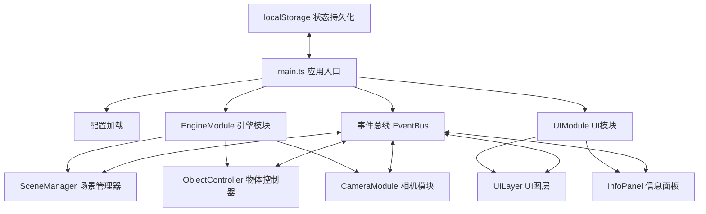

## 1. 架构设计

本应用采用模块化架构，分为渲染引擎层与UI交互层，通过事件总线实现模块间解耦通信。整体采用TypeScript确保类型安全，Three.js负责3D渲染，原生Web动画API处理UI交互动效。



**数据流向说明：**
1. `main.ts` 加载配置 → 启动 `EngineModule` 和 `UIModule`
2. `UIModule` 监听用户操作 → 通过事件总线发送指令 → `EngineModule` 响应更新3D场景
3. `ObjectController` 接收鼠标事件 → 变换文物姿态 → 反馈位置给 `CameraModule` 做缓动
4. `CameraModule` 接收聚焦信号 → 缓动相机位置 → 通知 `SceneManager` 调整景物透明度
5. `UILayer` 监听文物选择事件 → 显示/隐藏标注 → 调用 `ObjectController` 设置聚焦目标
6. `InfoPanel` 通过事件总线接收文物切换事件 → 从预设配置获取内容 → 更新DOM并触发动画

## 2. 技术描述

- **前端框架**：原生 TypeScript 5.x + Three.js 0.160.x
- **构建工具**：Vite 5.x（最小化配置，无额外插件）
- **动画方案**：原生 Web Animation API + Three.js 内置动画系统
- **状态管理**：自定义事件总线 + localStorage 持久化
- **UI样式**：原生 CSS3 + CSS 变量，采用毛玻璃效果（backdrop-filter）
- **后端服务**：无后端，文物数据使用预设 Mock 数据

### 依赖包说明
| 包名 | 版本 | 用途 |
|------|------|------|
| three | ^0.160.0 | 3D渲染引擎 |
| @types/three | ^0.160.0 | Three.js 类型定义 |
| typescript | ^5.3.0 | TypeScript 编译器 |
| vite | ^5.0.0 | 开发构建工具 |

## 3. 项目结构与文件定义

```
auto104/
├── package.json              # 项目依赖配置
├── vite.config.js            # Vite 构建配置
├── tsconfig.json             # TypeScript 配置（严格模式）
├── index.html                # 入口页面
└── src/
    ├── main.ts               # 应用入口
    ├── types/
    │   └── index.ts          # 全局类型定义
    ├── config/
    │   └── relics.ts         # 文物预设数据
    ├── engine/
    │   ├── EventBus.ts       # 事件总线
    │   ├── SceneManager.ts   # 场景管理器
    │   ├── ObjectController.ts # 物体控制器
    │   └── CameraModule.ts   # 相机模块
    ├── ui/
    │   ├── UILayer.ts        # UI图层
    │   └── InfoPanel.ts      # 信息面板
    └── utils/
        └── animation.ts      # 动画工具函数
```

### 文件职责说明

| 文件路径 | 核心职责 | 调用关系 |
|----------|----------|----------|
| `src/main.ts` | 初始化场景、相机、渲染器，协调模块启动，处理状态持久化 | 加载配置 → 启动 EngineModule 和 UIModule |
| `src/engine/EventBus.ts` | 实现发布订阅模式，管理模块间通信 | 被所有模块引用 |
| `src/engine/SceneManager.ts` | 创建场景、灯光组、地面反射、粒子背景，管理文物对象 | 接收 UIModule 的文物切换指令 → 更新场景内容 |
| `src/engine/ObjectController.ts` | 为文物添加 OrbitControls 交互，处理旋转、缩放、拖动 | 接收用户鼠标事件 → 变换文物姿态 → 反馈给 CameraModule |
| `src/engine/CameraModule.ts` | 管理三种预设视角：全景、聚焦、爆炸视图 | 接收聚焦信号 → 缓动相机 → 通知 SceneManager |
| `src/ui/UILayer.ts` | 悬浮菜单、文物卡片、加载进度条的渲染与交互 | 监听文物选择 → 显示/隐藏标注 → 调用 ObjectController |
| `src/ui/InfoPanel.ts` | 展示文物详情和3D标注列表 | 接收文物切换事件 → 更新DOM并触发动画 |
| `src/config/relics.ts` | 6件文物的预设数据：名称、年代、出土地、尺寸、标注点 | 被 main.ts 和 InfoPanel 引用 |

## 4. 核心数据模型

### 4.1 文物数据模型
```typescript
interface Relic {
  id: string;
  name: string;
  dynasty: string;
  origin: string;
  dimensions: {
    length: number;
    width: number;
    height: number;
  };
  description: string;
  geometry: {
    type: 'box' | 'cylinder' | 'sphere' | 'torus' | 'cone' | 'extrude';
    params: Record<string, number>;
    material: {
      color: string;
      metalness: number;
      roughness: number;
    };
  };
  annotations: Annotation[];
  explosionParts?: ExplosionPart[];
}

interface Annotation {
  id: string;
  title: string;
  content: string;
  position: { x: number; y: number; z: number };
}

interface ExplosionPart {
  id: string;
  name: string;
  offset: { x: number; y: number; z: number };
  geometry: Relic['geometry'];
}

interface AppState {
  currentRelicId: string;
  viewMode: 'free' | 'focus' | 'explosion';
  viewHistory: string[]; // 最近3次浏览的文物ID
  isFirstVisit: boolean;
}
```

## 5. 事件总线定义

| 事件名称 | 触发时机 | 数据载荷 | 订阅者 |
|----------|----------|----------|--------|
| `RELIC_SELECTED` | 用户点击文物卡片 | `{ relicId: string }` | SceneManager, CameraModule, InfoPanel |
| `VIEW_MODE_CHANGED` | 用户切换观察模式 | `{ mode: 'free' \| 'focus' \| 'explosion' }` | SceneManager, CameraModule, ObjectController |
| `ANNOTATION_HOVER` | 鼠标悬停标注点 | `{ annotationId: string }` | SceneManager, UILayer |
| `ANNOTATION_CLICKED` | 点击标注点 | `{ annotationId: string }` | InfoPanel |
| `CAMERA_POSITION_UPDATED` | 相机位置变化 | `{ position: Vector3, target: Vector3 }` | SceneManager |
| `LOAD_PROGRESS` | 资源加载进度 | `{ progress: number }` | UILayer |
| `LOAD_COMPLETE` | 所有资源加载完成 | - | UILayer |

## 6. 性能优化策略

### 6.1 3D渲染优化
- **LOD（细节层次）**：根据相机距离动态调整模型精度
- **视锥体剔除**：Three.js 内置视锥体剔除，仅渲染可见物体
- **InstancedMesh**：粒子系统使用实例化渲染，减少Draw Call
- **材质复用**：相同材质的文物共享材质实例
- **阴影优化**：仅主光源投射阴影，阴影贴图尺寸限制在1024x1024

### 6.2 内存管理
- 文物切换时及时销毁旧的几何体和材质
- 事件监听在组件销毁时正确移除
- 粒子对象池复用，避免频繁创建销毁

### 6.3 性能指标
| 指标 | 目标值 | 测量条件 |
|------|--------|----------|
| 帧率 | ≥ 50 FPS | Chrome 浏览器，1920x1080 分辨率 |
| 模型加载时间 | ≤ 2 秒 | 6件文物，每件约1万顶点 |
| 粒子数量 | ≤ 5000 | 背景粒子系统 |
| 内存占用 | ≤ 500 MB | 正常运行状态 |
