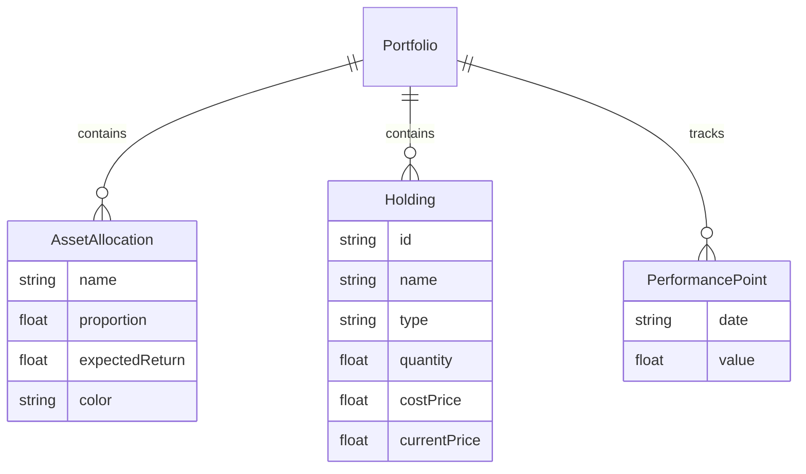

## 1. 架构设计

```mermaid
flowchart TD
    "前端 React App" --> "组件层"
    "组件层" --> "AssetAllocation"
    "组件层" --> "PerformanceChart"
    "组件层" --> "PortfolioTable"
    "组件层" --> "RebalancePanel"
    "AssetAllocation" --> "usePortfolioData Hook"
    "PerformanceChart" --> "usePortfolioData Hook"
    "PortfolioTable" --> "usePortfolioData Hook"
    "RebalancePanel" --> "usePortfolioData Hook"
    "usePortfolioData Hook" --> "模拟数据生成"
    "usePortfolioData Hook" --> "收益计算"
    "usePortfolioData Hook" --> "偏差计算"
```

## 2. 技术说明
- 前端：React 18 + TypeScript + Vite
- 图表：Chart.js + react-chartjs-2
- 拖拽：react-beautiful-dnd
- 工具库：lodash（防抖/节流）
- 初始化工具：vite-init
- 后端：无（纯前端，使用模拟数据）
- 数据库：无（内存状态管理）

## 3. 路由定义
| 路由 | 用途 |
|------|------|
| / | 仪表盘首页，展示所有投资组合模块 |

## 4. API定义
无后端API，所有数据通过 `usePortfolioData` hook 生成和管理。

### 数据类型定义
```typescript
interface AssetAllocation {
  name: string;
  proportion: number;
  expectedReturn: number;
  color: string;
}

interface Holding {
  id: string;
  name: string;
  type: string;
  quantity: number;
  costPrice: number;
  currentPrice: number;
}

interface PerformancePoint {
  date: string;
  value: number;
}

interface RebalanceSuggestion {
  name: string;
  action: 'buy' | 'sell';
  amount: number;
  deviation: number;
  targetProportion: number;
  currentProportion: number;
}
```

## 5. 服务器架构图
无后端服务。

## 6. 数据模型
### 6.1 数据模型定义


### 6.2 文件结构
```
├── package.json
├── index.html
├── vite.config.js
├── tsconfig.json
└── src/
    ├── App.tsx
    ├── components/
    │   ├── AssetAllocation.tsx
    │   ├── PerformanceChart.tsx
    │   ├── PortfolioTable.tsx
    │   └── RebalancePanel.tsx
    └── hooks/
        └── usePortfolioData.ts
```
