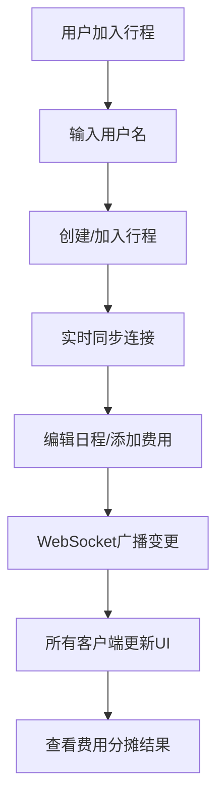

## 1. 产品概述

一个支持多人实时协作的旅行计划行程规划器，帮助团队成员共同制定旅行日程、可视化地图位置、公平分摊费用。通过WebSocket实现毫秒级同步，让团队协作如同在同一台设备上操作般流畅。

## 2. 核心功能

### 2.1 用户角色

| 角色 | 加入方式 | 核心权限 |
|------|----------|----------|
| 行程创建者 | 创建新行程 | 邀请成员、完整编辑权限、删除行程 |
| 团队成员 | 被邀请加入 | 编辑日程、添加费用、查看地图 |

### 2.2 功能模块

1. **行程面板**：行程列表、成员管理面板（可收起）
2. **日程时间线**：按天分组的日程卡片、拖拽排序、展开/收起详情
3. **地图视图**：Leaflet地图、位置标记（按日期着色）、点击弹出详情
4. **费用分摊**：费用录入、自动计算个人应收应付、明细表格

### 2.3 页面详情

| 页面名称 | 模块名称 | 功能描述 |
|----------|----------|----------|
| 主应用 | 左侧行程成员面板 | 展示行程信息、成员列表（在线状态）、邀请成员 |
| 主应用 | 中间日程时间线 | 按天垂直展示日程卡片、支持添加/删除/编辑/拖拽排序 |
| 主应用 | 右侧地图视图 | Leaflet地图展示所有地点标记、标记聚合、点击弹出详情 |
| 主应用 | 底部费用明细 | 费用录入表单、分摊计算结果表格、悬停高亮 |

## 3. 核心流程

用户进入应用 → 输入用户名加入/创建行程 → 在时间线中添加日程（含地点、预算） → 地图自动标记位置 → 录入费用并选择分摊成员 → 系统实时同步所有修改到在线成员 → 查看费用分摊结果

## 4. 用户界面设计

### 4.1 设计风格
- **主色调**：米白 #F5F0E8（背景）、深蓝 #2C3E50（标题/边框）、珊瑚 #E74C3C（强调/按钮）
- **卡片样式**：圆角 12px、柔和阴影、渐变背景色（按日期变化）
- **字体**：标题使用 Playfair Display、正文使用 Lato
- **布局**：三栏卡片式布局（左中右），桌面端水平排列，移动端垂直堆叠
- **图标**：Lucide React 图标库，20px 尺寸

### 4.2 页面设计概述

| 页面区域 | 模块名称 | UI 元素 |
|----------|----------|----------|
| 左侧栏 | 行程成员面板 | 行程标题卡片、成员列表（绿色在线圆点）、邀请输入框、收起按钮 |
| 中间区 | 日程时间线 | 日期标题、日程卡片（渐变背景、圆角阴影）、展开/收起动画（300ms ease）、添加按钮 |
| 右侧栏 | 地图视图 | Leaflet 地图容器、彩色标记、弹出信息卡片（弹性缩放动画） |
| 底部区 | 费用明细 | 费用表单、分摊结果表格（行悬停变浅高亮）、总计金额 |

### 4.3 响应式设计
- **桌面端（≥768px）**：三栏水平布局，地图固定右侧
- **移动端（<768px）**：垂直堆叠布局，地图移至日程下方，支持水平滚动查看
- **触控优化**：增大点击区域至 44px，支持触摸拖拽

### 4.4 动效规范
- 日程卡片展开/收起：300ms ease 高度过渡
- 地图标记点击：弹性缩放（scale 1 → 1.3 → 1）
- Toast 提示：2秒自动消失，淡入淡出
- 拖拽占位：半透明虚线边框
