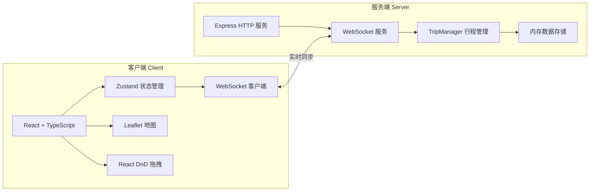
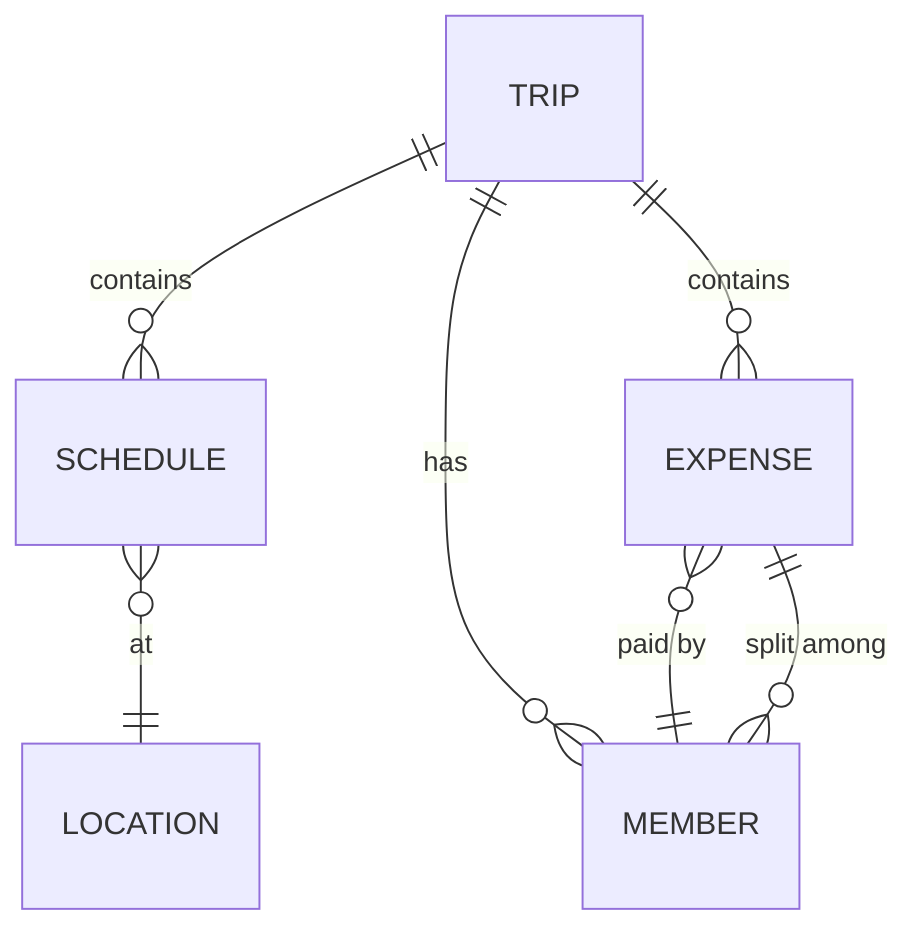
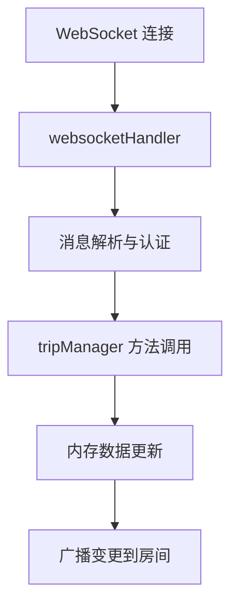

## 1. 架构设计



## 2. 技术描述

- **前端**：React@18 + TypeScript + Vite + Zustand + Tailwind CSS
- **后端**：Node.js + Express@4 + TypeScript + ws (WebSocket)
- **地图**：Leaflet@1.9 + react-leaflet
- **拖拽**：@dnd-kit/core + @dnd-kit/sortable
- **实时通信**：ws (WebSocket 库)
- **并发启动**：concurrently

## 3. 项目文件结构

| 文件路径 | 说明 |
|----------|------|
| `/package.json` | 前后端统一依赖管理、启动脚本 |
| `/index.html` | Vite 前端入口 HTML |
| `/tsconfig.json` | TypeScript 严格模式配置 |
| `/vite.config.js` | Vite 构建配置 |
| `/server/src/index.ts` | 后端入口：Express + WebSocket 启动（8080端口） |
| `/server/src/tripManager.ts` | 行程数据管理、用户连接、广播通知 |
| `/server/src/websocketHandler.ts` | WebSocket 消息分发、实时同步处理 |
| `/client/src/App.tsx` | 主应用：路由、全局状态、布局 |
| `/client/src/components/TripBoard.tsx` | 日程面板：时间线、费用明细、实时通信 |
| `/client/src/components/MapView.tsx` | 地图组件：Leaflet 标记、信息弹窗 |
| `/client/src/types.ts` | 共享 TypeScript 类型定义 |
| `/client/src/store.ts` | Zustand 全局状态管理 |

## 4. WebSocket 消息协议

### 消息类型定义

```typescript
// 客户端 → 服务端
type ClientMessage =
  | { type: 'JOIN_TRIP'; tripId: string; username: string }
  | { type: 'LEAVE_TRIP'; tripId: string }
  | { type: 'ADD_SCHEDULE'; tripId: string; schedule: Schedule }
  | { type: 'UPDATE_SCHEDULE'; tripId: string; schedule: Schedule }
  | { type: 'DELETE_SCHEDULE'; tripId: string; scheduleId: string }
  | { type: 'REORDER_SCHEDULES'; tripId: string; dayKey: string; order: string[] }
  | { type: 'ADD_EXPENSE'; tripId: string; expense: Expense }
  | { type: 'INVITE_MEMBER'; tripId: string; username: string }

// 服务端 → 客户端
type ServerMessage =
  | { type: 'TRIP_STATE'; trip: Trip }
  | { type: 'SCHEDULE_ADDED'; schedule: Schedule }
  | { type: 'SCHEDULE_UPDATED'; schedule: Schedule }
  | { type: 'SCHEDULE_DELETED'; scheduleId: string }
  | { type: 'SCHEDULES_REORDERED'; dayKey: string; order: string[] }
  | { type: 'EXPENSE_ADDED'; expense: Expense }
  | { type: 'MEMBER_JOINED'; member: Member }
  | { type: 'MEMBER_LEFT'; memberId: string }
  | { type: 'MEMBER_STATUS_CHANGED'; memberId: string; online: boolean }
```

## 5. 数据模型

### 5.1 ER 图



### 5.2 TypeScript 类型定义

```typescript
interface Member {
  id: string;
  username: string;
  online: boolean;
  isOwner: boolean;
}

interface Location {
  name: string;
  lat: number;
  lng: number;
}

interface Schedule {
  id: string;
  tripId: string;
  dayKey: string;      // YYYY-MM-DD
  time: string;        // HH:mm
  title: string;
  location: Location;
  notes?: string;
  budget: number;
}

interface Expense {
  id: string;
  tripId: string;
  scheduleId?: string;
  description: string;
  amount: number;
  paidBy: string;      // memberId
  splitAmong: string[]; // memberId[]
}

interface Trip {
  id: string;
  name: string;
  ownerId: string;
  members: Member[];
  schedules: Schedule[];
  expenses: Expense[];
}

interface Settlement {
  memberId: string;
  username: string;
  paid: number;
  owed: number;
  balance: number; // positive = should receive, negative = should pay
}
```

## 6. 服务端架构


