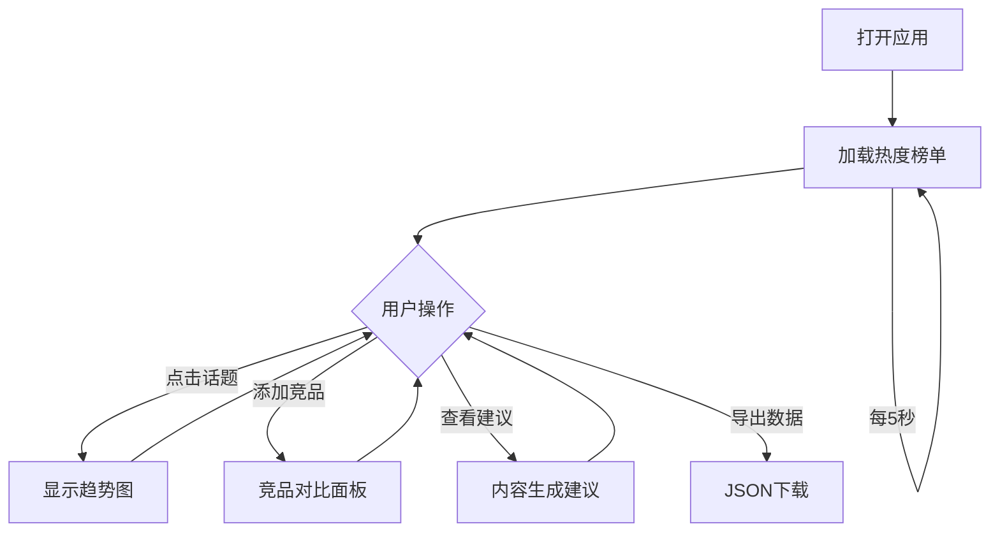

## 1. 产品概述
社交媒体热度趋势分析仪表盘，帮助内容创作者和营销人员实时追踪话题热度、对比竞争对手、获取最佳发布时间建议。
- 目标用户：社交媒体内容创作者、数字营销人员、品牌运营团队
- 核心价值：通过数据可视化和智能分析，提升内容运营效率和传播效果

## 2. 核心功能

### 2.1 功能模块
1. **实时热度榜单**：热门话题排行榜、热度指数渐变柱状图、增长趋势、5秒自动刷新
2. **话题趋势图**：24小时热度曲线、平滑动画过渡、悬停数据点、关键事件标注
3. **竞品对比面板**：最多3个竞品话题、多颜色折线图、隐藏/显示控制、淡入淡出动画
4. **内容生成建议**：最佳发帖时间推荐、置信度进度条、数字跳动动画
5. **历史数据导出**：JSON格式导出、加载动画、下载弹窗提示

### 2.2 页面详情
| 页面名称 | 模块名称 | 功能描述 |
|-----------|-------------|---------------------|
| 仪表盘主页面 | 顶部导航栏 | 固定导航、Logo、导出按钮、刷新状态指示 |
| 仪表盘主页面 | 实时热度榜单 | 排名、话题标签、热度指数、增长箭头、渐变柱状图、磨砂玻璃卡片 |
| 仪表盘主页面 | 话题趋势图 | 平滑折线图、时间轴、悬停Tooltip、关键事件标记 |
| 仪表盘主页面 | 竞品对比面板 | 添加/删除竞品、多折线对比、显示/隐藏切换 |
| 仪表盘主页面 | 内容建议区 | 最佳时段推荐、峰值热度预测、置信度展示 |

## 3. 核心流程
用户打开仪表盘 → 自动加载实时热度榜单（每5秒刷新）→ 点击话题查看24小时趋势 → 添加竞品进行对比分析 → 获取最佳发布时间建议 → 导出数据报告

## 4. 用户界面设计

### 4.1 设计风格
- **主色调**：霓虹蓝(#00D4FF)、紫罗兰(#7B2FF7)
- **背景色**：深灰(#1A1A2E)
- **文字色**：浅灰(#E0E0E0)
- **卡片效果**：磨砂玻璃（背景模糊+半透明叠加）
- **动画**：0.2s cubic-bezier过渡、0.3s ease-out悬停上浮
- **字体**：Google Fonts (Orbitron for display, Inter for body)
- **布局**：顶部导航固定，卡片式网格布局

### 4.2 页面设计概述
| 页面名称 | 模块名称 | UI元素 |
|-----------|-------------|-------------|
| 主仪表盘 | 导航栏 | 固定定位、渐变边框、霓虹发光效果 |
| 主仪表盘 | 热度榜单 | 磨砂玻璃卡片、渐变柱状图、增长箭头动画 |
| 主仪表盘 | 趋势图 | Recharts平滑折线、渐变填充、事件标记点 |
| 主仪表盘 | 竞品面板 | 彩色标签切换、联动图表、动画过渡 |
| 主仪表盘 | 建议区 | 进度条动画、数字滚动效果 |

### 4.3 响应式设计
- **桌面端(>768px)**：4列排行榜、横向布局、全尺寸图表
- **平板端(768px)**：保持桌面布局，缩小间距
- **移动端(<480px)**：排行榜改为纵向列表、趋势图缩小至80%宽度
