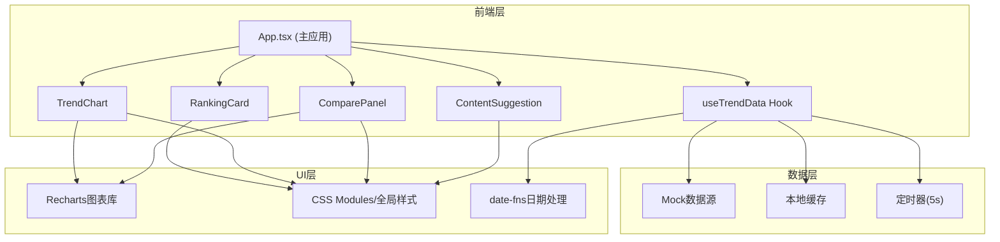

## 1. 架构设计



## 2. 技术说明
- **前端框架**：React@18 + TypeScript@5
- **构建工具**：Vite@5 + @vitejs/plugin-react
- **图表库**：Recharts@2
- **日期处理**：date-fns@3
- **HTTP客户端**：axios@1（预留用于真实API）
- **样式方案**：原生CSS + CSS变量（暗色主题）
- **状态管理**：React Hooks + 自定义Hook (useTrendData)

## 3. 目录结构
```
auto108/
├── index.html
├── package.json
├── tsconfig.json
├── vite.config.js
└── src/
    ├── App.tsx
    ├── main.tsx
    ├── index.css
    ├── hooks/
    │   └── useTrendData.ts
    ├── components/
    │   ├── RankingCard.tsx
    │   ├── TrendChart.tsx
    │   ├── ComparePanel.tsx
    │   └── ContentSuggestion.tsx
    └── types/
        └── index.ts
```

## 4. 数据模型

### 4.1 类型定义
```typescript
interface TrendTopic {
  id: string;
  rank: number;
  tag: string;
  heatIndex: number;      // 0-10000
  growth: number;         // 百分比 -100 ~ +500
  growthDirection: 'up' | 'down' | 'flat';
  category: string;
}

interface TimeSeriesPoint {
  time: string;           // ISO时间戳
  timestamp: number;
  heat: number;
  event?: string;         // 关键事件描述
}

interface TopicTrend {
  topicId: string;
  topicTag: string;
  data: TimeSeriesPoint[];
}

interface ContentSuggestion {
  topicId: string;
  bestTimeRange: string;  // 如 "18:00-20:00"
  peakHeat: number;
  confidence: number;     // 0-100
  reason: string;
}

interface ExportData {
  exportedAt: string;
  ranking: TrendTopic[];
  trends: TopicTrend[];
  suggestions: ContentSuggestion[];
}
```

## 5. 核心模块说明

### 5.1 useTrendData Hook
- 职责：模拟API请求、定时刷新(5s)、数据缓存、话题查询
- 返回值：ranking列表、selectedTrend、compareTrends、loading状态、exportData方法

### 5.2 RankingCard 组件
- 接收：TrendTopic数据 + 选中状态
- 渲染：磨砂玻璃卡片、渐变热度条、增长箭头、点击事件

### 5.3 TrendChart 组件
- 接收：topicId, timeRange, trendData
- 渲染：Recharts LineChart + Tooltip + 事件标记

### 5.4 ComparePanel 组件
- 状态管理：最多3个竞品的selectedTopics数组
- 渲染：多色LineChart + 显示/隐藏Checkbox + 淡入淡出动画
