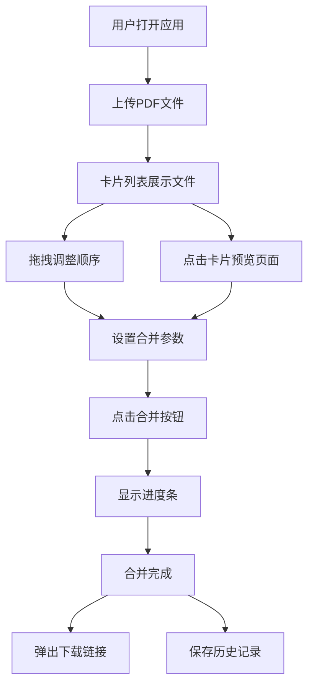

## 1. 产品概述

PDF合并预览助手是一款面向学生和职场人士的在线PDF文档合并工具，解决用户需要将多个PDF文档合并为一个文件并在合并前预览和调整顺序的痛点。产品提供直观的拖拽排序、页面级预览、灵活的合并参数配置以及合并历史记录管理，让PDF合并操作高效且可控。

## 2. 核心功能

### 2.1 用户角色

| 角色 | 注册方式 | 核心权限 |
|------|----------|----------|
| 普通用户 | 无需注册 | 上传、预览、合并、下载PDF文件 |

### 2.2 功能模块

1. **主页面**：文件上传与管理、拖拽排序、合并预览、参数设置、合并执行与下载、历史记录

### 2.3 页面详情

| 页面名称 | 模块名称 | 功能描述 |
|----------|----------|----------|
| 主页面 | 文件上传区 | 支持拖拽上传多个PDF文件，允许多选，卡片列表展示文件名、页数、缩略图 |
| 主页面 | 拖拽排序 | 通过拖拽调整文件顺序，平滑动画和位置指示线 |
| 主页面 | 合并前预览 | 点击卡片展开页面级缩略图，支持翻页（按钮+键盘左右键），显示页码，面板可拖拽调整大小 |
| 主页面 | 合并参数面板 | 输出文件名、页面范围（全部/自定义1-3,5）、书签开关（基于原文件名生成层级书签），实时生效 |
| 主页面 | 合并执行 | 合并按钮、进度条（百分比+剩余时间）、完成后自动弹出下载链接、显示总页数和大小 |
| 主页面 | 历史记录侧边栏 | 最近5次合并记录（时间戳、文件名、页数）、重新下载、一键清除（淡出动画） |

## 3. 核心流程

用户打开应用 → 拖拽/选择上传多个PDF文件 → 文件以卡片列表展示 → 用户通过拖拽调整文件顺序 → 点击卡片展开预览查看页面缩略图 → 设置合并参数（文件名、页码范围、书签） → 点击合并按钮 → 显示进度条 → 完成后弹出下载链接 → 合并记录保存到侧边栏

## 4. 用户界面设计

### 4.1 设计风格

- 主色：深蓝色 (#1a237e)
- 辅助色：白色 (#ffffff)、浅灰 (#f5f5f5)
- 渐变按钮/进度条：#1e88e5 到 #1565c0
- 按钮样式：圆角8px，渐变蓝色背景，悬停时1.05缩放并加深背景色
- 字体：系统默认无衬线字体，标题18px加粗，正文14px
- 布局：卡片式布局，左侧可折叠侧边栏（300px），右侧预览和操作面板
- 圆角统一8px，阴影统一 0 2px 4px rgba(0,0,0,0.1)
- 拖拽文件时显示虚线边框和"松开以添加"提示
- 卡片插入弹性动画，预览翻页淡入淡出过渡

### 4.2 页面设计概览

| 页面名称 | 模块名称 | UI元素 |
|----------|----------|--------|
| 主页面 | 侧边栏 | 深蓝背景，白色文字，历史记录列表，可折叠，宽度300px |
| 主页面 | 文件上传区 | 虚线边框拖拽区域，卡片列表，缩略图+文件名+页数 |
| 主页面 | 预览面板 | 页面缩略图网格，翻页控件，页码显示，可拖拽调整大小 |
| 主页面 | 合并参数面板 | 输入框、选择框、开关控件，深蓝主题 |
| 主页面 | 合并按钮 | 渐变蓝色大按钮，悬停放大1.05 |
| 主页面 | 进度条 | 渐变蓝色进度条，百分比和剩余时间文字 |

### 4.3 响应式适配

- 桌面端（≥768px）：左侧侧边栏 + 右侧主内容区
- 移动端（<768px）：侧边栏收起为顶部菜单栏，卡片列表改为单列布局
- 触摸优化：拖拽操作支持触摸事件

### 4.4 3D场景指导

不适用
