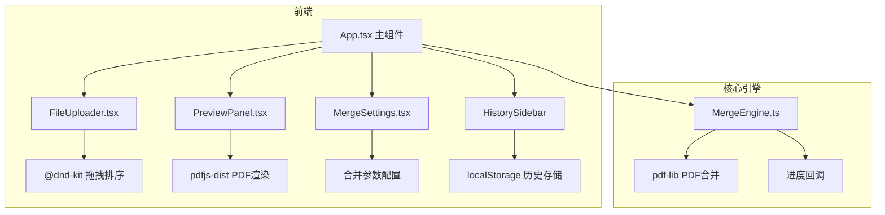
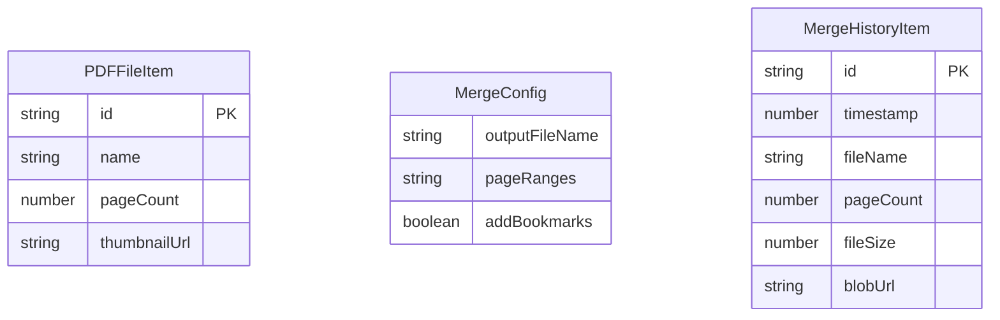

## 1. 架构设计



## 2. 技术说明

- 前端：React 18 + TypeScript + Vite
- 初始化工具：vite-init (react-ts模板)
- 状态管理：zustand
- 样式：Tailwind CSS
- PDF预览：pdfjs-dist
- PDF合并：pdf-lib
- 拖拽排序：@dnd-kit/core + @dnd-kit/sortable + @dnd-kit/utilities
- 后端：无（纯前端应用）
- 数据库：无（使用localStorage存储历史记录）

## 3. 路由定义

| 路由 | 用途 |
|------|------|
| / | 主页面，包含所有功能模块 |

## 4. API定义

无后端API，所有操作在浏览器端完成。

### 4.1 核心类型定义

```typescript
interface PDFFileItem {
  id: string;
  file: File;
  name: string;
  pageCount: number;
  thumbnailUrl: string;
  pdfDoc: PDFDocumentProxy;
}

interface MergeConfig {
  outputFileName: string;
  pageRanges: string;
  addBookmarks: boolean;
}

interface MergeHistoryItem {
  id: string;
  timestamp: number;
  fileName: string;
  pageCount: number;
  fileSize: number;
  blobUrl: string;
}

interface MergeProgress {
  percent: number;
  estimatedTimeRemaining: number;
}
```

## 5. 服务器架构图

不适用（纯前端应用）

## 6. 数据模型

### 6.1 数据模型定义



### 6.2 数据存储

使用浏览器localStorage存储合并历史记录（最多5条），PDF文件数据使用Blob URL存储在内存中。页面关闭后历史记录中的blobUrl将失效，重新下载功能仅在当前会话有效。
