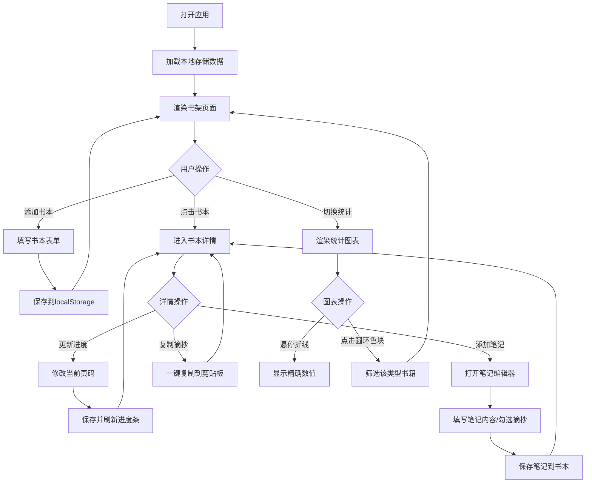

## 1. 产品概述

书架笔记是一款面向独立书店常客与热爱阅读的个人用户的轻量化阅读管理应用。用户可以记录正在阅读的书籍、追踪阅读进度、摘抄精彩段落、撰写读书笔记，并通过可视化图表了解自己的阅读习惯。产品采用纯前端架构，数据通过浏览器本地存储持久化，无需后端服务。

- 核心价值：为读者提供私密、美观、易用的读书笔记空间，激发阅读热情
- 目标用户：热爱阅读的个人、独立书店的会员读者
- 市场定位：区别于大型阅读社区的私密个人阅读工具

## 2. 核心功能

### 2.1 用户角色

| 角色 | 注册方式 | 核心权限 |
|------|----------|----------|
| 个人用户 | 无需注册，直接使用 | 完整的书本管理、笔记记录、统计查看功能 |

### 2.2 功能模块

1. **书架页面**：书本卡片网格、搜索筛选栏、添加书本入口
2. **书本详情页**：封面展示、阅读进度条、笔记列表、摘抄专区
3. **笔记编辑器**：笔记编辑区、已存笔记时间线、摘抄标记功能
4. **统计页面**：月度阅读量折线图、书籍类型分布圆环图
5. **底部导航（移动端）**：书架、统计、搜索三个页面切换

### 2.3 页面详情

| 页面名称 | 模块名称 | 功能描述 |
|----------|----------|----------|
| 书架页面 | 搜索筛选栏 | 书名/作者模糊搜索、类型筛选、阅读状态筛选 |
| 书架页面 | 书本卡片网格 | 封面、书名、作者、进度条、阅读状态标签、悬停动画 |
| 书架页面 | 添加书本弹窗 | 封面选择（预设/自定义上传）、书名、作者、总页数、类型、开始日期 |
| 书本详情页 | 书籍信息区 | 封面、书名、作者、类型标签、阅读进度条（百分比） |
| 书本详情页 | 笔记列表 | 时间戳、页码、内容，按创建时间倒序 |
| 书本详情页 | 摘抄专区 | 高亮摘抄卡片、一键复制到剪贴板 |
| 书本详情页 | 笔记编辑器入口 | 新增笔记按钮、编辑已有笔记 |
| 笔记编辑器 | 编辑区 | 标题输入、富文本内容输入、页码输入、摘抄标记勾选框 |
| 笔记编辑器 | 时间线 | 已保存笔记的时间线展示，按时间倒序 |
| 统计页面 | 月度折线图 | X轴月份、Y轴阅读页数、平滑曲线、绘制动画、悬停精确值 |
| 统计页面 | 类型圆环图 | 各类型占比色块、中心显示选中类型、点击色块筛选书籍 |

## 3. 核心流程

用户打开应用后，首先看到书架页面，展示所有已添加的书籍卡片。用户可以通过搜索栏快速查找书籍，或通过筛选器按类型和阅读状态过滤。点击"添加书本"按钮弹出表单，填写书籍信息后保存到本地存储。

点击某本书进入详情页，可以查看完整信息、更新阅读进度、添加笔记和摘抄。笔记编辑器支持左右两栏布局——左侧编辑、右侧时间线。摘抄的笔记会自动在详情页的摘抄专区高亮展示，用户可一键复制。

切换到统计页面，可以查看月度阅读量趋势和类型分布圆环图，点击圆环图的色块可以筛选该类型的所有书籍。

## 4. 用户界面设计

### 4.1 设计风格

- **主色调**：深胡桃木色 `#4E342E`（灵感来源：木质书架）
- **背景色**：米白色 `#F5F0E1`（灵感来源：纸本书籍质感）
- **辅助色**：
  - 深棕 `#3E2723`（文字标题）
  - 琥珀棕 `#8D6E63`（边框、次要文字）
  - 奶油黄 `#FFF8E1`（卡片背景）
  - 暖橙 `#FF8A65`（强调色、进度条）
  - 浅褐 `#D7CCC8`（分割线、禁用状态）
- **按钮风格**：圆角按钮，悬停时微上浮 + 阴影加深，按下时轻微凹陷
- **字体选择**：
  - 标题：Noto Serif SC（衬线体，呼应纸质书籍质感）
  - 正文：Noto Sans SC（无衬线体，保证阅读舒适度）
  - 代码/数字：JetBrains Mono
- **布局风格**：卡片式网格布局，桌面端多列，移动端单列
- **图标风格**：线性 + 填充混合图标，使用书本、羽毛笔、墨水瓶等阅读主题元素

### 4.2 页面设计概述

| 页面名称 | 模块名称 | UI元素描述 |
|----------|----------|-----------|
| 书架页面 | 搜索筛选栏 | 搜索框带放大镜图标，筛选下拉框带木纹边框，整体悬浮顶部 |
| 书架页面 | 书本卡片 | 阴影圆角 `12px`，悬停 `translateY(-6px)` 上浮，内侧动画书脊线 `1.5s` 从左到右划过 |
| 书本详情页 | 进度条 | 暖橙渐变填充，平滑过渡动画，百分比数字内嵌显示 |
| 书本详情页 | 摘抄专区 | 奶油黄背景，左侧琥珀色竖线装饰，复制按钮带对勾反馈动画 |
| 笔记编辑器 | 编辑区 | 草稿纸横线背景纹理，左右两栏 `55%:45%` 分割 |
| 笔记编辑器 | 时间线 | 左侧时间轴带圆点节点，卡片交错淡入动画 |
| 统计页面 | 折线图 | 暖橙平滑曲线，路径绘制动画 `2s ease-out`，数据点发光效果 |
| 统计页面 | 圆环图 | 胡桃木色系渐变填充，中心文字淡入切换，色块悬停放大效果 |
| 全局 | 底部导航（移动端） | 固定底部，胡桃木背景，米白图标文字，选中项带下划线动画 |

### 4.3 响应式设计

- **设计策略**：桌面端优先，移动端适配
- **断点设置**：
  - 桌面端：`≥1024px`，书架卡片 4 列网格
  - 平板端：`768px ~ 1023px`，书架卡片 2~3 列网格
  - 移动端：`<768px`，书架卡片单列，底部导航栏固定，搜索筛选栏固定顶部
- **触控优化**：移动端按钮最小尺寸 `44×44px`，增加点击区域，减少误触

### 4.4 动画与交互动效

- **页面切换**：淡入 + 轻微上移动画，`300ms ease-out`
- **卡片悬停**：上浮 `6px` + 阴影增强，书脊线流光效果 `1.5s`
- **搜索筛选**：结果平滑淡入，`200ms` 交错延迟
- **进度更新**：进度条宽度过渡动画 `500ms ease-out`
- **图表加载**：折线路径绘制动画 `2s`，圆环扇形渐入
- **复制反馈**：点击复制后按钮变绿 + 对勾图标，`1s` 后恢复
