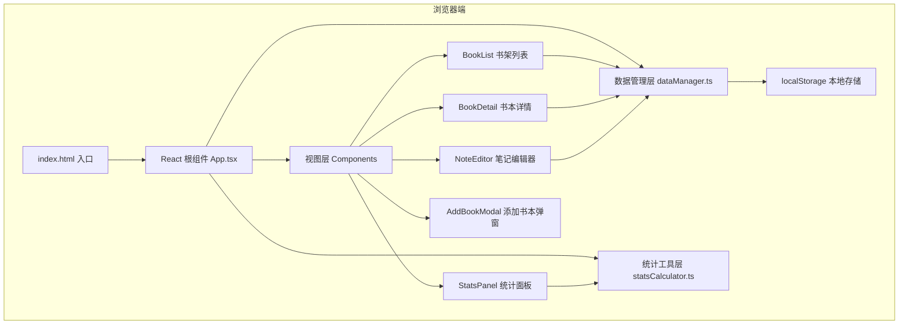
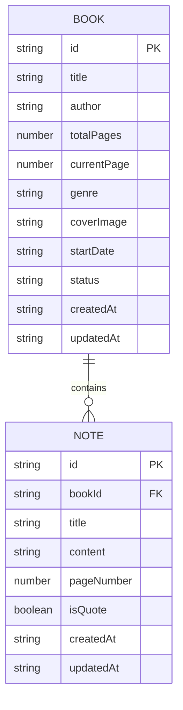

## 1. 架构设计

书架笔记采用纯前端单页应用架构，无需后端服务器。数据通过浏览器 localStorage 持久化，状态管理通过 React Hooks 实现，组件间通过 Props 传递数据和回调函数。



**数据流向说明：**
1. App 启动时调用 dataManager.loadAll() 从 localStorage 加载全部数据
2. App 将数据通过 Props 分发给各子组件
3. 子组件（如 BookDetail、NoteEditor）触发写操作时，调用 dataManager 的增删改方法
4. dataManager 更新 localStorage 后，通过回调通知 App 重新加载数据
5. 统计组件 StatsPanel 调用 statsCalculator 纯函数获取图表数据

## 2. 技术描述

- **前端框架**：React@18（函数式组件 + Hooks）
- **开发语言**：TypeScript@5（严格模式，ESModule 导入）
- **构建工具**：Vite@5 + @vitejs/plugin-react
- **图表库**：recharts@2（折线图、圆环图）
- **ID 生成**：uuid@9
- **样式方案**：原生 CSS + CSS 变量（全局主题 + 模块化类名）
- **数据持久化**：浏览器 localStorage
- **路由方案**：使用 React 状态模拟路由（无需 react-router，减少依赖）
- **初始化方式**：手动创建项目结构（非 vite-init 交互式创建）

## 3. 页面路由（状态模拟）

| 逻辑路由 | 对应组件/视图 | 说明 |
|----------|--------------|------|
| /shelf | BookList + 搜索筛选栏 | 书架首页，显示所有书籍卡片 |
| /book/:id | BookDetail + NoteEditor | 书本详情页，含笔记编辑 |
| /stats | StatsPanel | 统计可视化页面 |

移动端通过底部导航切换上述三个主要视图，桌面端在顶部导航栏切换。

## 4. 数据模型定义

### 4.1 实体关系



### 4.2 TypeScript 类型定义

```typescript
export type BookStatus = 'not_started' | 'reading' | 'completed';

export type BookGenre = '小说' | '非虚构' | '传记' | '科幻' | '历史' | '哲学' | '诗歌' | '其他';

export interface Book {
  id: string;
  title: string;
  author: string;
  totalPages: number;
  currentPage: number;
  genre: BookGenre;
  coverImage: string;
  startDate: string;
  status: BookStatus;
  createdAt: string;
  updatedAt: string;
}

export interface Note {
  id: string;
  bookId: string;
  title: string;
  content: string;
  pageNumber: number;
  isQuote: boolean;
  createdAt: string;
  updatedAt: string;
}

export interface MonthlyStats {
  month: string;
  pages: number;
}

export interface GenreStats {
  name: string;
  value: number;
}
```

### 4.3 localStorage 存储结构

```json
{
  "bookshelf_books": [
    { "id": "...", "title": "...", ... }
  ],
  "bookshelf_notes": [
    { "id": "...", "bookId": "...", ... }
  ]
}
```

## 5. 模块职责与调用关系

### 5.1 文件结构

```
src/
├── App.tsx                    # 主应用组件，路由/状态管理
├── main.tsx                   # React 挂载入口
├── types/
│   └── index.ts               # 全局类型定义
├── dataManager.ts             # localStorage 增删改查封装
├── utils/
│   └── statsCalculator.ts     # 统计计算纯函数
├── components/
│   ├── BookList.tsx           # 书架列表组件
│   ├── BookCard.tsx           # 单本书卡片组件
│   ├── BookDetail.tsx         # 书本详情组件
│   ├── NoteEditor.tsx         # 笔记编辑器组件
│   ├── NoteTimeline.tsx       # 笔记时间线组件
│   ├── QuoteCard.tsx          # 摘抄卡片组件
│   ├── StatsPanel.tsx         # 统计面板组件
│   ├── AddBookModal.tsx       # 添加书本弹窗
│   ├── SearchBar.tsx          # 搜索筛选栏
│   ├── BottomNav.tsx          # 移动端底部导航
│   └── ProgressBar.tsx        # 阅读进度条
└── styles/
    ├── global.css             # 全局样式、CSS 变量
    ├── animations.css         # 动画关键帧
    └── responsive.css         # 响应式断点
```

### 5.2 调用关系矩阵

| 调用方 → 被调用方 | dataManager | statsCalculator | BookList | BookDetail | NoteEditor | StatsPanel |
|-------------------|-------------|-----------------|----------|------------|------------|------------|
| App.tsx           | ✅ 加载/保存回调 | ✅ 计算统计 | ✅ 渲染 | ✅ 渲染 | ✅ 渲染 | ✅ 渲染 |
| BookList.tsx      | ✅ 删除书本 | ❌ | ❌ | ✅ 跳转回调 | ❌ | ❌ |
| BookDetail.tsx    | ✅ 更新进度/删除笔记 | ❌ | ❌ | ❌ | ✅ 打开编辑器 | ❌ |
| NoteEditor.tsx    | ✅ 新增/保存笔记 | ❌ | ❌ | ✅ 保存后刷新 | ❌ | ❌ |
| StatsPanel.tsx    | ❌ | ✅ 渲染图表 | ✅ 筛选跳转 | ❌ | ❌ | ❌ |

### 5.3 性能约束实现方案

**搜索筛选响应时间 <100ms：**
- 使用 `useMemo` 缓存搜索结果，仅依赖变化时重计算
- 搜索算法使用字符串 `includes()` 线性匹配，30 本书数据量下无需索引
- 不使用防抖（100ms 以内即时响应），输入即过滤

**初始加载 <1s（30本书测试数据）：**
- localStorage 读取为同步操作，约 <10ms
- 组件懒加载：统计面板和笔记编辑器按需渲染
- 使用 `React.memo` 包裹 BookCard 避免不必要的重渲染
- 图片懒加载：封面图 `loading="lazy"`
