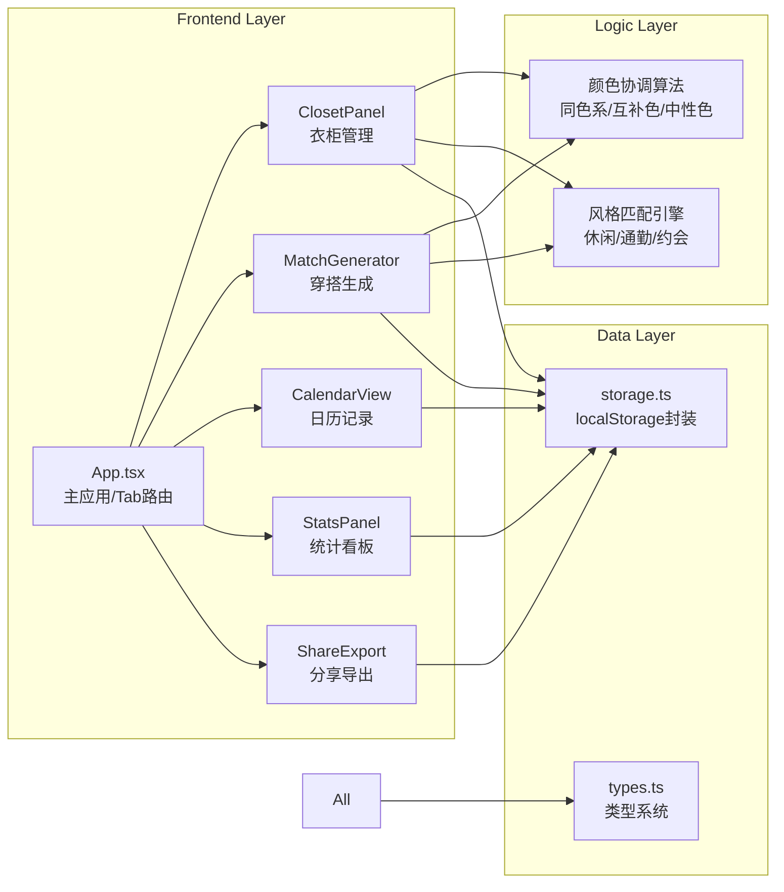
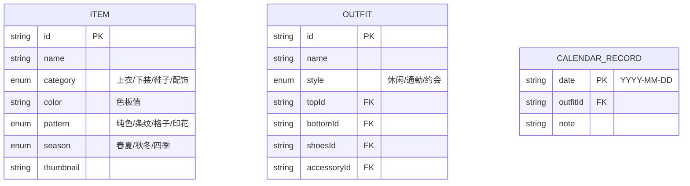

## 1. 架构设计

## 2. 技术描述

- **前端框架**：React@18 + TypeScript（严格模式）
- **构建工具**：Vite@5 + @vitejs/plugin-react
- **样式方案**：styled-components@6（CSS-in-JS，处理动画和主题）
- **数据持久化**：localStorage（封装CRUD方法）
- **唯一ID**：uuid
- **图表方案**：原生SVG实现圆环图和条形图（避免额外依赖）
- **分享图导出**：Canvas API 绘制后导出PNG

## 3. 路由/Tab定义

| Tab标识 | 对应组件 | 说明 |
|-------|---------|------|
| closet | ClosetPanel | 虚拟衣柜，单品CRUD+筛选 |
| match | MatchGenerator | 选择基础单品→生成3套搭配 |
| calendar | CalendarView | 月视图日历，保存/查看搭配 |
| stats | StatsPanel | 统计数据+图表 |

## 4. 数据模型

### 4.1 数据模型定义

### 4.2 localStorage键名
- `wardrobe_items`：单品数组（JSON）
- `outfit_records`：日历记录对象（key=日期）

## 5. 核心算法

### 5.1 颜色协调规则
- **同色系**：色相H差异<30°，明度/饱和度可调节
- **互补色**：色相H差异=180°±30°
- **中性色搭配**：黑/白/灰/米/棕作为基底，任意色可搭配

### 5.2 季节匹配
- 基础单品season为"春夏"时，优先匹配"春夏"+"四季"
- 基础单品season为"秋冬"时，优先匹配"秋冬"+"四季"
- 基础单品season为"四季"时，无限制

### 5.3 风格映射
| 风格 | 上衣特征 | 下装特征 | 鞋子特征 |
|------|---------|---------|---------|
| 休闲 | 宽松/印花/条纹 | 牛仔裤/运动裤 | 运动鞋/帆布鞋 |
| 通勤 | 纯色/简约 | 西裤/铅笔裙 | 皮鞋/乐福鞋 |
| 约会 | 柔美/精致 | 半身裙/修身裤 | 高跟鞋/短靴 |

## 6. 性能保障

- 日历月份切换：纯前端计算，O(1)查找记录，<200ms
- 穿搭生成：数组筛选+排序，O(n)时间，实时无等待
- 动效：全部CSS transition/transform，GPU加速
- 响应式：CSS媒体查询，无JS重排开销
