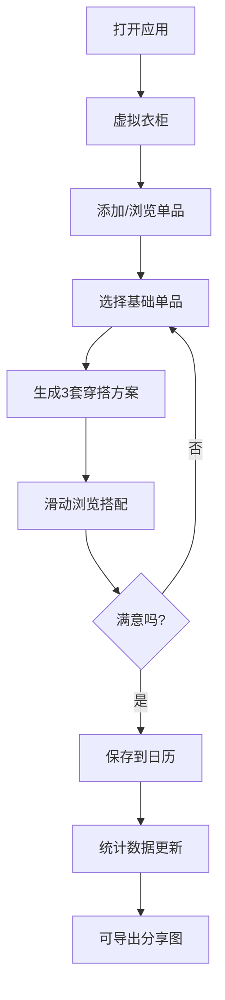

## 1. 产品概述

智能每日穿搭助手是一款帮助用户管理虚拟衣柜、自动生成穿搭方案、记录穿搭历史并进行数据分析的Web应用。解决用户在衣柜前纠结搭配、购买新衣后缺乏搭配灵感的核心痛点。

- 目标用户：追求时尚、关注日常穿搭的年轻人和都市白领
- 产品价值：通过颜色协调算法和智能推荐，让用户轻松获得专业级穿搭建议

## 2. 核心功能

### 2.1 功能模块

1. **虚拟衣柜管理**：单品CRUD、分类筛选、卡片网格展示、翻转动画详情
2. **智能穿搭生成器**：基于基础单品推荐3套风格搭配（休闲/通勤/约会），水平轮播展示
3. **穿搭日历与记录**：月视图日历、搭配保存、缩略图标记、文字备注
4. **穿搭统计看板**：品类占比圆环图、Top5颜色组合条形图、记录数与连续天数
5. **一键导出分享**：方形分享图生成（单品小图+名称），PNG下载

### 2.2 页面详情

| 页面名称 | 模块名称 | 功能描述 |
|-----------|-------------|---------------------|
| 衣柜面板 | 筛选工具栏 | 分类/颜色/季节三维筛选器 |
| 衣柜面板 | 单品卡片网格 | 缩略图+名称展示，卡片翻转动效 |
| 衣柜面板 | 添加单品表单 | 名称/分类/颜色/图案/季节录入 |
| 穿搭生成器 | 基础单品选择 | 从衣柜中挑选一件基础单品 |
| 穿搭生成器 | 搭配方案轮播 | 3套不同风格水平滑动切换 |
| 穿搭生成器 | 联动单品卡片 | 展示搭配中每件单品详情 |
| 日历视图 | 月历网格 | 有搭配的日子显示缩略图圆点 |
| 日历视图 | 搭配详情弹层 | 点击日期展开当日搭配卡片+备注编辑 |
| 统计看板 | 图表区域 | 品类圆环图+颜色组合条形图 |
| 统计看板 | 数据概览 | 总记录数+连续搭配天数 |
| 分享导出 | 分享图预览 | 方形构图，单品小图排列 |

## 3. 核心流程

用户打开应用 → 进入虚拟衣柜查看/添加单品 → 选择一件基础单品触发穿搭生成 → 系统实时计算3套风格方案 → 用户滑动浏览选择满意搭配 → 保存到日历指定日期 → 统计看板自动更新数据 → 可一键生成分享图下载。

## 4. 用户界面设计

### 4.1 设计风格
- **主色调**：#F5E6CC（暖米色背景）
- **辅助色**：#8B7355（深棕色文字/边框）
- **强调色**：#E8A87C（桃橙色按钮/高亮）
- **按钮风格**：大圆角（12px）、柔和阴影、点击缩放动效
- **字体**：优雅的无衬线字体，标题稍带衬线风格
- **布局**：卡片式布局，移动端底部Tab导航，桌面端侧边导航
- **图标风格**：线性简约图标，与暖色调协调

### 4.2 页面设计概述

| 页面名称 | 模块名称 | UI元素 |
|-----------|-------------|-------------|
| 衣柜面板 | 单品卡片 | 圆角卡片、颜色块缩略图、3D翻转动效、悬停阴影加深 |
| 穿搭生成器 | 轮播卡片 | 水平滑动、联动高亮、当前方案放大效果 |
| 日历视图 | 日期格子 | 缩略图圆点标记、选中态边框、淡入滑出动画 |
| 统计看板 | 图表 | 柔和过渡动画、渐变填充色 |
| 全局 | 导航切换 | 横向滑动+淡入过渡（200ms内） |

### 4.3 响应式
- 桌面端（≥1024px）：左侧垂直导航栏，主内容区多列网格
- 平板端（768-1024px）：顶部导航，自适应网格列数
- 移动端（<768px）：底部Tab导航栏，单列/双列网格，触控优化
- 所有交互元素最小触控目标44×44px

### 4.4 动效规范
- 卡片翻转：perspective(1000px) + rotateY(180deg)，300ms ease
- 视图切换：translateX 0→100% + opacity 0→1，200ms ease-out
- 轻触反馈：scale(0.96) + 阴影变化，100ms
- 日历月份切换：纵向滑入，150ms（确保<200ms性能要求）
