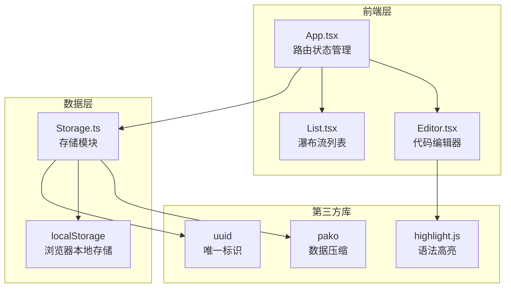

## 1. 架构设计



## 2. 技术说明

- **前端**：React 18 + TypeScript + Vite
- **初始化工具**：vite-init (react-ts模板)
- **样式方案**：CSS Modules / 内联样式（深色主题，无Tailwind）
- **后端**：无（纯前端，localStorage持久化）
- **数据库**：无（localStorage模拟持久化）

### 核心依赖

| 依赖 | 版本 | 用途 |
|------|------|------|
| react | ^18 | UI框架 |
| react-dom | ^18 | DOM渲染 |
| typescript | ^5 | 类型安全 |
| vite | ^5 | 构建工具 |
| @vitejs/plugin-react | ^4 | Vite React插件 |
| highlight.js | ^11 | 语法高亮 |
| pako | ^2 | 代码压缩/解压 |
| uuid | ^9 | 唯一ID生成 |

## 3. 路由定义

| 路由 | 用途 |
|------|------|
| / | 首页，瀑布流代码片段列表 |
| /snippet/:hash | 详情页，通过哈希查看完整代码 |

## 4. 数据模型

### 4.1 Snippet 数据结构

```typescript
interface Snippet {
  id: string;
  code: string;
  language: string;
  createdAt: number;
  hash: string;
}
```

### 4.2 存储策略

- 代码片段使用pako压缩后以Base64编码存入localStorage
- 键名格式：`snippet_{hash}`
- 哈希生成：uuid取前8位作为短哈希
- 分享链接格式：`/#/snippet/{hash}`

## 5. 模块职责划分

### 5.1 编辑器模块 (Editor.tsx)
- 集成textarea与highlight.js实时渲染
- 行号显示与同步滚动
- 语言下拉选择（JavaScript, Python, HTML, CSS, TypeScript, Java, C++, Go, Rust, SQL等）
- 语言切换时高亮自动更新，淡入切换动画
- 输出代码内容和语言类型给父组件

### 5.2 展示模块 (List.tsx)
- 瀑布流网格卡片布局
- 每张卡片显示前10行代码预览、语言标签、创建时间
- 语言标签筛选，带弹性动画
- 卡片逐项渐入动画（stagger 0.05s）
- 点击卡片进入详情页

### 5.3 存储模块 (Storage.ts)
- pako压缩/解压代码
- localStorage读写封装
- 短哈希URL生成
- 片段CRUD操作

## 6. 文件结构

```
├── package.json
├── index.html
├── tsconfig.json
├── vite.config.js
└── src/
    ├── App.tsx
    ├── Editor.tsx
    ├── Storage.ts
    └── List.tsx
```
