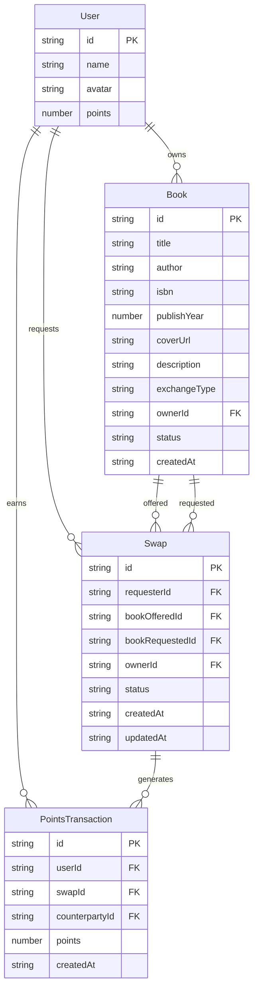

## 1. 架构设计

```mermaid
graph TB
    "前端 React+Vite" --> "API请求 axios/fetch"
    "API请求 axios/fetch" --> "后端 Express API"
    "后端 Express API" --> "bookService"
    "后端 Express API" --> "swapService"
    "后端 Express API" --> "pointsService"
    "bookService" --> "jsonStore"
    "swapService" --> "jsonStore"
    "swapService" --> "bookService"
    "pointsService" --> "jsonStore"
    "jsonStore" --> "本地JSON文件"
```

## 2. 技术说明
- 前端：React@18 + TypeScript + TailwindCSS@3 + Vite
- 初始化工具：vite-init（react-express-ts模板）
- 后端：Express@4 + TypeScript
- 数据库：本地JSON文件模拟（data/books.json, data/swaps.json, data/users.json）
- 状态管理：zustand
- 路由：react-router-dom
- 图标：lucide-react

## 3. 路由定义
| 路由 | 用途 |
|------|------|
| / | 交换广场（书籍浏览+搜索+排行榜） |
| /publish | 书籍发布页面 |
| /swaps | 交换历史与状态跟踪 |
| /profile | 个人中心（积分+我的书籍+交易明细） |

## 4. API定义

### 4.1 用户相关
```
GET    /api/users          获取所有用户
GET    /api/users/:id      获取单个用户
GET    /api/users/leaderboard  积分排行榜（前十）
```

### 4.2 书籍相关
```
GET    /api/books          获取所有书籍（支持?search=搜索&ownerId=筛选）
GET    /api/books/:id      获取单本书籍
POST   /api/books          发布新书籍
DELETE /api/books/:id      删除书籍
```

### 4.3 交换相关
```
GET    /api/swaps          获取所有交换（支持?userId=筛选&status=状态筛选）
GET    /api/swaps/:id      获取单个交换
POST   /api/swaps          创建交换请求
PUT    /api/swaps/:id/accept  接受交换
PUT    /api/swaps/:id/reject  拒绝交换
PUT    /api/swaps/:id/complete 完成交换（模拟物流后）
```

### 4.4 积分相关
```
GET    /api/points/:userId  获取用户积分和交易明细
POST   /api/points/:userId/add  增加积分
```

### 4.5 TypeScript类型定义
```typescript
interface User {
  id: string;
  name: string;
  avatar: string;
  points: number;
}

interface Book {
  id: string;
  title: string;
  author: string;
  isbn: string;
  publishYear: number;
  coverUrl: string;
  description: string;
  exchangeType: string;
  ownerId: string;
  status: 'available' | 'swapped';
  createdAt: string;
}

interface Swap {
  id: string;
  requesterId: string;
  bookOfferedId: string;
  bookRequestedId: string;
  ownerId: string;
  status: 'pending' | 'accepted' | 'rejected' | 'completed';
  createdAt: string;
  updatedAt: string;
}

interface PointsTransaction {
  id: string;
  userId: string;
  swapId: string;
  counterpartyId: string;
  points: number;
  createdAt: string;
}
```

## 5. 服务端架构图

```mermaid
graph LR
    "Express Router" --> "bookController"
    "Express Router" --> "swapController"
    "Express Router" --> "userController"
    "bookController" --> "bookService"
    "swapController" --> "swapService"
    "userController" --> "userService"
    "bookService" --> "jsonStore"
    "swapService" --> "jsonStore"
    "swapService" --> "bookService"
    "userService" --> "jsonStore"
    "jsonStore" --> "JSON文件读写"
```

## 6. 数据模型

### 6.1 数据模型定义



### 6.2 初始数据
预置3-5个模拟用户，每人2-3本已发布书籍，部分交换记录，确保平台启动即可体验完整流程。
