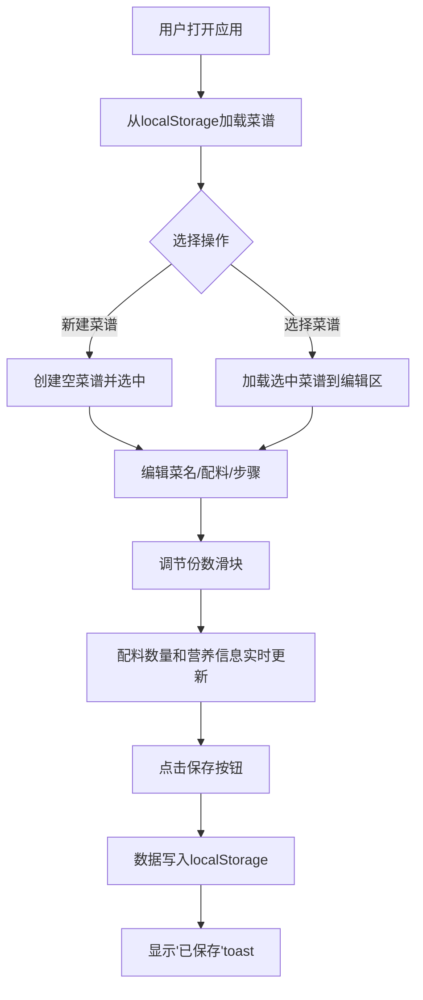

## 1. 产品概述

烹饪日志是一款面向家庭厨师的食谱记录与管理应用，让用户能够像写日记一样记录每次做菜的用料配比、步骤和心得，同时支持智能份数缩放和可视化营养标签生成。

- 核心价值：解决家庭烹饪中食谱记录不便、配料换算繁琐、营养信息不透明的痛点
- 目标用户：热爱烹饪、注重饮食健康、喜欢记录和分享菜谱的家庭厨师

## 2. 核心功能

### 2.1 用户角色

| 角色 | 注册方式 | 核心权限 |
|------|----------|----------|
| 普通用户 | 无需注册（本地存储） | 创建、编辑、删除菜谱，缩放份数，查看营养信息 |

### 2.2 功能模块

1. **主页面**：顶部操作栏、左侧菜谱列表、右侧编辑区
2. **菜谱管理**：新建菜谱、编辑菜谱、删除菜谱、本地持久化存储
3. **配料管理**：增删配料行、食材名称/数量/单位编辑、批量份数缩放
4. **步骤编辑**：支持无序列表和编号列表快捷输入的多行文本编辑
5. **份数缩放**：1-20份滑块调节，配料数量按比例实时更新
6. **营养标签**：实时计算并展示热量、蛋白质、脂肪、碳水的可视化卡片

### 2.3 页面详情

| 页面名称 | 模块名称 | 功能描述 |
|----------|----------|----------|
| 主页面 | 顶部操作栏 | 渐变色背景，左侧应用名称，右侧新建菜谱按钮 |
| 主页面 | 菜谱列表 | 300px宽侧栏，自定义细圆角滚动条，点击切换选中 |
| 主页面 | 编辑区 | 菜名输入、配料表格、步骤文本框、份数滑块、营养卡片、保存按钮 |
| 编辑区 | 配料表格 | 每行含食材名/数量/单位/删除按钮，删除时左滑淡出动画 |
| 编辑区 | 步骤文本框 | 输入"- "转圆点列表，输入"1. "转编号列表 |
| 编辑区 | 份数滑块 | 1-20范围，实时显示数值，配料与营养联动更新 |
| 编辑区 | 营养标签卡片 | 白色背景2px圆角边框，显示热量/蛋白质/脂肪/碳水 |
| 编辑区 | 保存按钮 | 保存到localStorage，底部滑入toast提示 |

## 3. 核心流程

用户打开应用 → 从本地存储加载菜谱列表 → 点击"新建菜谱"或选择已有菜谱 → 在编辑区填写菜名、配料、步骤 → 调节份数滑块查看缩放效果 → 点击保存按钮 → 数据持久化到localStorage → 显示保存成功toast

## 4. 用户界面设计

### 4.1 设计风格

- **主色调**：暖橙渐变（#ff7e5f → #feb47b），营造温馨的厨房氛围
- **辅助色**：棕色系（#d4a574, #e2d5c4），呼应食材和木质厨具
- **文字色**：深灰（#555），保证可读性
- **按钮风格**：新建菜谱按钮圆角50px，悬停上浮8px并加深阴影
- **字体**：标题使用 'Playfair Display' 衬线字体（1.8rem），正文配合手写体 'Patrick Hand'
- **布局风格**：桌面端左右两栏布局（列表300px + 编辑区自适应），移动端顶部下拉选择器
- **视觉元素**：细圆角滚动条（#d4a574色），卡片阴影，微交互动画

### 4.2 页面设计概览

| 页面名称 | 模块名称 | UI元素 |
|----------|----------|--------|
| 主页面 | 顶部操作栏 | 线性渐变背景（#ff7e5f→#feb47b），左侧衬线字体标题，右侧胶囊按钮带悬停上浮效果 |
| 主页面 | 菜谱列表 | 300px固定宽度，自定义细圆角滚动条，hover高亮选中态 |
| 编辑区 | 配料表格 | 每行末端红色圆形叉号删除按钮，点击左滑300ms淡出动画 |
| 编辑区 | 份数滑块 | 轨道#e2d5c4，滑块#ff7e5f，右侧实时显示数值 |
| 编辑区 | 营养标签卡片 | 白色背景，2px #ccc圆角边框，0.9rem字体#555色 |
| 编辑区 | Toast提示 | 从底部滑入，2秒后自动滑出，显示"已保存" |

### 4.3 响应式设计

- **设计策略**：桌面端优先，移动端自适应
- **断点**：768px
- **移动端适配**：
  - 左侧菜谱列表折叠为顶部下拉选择器（白色背景，下拉箭头动画）
  - 编辑区占满全宽
  - 保存按钮固定在底部，添加安全区域适配（env(safe-area-inset-bottom)）
- **触摸优化**：按钮最小点击区域44px，滑块拖动流畅

### 4.4 性能要求

- 所有交互响应时间 ≤ 100ms
- 份数缩放和配料表更新无卡顿（使用本地计算，避免重渲染）
- 动画使用CSS transform和opacity，保证GPU加速
- Zustand状态管理精准订阅，避免不必要的重渲染
