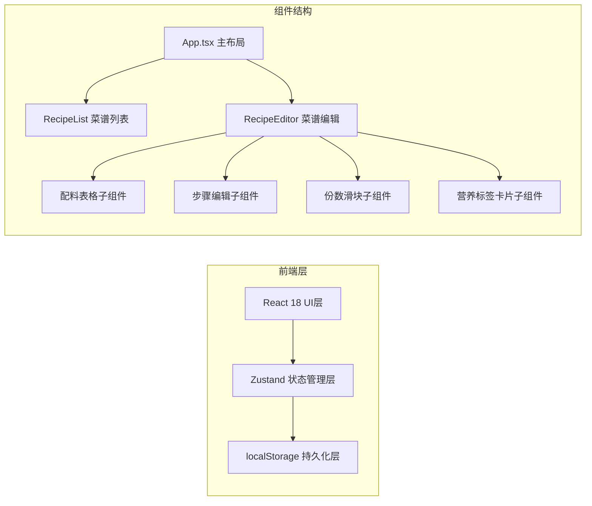
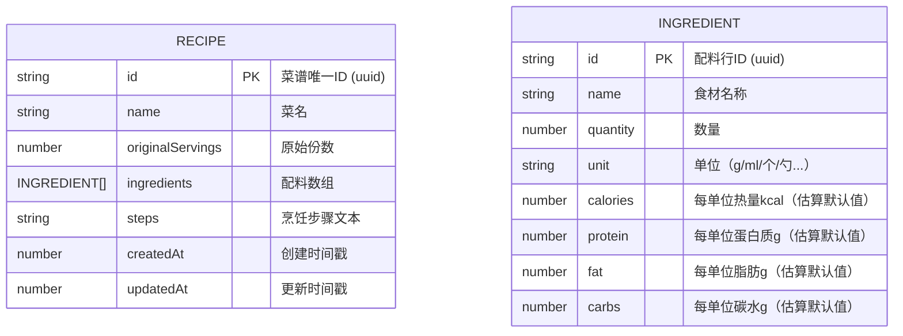

## 1. 架构设计



## 2. 技术描述

- **前端框架**：React 18 + TypeScript 5
- **构建工具**：Vite 5 + @vitejs/plugin-react
- **状态管理**：Zustand 4（轻量、高性能，支持精准订阅避免重渲染）
- **ID生成**：uuid
- **字体**：Google Fonts（Playfair Display 衬线体 + Patrick Hand 手写体）
- **样式方案**：原生CSS + CSS Modules（内联在组件中，使用CSS变量管理主题）
- **数据持久化**：localStorage（浏览器本地存储，无需后端）
- **初始化方式**：手动创建所有配置文件（非脚手架生成）

## 3. 文件结构定义

| 文件路径 | 用途 |
|----------|------|
| `/package.json` | 项目依赖配置（react, react-dom, typescript, vite, @vitejs/plugin-react, zustand, uuid），启动脚本 npm run dev |
| `/index.html` | 入口HTML，引入Google Fonts字体 |
| `/vite.config.ts` | Vite构建配置，启用@vitejs/plugin-react |
| `/tsconfig.json` | TypeScript配置，严格模式，target ES2020 |
| `/src/main.tsx` | React入口文件，渲染App组件 |
| `/src/App.tsx` | 主应用组件，左右两栏布局，包含顶部操作栏 |
| `/src/store.ts` | Zustand全局状态，管理recipes数组和currentRecipeId |
| `/src/components/RecipeList.tsx` | 菜谱列表组件，桌面端侧栏/移动端下拉选择器 |
| `/src/components/RecipeEditor.tsx` | 菜谱编辑组件，包含所有编辑功能模块 |

## 4. 数据模型

### 4.1 数据模型定义



### 4.2 Zustand Store 接口定义

```typescript
interface Recipe {
  id: string;
  name: string;
  originalServings: number;
  ingredients: Ingredient[];
  steps: string;
  createdAt: number;
  updatedAt: number;
}

interface Ingredient {
  id: string;
  name: string;
  quantity: number;
  unit: string;
  calories: number;
  protein: number;
  fat: number;
  carbs: number;
}

interface RecipeStore {
  recipes: Recipe[];
  currentRecipeId: string | null;
  currentServings: Record<string, number>; // recipeId -> 当前份数
  addRecipe: () => Recipe;
  updateRecipe: (id: string, updates: Partial<Recipe>) => void;
  deleteRecipe: (id: string) => void;
  selectRecipe: (id: string | null) => void;
  setServings: (recipeId: string, servings: number) => void;
  saveToStorage: () => void;
  loadFromStorage: () => void;
}
```

### 4.3 营养计算规则

每种配料默认提供基准营养值（可在创建配料时设置默认值），总营养计算公式：

```
总热量(kcal) = Σ(配料数量 × 每单位热量) × (当前份数 / 原始份数)
总蛋白质(g) = Σ(配料数量 × 每单位蛋白质) × (当前份数 / 原始份数)
总脂肪(g)   = Σ(配料数量 × 每单位脂肪) × (当前份数 / 原始份数)
总碳水(g)   = Σ(配料数量 × 每单位碳水) × (当前份数 / 原始份数)
```

配料数量显示保留1位小数。

## 5. 性能优化策略

1. **Zustand 选择器模式**：组件使用 selector 精准订阅所需状态片段，避免全局状态变更导致的无关组件重渲染
2. **CSS 动画优化**：删除行动画使用 transform: translateX + opacity，触发GPU合成层，不引起重排
3. **滑块节流**：份数滑块使用原生input事件，直接操作React状态（Zustand更新轻量），无需额外防抖
4. **localStorage 批量写入**：仅在点击保存时写入，避免每次编辑都触发IO操作
5. **列表虚拟滚动预留**：菜谱列表使用原生滚动（max-height + overflow），当前量级无需虚拟滚动，保持代码简洁

## 6. 交互细节实现

| 交互 | 实现方式 |
|------|----------|
| 删除行左滑淡出 | CSS类切换 + transition: transform 300ms, opacity 300ms，动画结束后从数组移除 |
| 列表快捷输入 | textarea的onChange事件中检测前缀，正则匹配"- "和"\d+\. "，自动转换为Unicode圆点或保持编号 |
| Toast滑入滑出 | fixed定位 + transform: translateY(100%) → translateY(0)，setTimeout 2秒后反向动画 |
| 自定义滚动条 | ::-webkit-scrollbar系列伪类，设置width:6px，thumb圆角+#d4a574色 |
| 按钮悬停上浮 | :hover时transform: translateY(-8px) + box-shadow加深，transition: all 0.3s |
