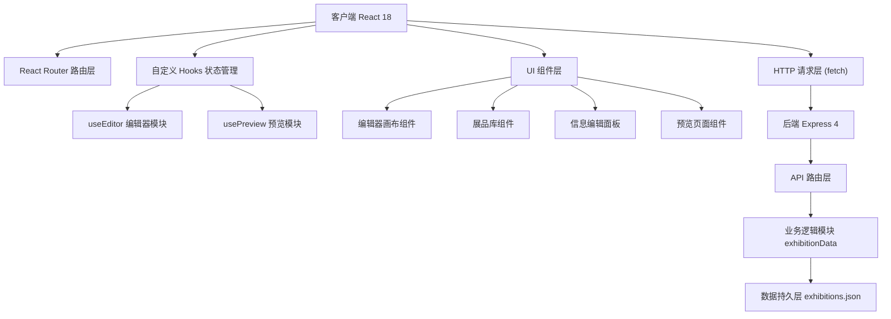
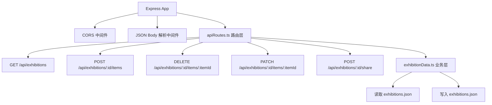
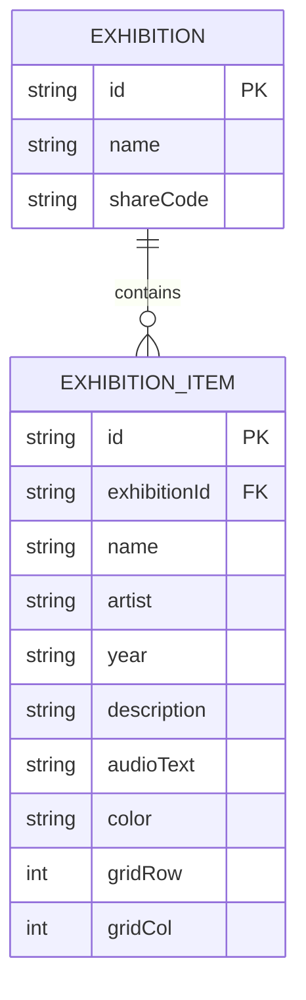

## 1. 架构设计



## 2. 技术说明

- **前端框架**：React 18 + TypeScript 5
- **构建工具**：Vite 5 + @vitejs/plugin-react
- **路由**：React Router DOM 6
- **状态管理**：useReducer + 自定义 Hooks (useEditor, usePreview)
- **HTTP通信**：原生 Fetch API
- **后端框架**：Express 4 + TypeScript
- **数据存储**：本地 JSON 文件 (exhibitions.json)
- **跨域处理**：cors 中间件 + Vite 代理
- **唯一ID**：uuid 库
- **字体**：Google Fonts Nunito

## 3. 路由定义

| 路由 | 用途 |
|------|------|
| / | 重定向到默认展览编辑页 |
| /edit/:id | 展览编辑器页面，管理展品布局和信息 |
| /preview/:id | 全屏展览预览页面，沉浸式浏览 |

## 4. API 定义

### 类型定义

```typescript
interface ExhibitionItem {
  id: string;
  name: string;
  artist: string;
  year: string;
  description: string;
  audioText: string;
  color: string;
  gridRow: number | null;
  gridCol: number | null;
}

interface Exhibition {
  id: string;
  name: string;
  shareCode: string | null;
  items: ExhibitionItem[];
}
```

### 接口列表

| 方法 | 路径 | 请求参数 | 返回值 | 描述 |
|------|------|---------|-------|------|
| GET | /api/exhibitions | - | Exhibition[] | 获取所有展览列表 |
| GET | /api/exhibitions/:id | - | Exhibition | 获取单个展览详情 |
| POST | /api/exhibitions/:id/items | ExhibitionItem | Exhibition | 添加展品到展览 |
| DELETE | /api/exhibitions/:id/items/:itemId | - | Exhibition | 删除指定展品 |
| PATCH | /api/exhibitions/:id/items/:itemId | Partial<ExhibitionItem> | Exhibition | 更新展品位置或详情 |
| POST | /api/exhibitions/:id/share | - | { shareCode: string, shareUrl: string } | 生成分享链接 |

## 5. 服务端架构



## 6. 数据模型

### 6.1 实体关系



### 6.2 初始数据

应用启动时自动创建默认展览，包含8-10件示例展品，颜色从预设调色板（暖橙、酒红、墨绿、藏蓝、紫罗兰、赭石等）中选取，每个展品带有占位信息。
