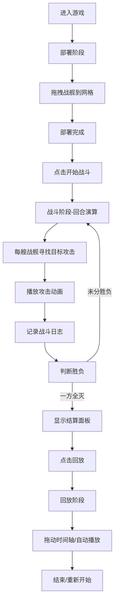

## 1. 产品概述

太空舰队战斗策略游戏是一款基于六边形网格的回合制战术模拟游戏，玩家在星际战场上部署舰队、指挥战斗并观看战斗演算，满足玩家对太空战术策略的娱乐需求。

- 核心玩法：玩家在8x8六边形网格上部署5艘己方战舰与敌方5艘战舰进行自动对战，通过战前布阵策略决定战斗胜负
- 目标用户：喜爱策略游戏、太空题材的休闲玩家
- 产品价值：提供沉浸式的太空战斗体验，通过可视化的战斗演算和回放功能增强游戏可玩性

## 2. 核心功能

### 2.1 功能模块

1. **部署阶段**：六边形网格布阵、舰船拖拽放置、战舰类型选择
2. **战斗阶段**：回合制自动演算、弹道轨迹动画、伤害数字显示、爆炸特效、战斗日志记录
3. **回放阶段**：战斗过程重播、时间轴控制、0.5倍速慢放、快进/后退功能
4. **结算面板**：胜负判定、战斗统计、重新开始选项

### 2.2 页面详情

| 页面名称 | 模块名称 | 功能描述 |
|-----------|-------------|---------------------|
| 主游戏页面 | 六边形网格战场 | 8x8六边形网格渲染、舰船Sprite显示、可部署区域高亮、敌方区域红色边框 |
| 主游戏页面 | 控制面板 | 部署阶段舰船选择、开始战斗按钮、回放控制、时间轴滑块 |
| 主游戏页面 | 战斗日志面板 | 实时滚动显示战斗事件、新事件飞入动画、日志倒序排列 |
| 主游戏页面 | 结算面板 | 胜负结果展示、战斗统计数据、回放按钮、重新开始按钮 |

## 3. 核心流程

## 4. 用户界面设计

### 4.1 设计风格

- **主色调**：深空蓝紫色渐变背景（#0a0a1f → #1a0a2e）
- **强调色**：金色（#ffd700）、亮蓝色（#00bfff）、红色（#ff4444）
- **UI元素**：白色（#ffffff）文本、半透明毛玻璃面板
- **按钮样式**：蓝紫渐变填充（#4a00e0 → #8e2de2）、圆角8px、悬浮放大1.05倍、阴影增强
- **字体**：使用Orbitron作为标题字体（科技感），Roboto作为正文字体
- **布局**：左侧70%区域为战场，右侧30%为控制面板和日志面板，1024px以下右侧折叠到底部

### 4.2 页面设计概述

| 页面名称 | 模块名称 | UI元素 |
|-----------|-------------|-------------|
| 主游戏页面 | 六边形网格战场 | 半透明网格线带脉动光效、可部署区域蓝色高亮、敌方区域红色边框、当前攻击目标金色光晕闪烁、弹道轨迹亮白色线条带蓝色尾迹 |
| 主游戏页面 | 控制面板 | 毛玻璃背景（blur: 8px）、圆角12px、柔和阴影、渐变按钮、时间轴滑块 |
| 主游戏页面 | 战斗日志面板 | 毛玻璃背景、滚动列表、新日志从底部飞入动画、超过30条自动清除 |
| 主游戏页面 | 结算面板 | 居中弹窗、毛玻璃背景、金色标题、胜负结果动画、操作按钮组 |

### 4.3 响应式设计

- **桌面端（>1024px）**：左右分栏布局，左侧战场70%，右侧面板30%
- **平板/移动端（≤1024px）**：上下布局，战场占上半部分，面板折叠到底部可展开
- **触控优化**：按钮最小尺寸48x48px，拖拽操作支持触摸事件

### 4.4 动画与特效指引

- **网格脉动**：网格线透明度在0.3-0.6之间缓慢脉动（周期2秒）
- **弹道动画**：攻击弹道使用ease-out缓动，持续0.5秒，带蓝色尾迹淡出效果
- **伤害数字**：命中时目标闪烁红色3次，伤害数字从目标位置向上漂浮，随机横向偏移，1秒后淡出
- **爆炸特效**：粒子扩散（最多50个粒子）+ 碎片飞散（最多8个碎片），粒子数量限制在200以内
- **按钮悬浮**：放大1.05倍，box-shadow增强，过渡时长0.2s ease-out
- **日志飞入**：新日志从底部translateY(20px) + opacity 0 → translateY(0) + opacity 1，过渡时长0.3s

## 5. 性能要求

- 战斗动画帧率：≥30FPS
- 回放帧率：≥20FPS
- 粒子特效并发数：≤200个
- 内存占用：≤200MB
- 首屏加载时间：≤3秒
