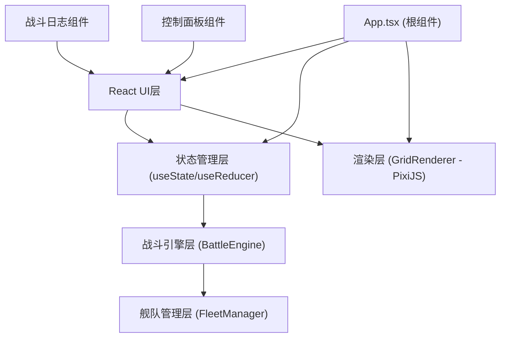

## 1. 架构设计



## 2. 技术栈说明

- **前端框架**: React@18 + TypeScript@5
- **构建工具**: Vite@5 + @vitejs/plugin-react@4
- **渲染引擎**: PixiJS@7 (用于六边形网格、舰船Sprite和战斗动画渲染)
- **工具库**: uuid@9 (生成唯一ID)
- **样式方案**: 原生CSS + CSS变量，无需额外UI库
- **动画方案**: CSS transitions + PixiJS tweening + requestAnimationFrame

## 3. 目录结构

```
e:\solo\SoloAutoDemo\tasks\auto124\
├── index.html
├── package.json
├── tsconfig.json
├── vite.config.js
└── src/
    ├── App.tsx                    # 根组件，游戏状态管理
    ├── main.tsx                   # 应用入口
    ├── index.css                  # 全局样式
    ├── engine/
    │   ├── FleetManager.ts        # 舰队管理模块
    │   └── BattleEngine.ts        # 战斗引擎模块
    ├── renderer/
    │   └── GridRenderer.ts        # PixiJS渲染模块
    ├── components/
    │   ├── BattleLog.tsx          # 战斗日志组件
    │   └── ControlPanel.tsx       # 控制面板组件
    └── types/
        └── index.ts               # TypeScript类型定义
```

## 4. 核心数据模型

### 4.1 类型定义

```typescript
// 舰船类型
type ShipType = 'frigate' | 'destroyer' | 'cruiser';

// 阵营
type Faction = 'player' | 'enemy';

// 游戏阶段
type GamePhase = 'deploy' | 'battle' | 'replay' | 'result';

// 六边形坐标（轴向坐标系）
interface HexCoord {
  q: number;  // 列
  r: number;  // 行
}

// 舰船属性
interface Ship {
  id: string;
  type: ShipType;
  name: string;
  faction: Faction;
  hp: number;
  maxHp: number;
  attack: number;
  range: number;
  position: HexCoord | null;
  isAlive: boolean;
}

// 舰船基础配置
interface ShipConfig {
  type: ShipType;
  name: string;
  hp: number;
  attack: number;
  range: number;
}

// 攻击事件
interface AttackEvent {
  id: string;
  round: number;
  attackerId: string;
  attackerName: string;
  targetId: string;
  targetName: string;
  damage: number;
  isKill: boolean;
  timestamp: number;
}

// 回合结果
interface RoundResult {
  round: number;
  events: AttackEvent[];
  playerFleet: Ship[];
  enemyFleet: Ship[];
  isGameOver: boolean;
  winner: Faction | null;
}

// 动画状态
interface AnimationState {
  type: 'projectile' | 'damage' | 'explosion' | 'target-highlight';
  shipId: string;
  targetId?: string;
  progress: number;
  startTime: number;
}
```

### 4.2 舰船基础配置

| 类型 | 名称 | 血量 | 攻击力 | 射程 |
|------|------|------|--------|------|
| 护卫舰 (frigate) | 护卫舰 | 30 | 8 | 2 |
| 驱逐舰 (destroyer) | 驱逐舰 | 50 | 15 | 3 |
| 巡洋舰 (cruiser) | 巡洋舰 | 80 | 25 | 4 |

## 5. 核心模块接口定义

### 5.1 FleetManager 接口

```typescript
class FleetManager {
  // 创建舰队
  createFleet(faction: Faction, shipTypes: ShipType[]): Ship[];
  
  // 对舰船造成伤害
  applyDamage(ship: Ship, damage: number): { isDead: boolean; remainingHp: number };
  
  // 检查舰队是否全灭
  isFleetDestroyed(fleet: Ship[]): boolean;
  
  // 复制舰队状态
  cloneFleet(fleet: Ship[]): Ship[];
}
```

### 5.2 BattleEngine 接口

```typescript
class BattleEngine {
  constructor(playerFleet: Ship[], enemyFleet: Ship[]);
  
  // 模拟单回合战斗
  simulateRound(): RoundResult;
  
  // 获取完整战斗日志
  getFullBattleLog(): AttackEvent[];
  
  // 获取所有回合结果（用于回放）
  getAllRoundResults(): RoundResult[];
  
  // 计算两个六边形之间的距离
  static getHexDistance(a: HexCoord, b: HexCoord): number;
  
  // 寻找最近的目标
  static findNearestTarget(attacker: Ship, targets: Ship[]): Ship | null;
}
```

### 5.3 GridRenderer 接口

```typescript
class GridRenderer {
  constructor(container: HTMLElement, width: number, height: number);
  
  // 渲染网格
  renderGrid(): void;
  
  // 更新舰船显示
  updateShips(playerFleet: Ship[], enemyFleet: Ship[]): void;
  
  // 更新动画
  updateAnimation(deltaTime: number, animations: AnimationState[]): void;
  
  // 显示攻击弹道
  showProjectile(from: HexCoord, to: HexCoord, onComplete: () => void): void;
  
  // 显示伤害数字
  showDamage(position: HexCoord, damage: number): void;
  
  // 显示爆炸特效
  showExplosion(position: HexCoord): void;
  
  // 高亮目标
  highlightTarget(position: HexCoord): void;
  
  // 清除高亮
  clearHighlights(): void;
  
  // 设置游戏阶段
  setPhase(phase: GamePhase): void;
  
  // 获取点击的六边形坐标
  getHexAtPosition(screenX: number, screenY: number): HexCoord | null;
  
  // 销毁渲染器
  destroy(): void;
  
  // 事件回调
  onHexClick: (coord: HexCoord) => void;
  onShipDragStart: (shipId: string) => void;
  onShipDragEnd: (shipId: string, coord: HexCoord | null) => void;
}
```

## 6. 组件Props定义

### 6.1 BattleLog 组件

```typescript
interface BattleLogProps {
  events: AttackEvent[];
  maxEntries?: number;
}
```

### 6.2 ControlPanel 组件

```typescript
interface ControlPanelProps {
  phase: GamePhase;
  availableShips: { type: ShipType; count: number }[];
  currentRound: number;
  totalRounds: number;
  replaySpeed: number;
  selectedShipType: ShipType | null;
  winner: Faction | null;
  onSelectShipType: (type: ShipType | null) => void;
  onStartBattle: () => void;
  onReplay: () => void;
  onRestart: () => void;
  onReplaySpeedChange: (speed: number) => void;
  onTimelineChange: (round: number) => void;
}
```

## 7. 六边形网格坐标系统

使用轴向坐标系（Axial Coordinates）：
- 每个六边形由 (q, r) 两个坐标表示
- 8x8 网格：q ∈ [0, 7], r ∈ [0, 7]
- 像素坐标转换公式：
  - x = size * (3/2 * q)
  - y = size * (sqrt(3)/2 * q + sqrt(3) * r)
- 距离计算公式：distance = (|q1 - q2| + |q1 + r1 - q2 - r2| + |r1 - r2|) / 2

## 8. 性能优化策略

1. **PixiJS 渲染优化**：
   - 使用对象池（Object Pool）管理粒子和弹道Sprite
   - 离屏Canvas预渲染六边形网格纹理
   - 限制同时显示的粒子数量≤200

2. **React 渲染优化**：
   - 使用 React.memo 包装 BattleLog 和 ControlPanel
   - 战斗日志使用虚拟滚动（仅渲染可见区域）
   - 避免不必要的重渲染

3. **动画优化**：
   - 使用 requestAnimationFrame 统一调度动画
   - 弹道动画使用 PixiJS tweening 系统
   - 离屏元素自动暂停动画

4. **内存管理**：
   - 战斗结束后清理PixiJS纹理和对象池
   - 组件卸载时调用renderer.destroy()
   - 及时移除事件监听器

## 9. 构建配置

### 9.1 package.json 依赖

```json
{
  "dependencies": {
    "react": "^18.2.0",
    "react-dom": "^18.2.0",
    "pixi.js": "^7.4.0",
    "uuid": "^9.0.1"
  },
  "devDependencies": {
    "@types/react": "^18.2.0",
    "@types/react-dom": "^18.2.0",
    "@types/uuid": "^9.0.7",
    "typescript": "^5.3.0",
    "vite": "^5.0.0",
    "@vitejs/plugin-react": "^4.2.0"
  }
}
```

### 9.2 tsconfig.json 配置

```json
{
  "compilerOptions": {
    "target": "ES2020",
    "useDefineForClassFields": true,
    "lib": ["ES2020", "DOM", "DOM.Iterable"],
    "module": "ESNext",
    "skipLibCheck": true,
    "moduleResolution": "bundler",
    "allowImportingTsExtensions": true,
    "resolveJsonModule": true,
    "isolatedModules": true,
    "noEmit": true,
    "jsx": "react-jsx",
    "strict": true,
    "noUnusedLocals": true,
    "noUnusedParameters": true,
    "noFallthroughCasesInSwitch": true,
    "esModuleInterop": true
  },
  "include": ["src"]
}
```
