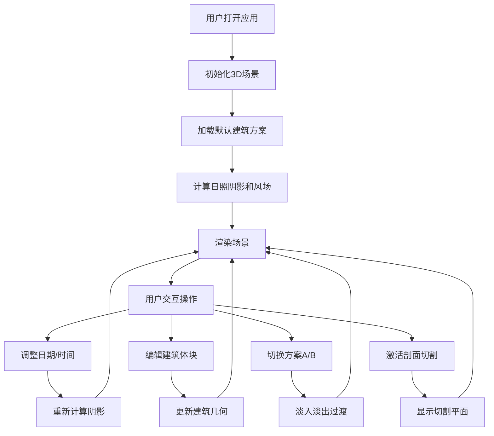

## 1. 产品概述

街区日照与风环境分析仪是一款面向城市规划师、建筑师的沉浸式3D可视化评估工具，通过实时模拟建筑体块对周围街区的日照阴影和风环境影响，帮助设计师和业主更高效地沟通和决策。

- 核心目标：提供直观、实时的建筑环境影响评估，降低沟通成本，提升设计方案质量
- 目标用户：城市规划师、建筑设计师、地产开发商
- 核心价值：将复杂的环境分析转化为直观的3D可视化表达，支持多方案对比决策

## 2. 核心功能

### 2.1 用户角色

| 角色 | 注册方式 | 核心权限 |
|------|----------|----------|
| 规划师 | 无需注册 | 添加/编辑建筑、调整日照参数、切换方案、查看分析结果 |

### 2.2 功能模块

1. **主场景页**：3D场景渲染、建筑体块管理、日照阴影模拟、风场粒子可视化
2. **控制面板**：日期选择、时间滑块、方案切换、剖面切割控制
3. **对比分析面板**：多方案指标对比、条形图展示
4. **图例面板**：颜色对应关系说明

### 2.3 页面详情

| 页面名称 | 模块名称 | 功能描述 |
|----------|----------|----------|
| 主场景页 | 3D渲染区 | 全屏Three.js场景，展示建筑、阴影、风场粒子，支持轨道控制 |
| 主场景页 | 控制面板 | 左上角悬浮毛玻璃面板，包含日期下拉、时间滑块、方案切换、剖面开关 |
| 主场景页 | 对比面板 | 右侧滑出面板，展示方案A/B的日照时长和风场强度对比条形图 |
| 主场景页 | 图例面板 | 右下角悬浮面板，解释风速颜色渐变和阴影区域标识 |

## 3. 核心流程

用户进入应用后，默认加载一组示例建筑体块。用户可以：
1. 调整日期和时间滑块，观察阴影变化
2. 切换风场显示，查看粒子流线分布
3. 添加/编辑/删除建筑体块
4. 在方案A和方案B之间切换对比
5. 激活剖面切割平面进行深度分析

## 4. 用户界面设计

### 4.1 设计风格

- **主色调**：深蓝灰（#1a2332）作为深色背景，浅灰蓝（#e8edf3）作为文本和控件
- **强调色**：橙色系（#ff8c42）用于阴影标识和重要交互元素
- **风场渐变色**：蓝色（#3b82f6）→ 绿色（#22c55e）→ 红色（#ef4444）表示风速从低到高
- **材质风格**：毛玻璃效果（backdrop-filter: blur(10px)），半透明深色面板
- **按钮风格**：矩形圆角设计，0.2s cubic-bezier 弹性反馈动画
- **字体**：现代无衬线字体，清晰专业的工程软件风格

### 4.2 页面设计概述

| 页面名称 | 模块名称 | UI 元素 |
|----------|----------|----------|
| 主场景页 | 3D场景 | 全屏Canvas，建筑体块，阴影投射，风场粒子，地面网格 |
| 主场景页 | 控制面板 | 半透明深色背景，毛玻璃效果，日期下拉菜单，渐变时间滑块，方案切换标签，剖面开关按钮 |
| 主场景页 | 对比面板 | 右侧滑出，并排条形图，日照时长指标，风场强度指标 |
| 主场景页 | 图例面板 | 右下角，风速颜色条，阴影标识说明 |

### 4.3 响应性

- 桌面端优先设计，主3D场景占页面80%以上
- 移动端（视口宽度<768px）：UI元素自动缩小，控制面板改为横向排列，对比面板改为底部弹出
- 触摸优化：增大触摸区域，支持手势缩放旋转场景

### 4.4 3D 场景指导

- **环境**：深色背景，简洁的地面网格，突出建筑体块和阴影效果
- **光照**：方向光模拟太阳光，支持动态调整方位角和高度角，开启阴影投射
- **相机**：透视相机，初始俯视角，支持OrbitControls轨道控制
- **后处理**：柔和阴影边缘，建筑选中时的发光轮廓效果
- **动画**：阴影随时间平滑过渡，风场粒子连续流动，方案切换淡入淡出（1秒）
- **性能目标**：30 FPS以上，粒子数量2000以内，计算响应时间<50ms
