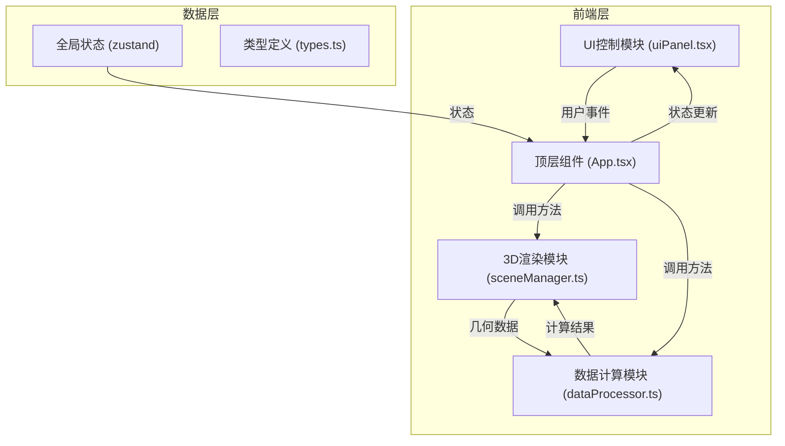

## 1. 架构设计



**数据流向说明**：
1. 用户操作 → uiPanel → App.tsx回调 → sceneManager更新场景
2. App.tsx → dataProcessor计算 → 结果回传 → sceneManager渲染
3. sceneManager建筑几何信息 → dataProcessor计算阴影和风场 → 返回sceneManager

## 2. 技术描述

- **前端框架**：React 18 + TypeScript
- **构建工具**：Vite 5
- **3D引擎**：Three.js (r160+)
- **图表库**：d3.js (v7)
- **状态管理**：zustand
- **UI样式**：CSS Modules + 原生CSS
- **路由**：单页应用，无需路由
- **包管理器**：npm

### 核心依赖

| 依赖 | 版本 | 用途 |
|------|------|------|
| react | ^18.2.0 | UI框架 |
| react-dom | ^18.2.0 | DOM渲染 |
| typescript | ^5.3.0 | 类型安全 |
| vite | ^5.0.0 | 构建工具 |
| @vitejs/plugin-react | ^4.2.0 | React支持 |
| three | ^0.160.0 | 3D渲染引擎 |
| @types/three | ^0.160.0 | Three.js类型定义 |
| d3 | ^7.8.0 | 数据可视化（风场流线） |
| zustand | ^4.4.0 | 状态管理 |
| uuid | ^9.0.0 | 唯一ID生成 |
| @types/uuid | ^9.0.0 | uuid类型定义 |

## 3. 目录结构

```
src/
├── App.tsx              # 顶层组件，全局状态管理，事件分发
├── main.tsx             # 入口文件
├── index.css            # 全局样式
├── types/
│   └── index.ts         # 类型定义（建筑、太阳位置、风场等）
├── scene/
│   └── sceneManager.ts  # 3D渲染模块
├── data/
│   └── dataProcessor.ts # 数据计算模块
├── components/
│   ├── UIPanel.tsx      # UI控制面板
│   ├── ComparePanel.tsx # 方案对比面板
│   └── LegendPanel.tsx  # 图例面板
├── hooks/
│   └── useStore.ts      # zustand store
└── utils/
    └── sunCalc.ts       # 太阳位置计算工具
```

## 4. 数据模型

### 4.1 建筑体块 (Building)

```typescript
interface Building {
  id: string;
  name: string;
  x: number;       // X轴位置
  z: number;       // Z轴位置
  width: number;   // 宽度（X方向）
  depth: number;   // 深度（Z方向）
  height: number;  // 高度
  color: string;   // 材质颜色
  opacity: number; // 透明度
  selected?: boolean;
}
```

### 4.2 太阳位置 (SunPosition)

```typescript
interface SunPosition {
  azimuth: number;   // 方位角（弧度）
  altitude: number;  // 高度角（弧度）
  date: string;      // 日期标识：'spring' | 'summer' | 'autumn' | 'winter'
  time: number;      // 时间（小时，如 12.5 表示12:30）
}
```

### 4.3 风场数据 (WindData)

```typescript
interface WindRose {
  direction: number;  // 风向（度，0°为北，顺时针）
  speed: number;      // 风速（m/s）
}

interface WindGridCell {
  x: number;
  y: number;
  z: number;
  velocity: { x: number; y: number; z: number };
  speed: number;
}
```

### 4.4 方案数据 (Scheme)

```typescript
interface Scheme {
  id: string;
  name: string;
  buildings: Building[];
  metrics: {
    avgSunshineHours: number;  // 平均日照时长
    avgWindSpeed: number;      // 平均风速
  };
}
```

### 4.5 剖面切割 (SectionPlane)

```typescript
interface SectionPlane {
  active: boolean;
  axis: 'x' | 'z';
  position: number;
}
```

## 5. 核心算法

### 5.1 太阳位置计算
- 基于日期（二分二至日）和时间计算太阳方位角和高度角
- 使用简化的天文公式计算

### 5.2 阴影投射
- 使用Three.js方向光 + ShadowMap实现硬阴影
- 阴影边缘添加柔和模糊效果
- 地面阴影区域用半透明橙色遮罩标识

### 5.3 风场粒子系统
- 基于风玫瑰数据生成初始速度场
- 使用简化的流体绕流算法计算建筑周围的风场
- 粒子沿流线移动，颜色根据风速渐变
- 粒子数量控制在2000以内保证性能

### 5.4 剖面切割
- 使用Three.js的ClippingPlanes实现建筑切割
- 切割面上显示风场速度热力图

## 6. 性能优化

- 风场粒子使用BufferGeometry + Points材质
- 阴影贴图分辨率适中，平衡质量与性能
- 建筑体块使用InstancedMesh优化（如数量较多时）
- 计算逻辑在requestAnimationFrame中合理分配
- 粒子更新使用对象池复用，避免频繁GC
