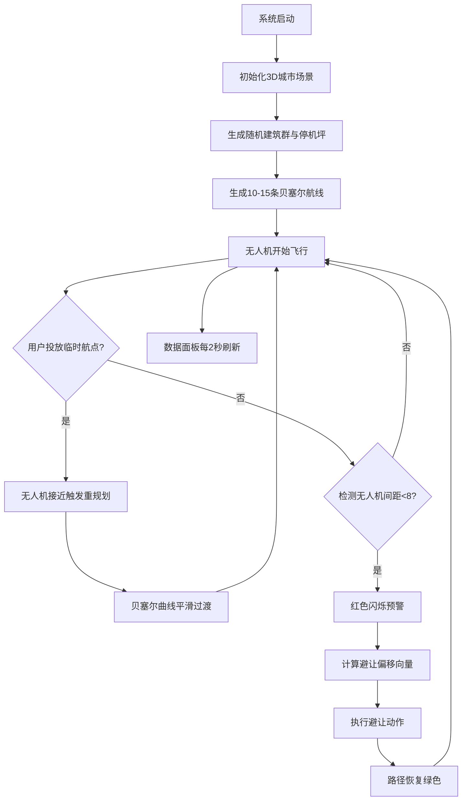

## 1. 产品概述

城市空中无人机交通管制可视化系统，用于模拟未来低空物流场景中多架无人机在同一空域的协同飞行管理。解决无人机碰撞风险、航线规划缺失、动态避让不可视化等核心问题，为城市低空交通管理提供直观的决策支持与演示平台。

- **目标用户**：城市规划者、物流企业、航空管制研究人员、智慧城市决策者
- **核心价值**：可视化展示无人机空域协同、碰撞预警与动态避让机制，辅助低空空域管理决策

---

## 2. 核心功能

### 2.1 功能模块

1. **3D城市场景模块**：随机生成建筑群（20+栋）、道路网格、屋顶停机坪，提供沉浸式低空飞行环境
2. **无人机航线系统**：10-15条贝塞尔曲线路径，无人机匀速飞行，LED灯带颜色区分航线
3. **临时航点投放**：拖拽投放临时航点，触发动态路径重规划与平滑过渡动画
4. **碰撞预警与避让**：实时距离检测、红色预警闪烁、自动避让计算与路径恢复
5. **实时数据面板**：飞行架次统计、冲突计数、平均路径长度，2秒刷新带动画

### 2.2 页面详情

| 页面名称 | 模块名称 | 功能描述 |
|---------|---------|---------|
| 主控制面板 | 3D场景画布 | Three.js渲染城市、无人机、航线，支持鼠标旋转/平移/缩放 |
| 主控制面板 | 实时数据面板 | 右上角显示飞行统计数据，数字更新上浮动画 |
| 主控制面板 | 拖拽投放区 | 右下角磨砂玻璃面板，支持拖拽临时航点到3D场景 |
| 主控制面板 | 碰撞事件日志 | 显示最近碰撞预警事件列表 |

---

## 3. 核心流程

### 3.1 主流程描述
系统初始化时自动生成3D城市场景与无人机航线，无人机沿贝塞尔曲线匀速飞行。用户可从控制面板拖拽临时航点投放至场景中，当无人机接近时触发路径重规划。系统持续检测无人机间距，距离过近时触发碰撞预警与自动避让，完成后恢复正常飞行。

### 3.2 流程图

---

## 4. 用户界面设计

### 4.1 设计风格
- **主色调**：深蓝色 #0a0e27 到深紫色 #1a1a3e 渐变背景
- **强调色**：航线蓝 #4fc3f7、预警红 #ff5252、安全绿 #69f0ae、航点橙 #ffab40
- **建筑风格**：半透明低多边形（透射效果），科技感赛博朋克风格
- **面板风格**：磨砂玻璃（backdrop-filter: blur + 半透明背景）
- **字体**：使用现代无衬线字体，数字使用等宽字体增强科技感
- **交互反馈**：悬停上浮2px + 阴影加深微动画

### 4.2 页面设计概览

| 页面名称 | 模块名称 | UI元素 |
|---------|---------|---------|
| 主控制界面 | 3D场景 | 全屏Canvas，建筑群半透明，航线发光线条，无人机LED灯带 |
| 主控制界面 | 数据面板 | 右上角悬浮，磨砂玻璃，4个数据卡片，数字更新上浮动画 |
| 主控制界面 | 控制面板 | 右下角磨砂玻璃，拖拽区橙色发光球预览，事件日志列表 |

### 4.3 响应式设计
- 桌面优先（1920x1080），自适应笔记本（1366x768）
- 3D场景始终占满视口，UI面板绝对定位悬浮
- 控制面板在小屏幕下自动缩小，拖拽区保持可点击区域

### 4.4 3D场景指引
- **环境**：深蓝紫色雾效，营造未来夜空氛围
- **光照**：环境光 + 方向光模拟月光，建筑内部透射光
- **相机**：透视相机，初始45°俯视角度，轨道控制器支持自由视角
- **后处理**：Bloom发光效果（航线、航点、无人机LED）
- **性能**：30FPS+，粒子数≤2000，建筑使用InstancedMesh优化
