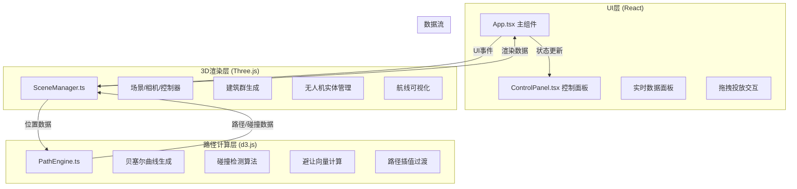

## 1. 架构设计



---

## 2. 技术说明

- **前端框架**：React 18 + TypeScript (严格模式)
- **构建工具**：Vite 5 + @vitejs/plugin-react
- **3D渲染**：Three.js r160（场景管理、模型渲染、动画循环）
- **路径计算**：d3.js v7（贝塞尔曲线插值、路径数据处理）
- **状态管理**：React useState/useRef（轻量级状态，无需Zustand）
- **辅助库**：uuid（唯一ID生成）、dat.gui（调试参数面板，可选）
- **样式方案**：原生CSS + CSS Modules（无Tailwind，按用户指定文件结构）

---

## 3. 目录结构

```
auto131/
├── package.json
├── index.html
├── tsconfig.json
├── vite.config.js
└── src/
    ├── main.tsx              # React入口
    ├── App.tsx               # 主应用组件
    ├── core/
    │   ├── SceneManager.ts   # 3D场景管理器
    │   └── PathEngine.ts     # 路径计算引擎
    └── ui/
        └── ControlPanel.tsx  # UI控制面板
```

---

## 4. 核心数据模型

### 4.1 类型定义

```typescript
// 三维坐标点
interface Vec3 {
  x: number;
  y: number;
  z: number;
}

// 建筑数据
interface Building {
  id: string;
  position: Vec3;
  width: number;
  height: number;
  depth: number;
  color: string;
  hasPad: boolean;
}

// 无人机实体
interface Drone {
  id: string;
  position: Vec3;
  targetPosition: Vec3;
  pathProgress: number;
  speed: number;
  color: string;
  routeId: string;
  isColliding: boolean;
  avoidanceOffset: Vec3;
}

// 航线数据
interface Route {
  id: string;
  waypoints: Vec3[];
  curvePoints: Vec3[];
  color: string;
  startPad: Vec3;
  endPad: Vec3;
  isTransitioning: boolean;
  transitionProgress: number;
  oldCurvePoints?: Vec3[];
}

// 临时航点
interface TemporaryWaypoint {
  id: string;
  position: Vec3;
  consumedBy: string[];
}

// 飞行统计数据
interface FlightStats {
  totalFlights: number;
  activeFlights: number;
  recentConflicts: number[];
  avgPathLength: number;
}

// 碰撞事件日志
interface CollisionEvent {
  id: string;
  timestamp: number;
  droneA: string;
  droneB: string;
  distance: number;
}
```

---

## 5. 关键算法

### 5.1 贝塞尔曲线路径生成
```
输入：起点、终点、3-6个中间控制点
输出：沿曲线采样的密集点数组（用于无人机飞行与线条渲染）
算法：d3.line().curve(d3.curveCatmullRom.alpha(0.5)) 生成平滑曲线
```

### 5.2 碰撞检测
```
遍历所有无人机对：
  distance = sqrt((x1-x2)² + (y1-y2)² + (z1-z2)²)
  if distance < 8:
    标记两架无人机为碰撞状态
    计算避让方向（右偏3 + 上抬2）
    更新避让偏移向量
```

### 5.3 动态路径重规划
```
当无人机距离临时航点 < 5:
  1. 保存当前曲线路径为 oldCurvePoints
  2. 在航点列表中插入临时航点
  3. 重新生成贝塞尔曲线
  4. 启动2秒过渡动画（线性插值混合新旧路径）
  5. 过渡完成后清除旧路径
```

---

## 6. 性能优化策略

1. **建筑渲染**：使用 InstancedMesh 合并多栋建筑的Draw Call
2. **航线渲染**：使用 BufferGeometry + LineBasicMaterial，顶点数最小化
3. **动画循环**：requestAnimationFrame 驱动，仅更新必要矩阵
4. **碰撞检测**：空间网格划分（可选），O(n²)对于15架无人机可接受
5. **粒子控制**：总数严格限制在2000以内，航点与LED使用简单几何体
