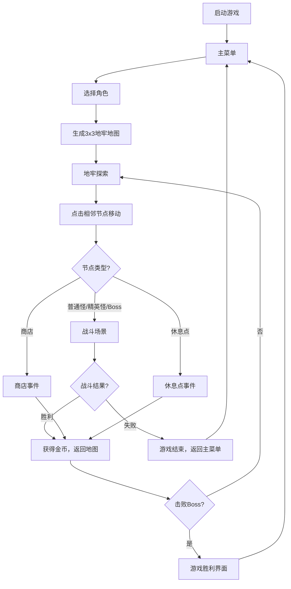

## 1. 产品概述
深渊牌局是一款融合Roguelike元素的回合制卡牌对战游戏原型，玩家选择角色组建牌组探索随机生成的3x3地牢，通过出牌对战击败Boss。
- 面向独立游戏爱好者、策略卡牌玩家，提供高重玩度的策略深度体验
- 产品价值：验证Roguelike+卡牌对战的核心玩法循环，提供可扩展的游戏原型框架

## 2. 核心功能

### 2.1 用户角色
| 角色 | 注册方式 | 核心权限 |
|------|----------|----------|
| 玩家 | 无需注册，本地启动 | 进行游戏、选择角色、探索地牢、战斗、购买卡牌 |

### 2.2 功能模块
1. **主菜单**：游戏标题、开始游戏按钮、角色选择面板
2. **地牢探索**：3x3节点地图、节点移动、事件触发
3. **战斗场景**：回合制卡牌对战、手牌管理、能量系统、敌人AI
4. **商店系统**：金币消费、卡牌购买、生命恢复
5. **休息点**：生命恢复、能量上限升级
6. **结算界面**：胜利/失败展示、统计信息

### 2.3 页面详情
| 页面名称 | 模块名称 | 功能描述 |
|-----------|-------------|---------------------|
| 主菜单 | 角色选择 | 3个预设角色（战士/法师/刺客）卡片展示，翻牌动画切换，显示生命值、能量、技能信息 |
| 主菜单 | 开始游戏 | 确认角色后启动游戏，生成地牢和初始牌组 |
| 地牢探索 | 地图视图 | 3x3节点网格，显示节点类型、连接路径、玩家位置、已探索状态 |
| 地牢探索 | 节点移动 | 点击相邻未探索节点移动，触发对应事件 |
| 战斗场景 | 玩家区域 | 显示玩家生命/能量/技能冷却/手牌，卡牌拖拽出牌 |
| 战斗场景 | 敌方区域 | 显示敌人像素精灵、生命值、行动意图 |
| 战斗场景 | 回合系统 | 玩家回合抽牌、出牌、结束回合，敌人回合AI自动行动 |
| 商店事件 | 卡牌购买 | 3张随机卡牌轮播展示，消耗金币购买 |
| 商店事件 | 生命恢复 | 消耗金币恢复20%最大生命值 |
| 休息点事件 | 恢复选项 | 回复30%生命值或永久+1能量上限 |
| 结算界面 | 胜利/失败 | 全屏遮罩展示，统计数据，自动返回主菜单 |

## 3. 核心流程
玩家启动游戏 → 选择角色（战士/法师/刺客）→ 生成3x3地牢地图 → 从左上角节点开始探索 → 点击相邻节点移动 → 触发事件（战斗/商店/休息/Boss）→ 战斗：玩家回合抽牌→出牌→结束回合→敌人回合→循环至一方死亡 → 击败Boss胜利或生命归零失败 → 返回主菜单

## 4. 用户界面设计

### 4.1 设计风格
- **主色调**：深紫(#1a0a2e)背景 + 暗金(#c9a13b)强调色
- **按钮风格**：圆角按钮，悬停从暗金渐变到亮金（transition 0.2s），点击scale(0.95)下压效果
- **字体**：Georgia, serif 中世纪衬线风格
- **布局风格**：左右两栏布局，左侧地图(40%)、右侧玩家状态+手牌(60%)
- **图标风格**：CSS绘制像素风精灵，几何图形组合

### 4.2 页面设计概述
| 页面名称 | 模块名称 | UI元素 |
|-----------|-------------|-------------|
| 主菜单 | 角色卡片 | 圆角卡片、渐变背景、翻牌动画(3D rotateY)、生命/能量数值 |
| 地牢探索 | 地图节点 | 60x60px圆角正方形，普通怪深红、精英怪暗金(脉动光晕)、Boss紫红(旋转光晕)、商店绿、休息点蓝，√/骷髅/金币通关图标 |
| 地牢探索 | 节点连接 | 半透明白色虚线(dashed)，线宽2px，节点间距80px |
| 战斗场景 | 背景 | 暗红色径向渐变 |
| 战斗场景 | 角色精灵 | CSS矩形带眼睛和特征的像素风，玩家左侧、敌人右侧 |
| 战斗场景 | 手牌区域 | 扇形展开4张可见，重叠30px，悬停放大1.2倍+上移30px |
| 战斗场景 | 卡牌 | 深紫金边卡背，正面：顶部牌名、左上能量圆标、中部描述、下方类型徽章 |
| 战斗场景 | 回合提示 | 屏幕中央半透明背景，"你的回合"/"敌人回合"淡入淡出1秒 |
| 战斗场景 | 伤害数字 | 漂浮±10px随机偏移，玩家伤害黄色、敌人伤害红色，0.3秒缩放消失 |
| 战斗场景 | 击杀效果 | 20个彩色粒子飞散0.5秒 |
| 商店事件 | 卡牌轮播 | 左右箭头切换3张随机卡牌 |
| 胜利界面 | 焰火粒子 | 彩色粒子从下往上喷发 |

### 4.3 响应式
- Desktop-first设计
- 最小支持宽度1024px，此分辨率下固定布局不缩放
- 不做移动端适配

### 4.4 性能要求
- 战斗期间每帧渲染 ≤ 16ms (60FPS)
- 随机地牢/牌组生成 ≤ 100ms
- WebSocket消息延迟 < 200ms (局域网)
