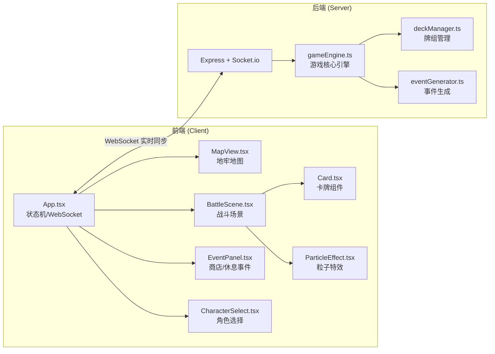
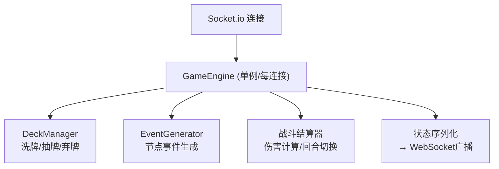

## 1. 架构设计



## 2. 技术说明
- **前端框架**：React@18 + TypeScript@5 + Vite@5
- **前端状态**：React useState/useReducer + WebSocket推送
- **后端框架**：Express@4 + Socket.io@4
- **通信协议**：WebSocket (Socket.io) 实时双向通信
- **工具库**：uuid (唯一ID生成)、concurrently (并行启动前后端)
- **构建工具**：Vite (前端开发服务器) + tsc (TypeScript编译)

## 3. 项目结构
```
auto134/
├── package.json                 # 根配置，concurrently启动前后端
├── vite.config.js               # Vite配置，WebSocket代理到后端
├── tsconfig.json                # TypeScript严格模式
├── index.html                   # 游戏入口HTML
├── server/
│   └── src/
│       ├── index.ts             # Express + Socket.io服务器入口
│       ├── gameEngine.ts        # 游戏引擎：状态管理、战斗结算、地牢生成
│       ├── deckManager.ts       # 牌组管理：洗牌、抽牌、弃牌
│       └── eventGenerator.ts    # 事件生成：战斗/商店/休息事件数据
├── client/
│   └── src/
│       ├── App.tsx              # 主入口：WebSocket连接、状态机、UI渲染
│       ├── types.ts             # 共享类型定义
│       ├── CharacterSelect.tsx  # 角色选择界面
│       ├── MapView.tsx          # 3x3地牢地图组件
│       ├── BattleScene.tsx      # 战斗场景组件
│       ├── EventPanel.tsx       # 商店/休息点事件面板
│       ├── Card.tsx             # 卡牌组件(含拖拽)
│       ├── ParticleEffect.tsx   # 粒子特效组件
│       └── styles.css           # 全局样式和动画
└── shared/                      # (可选)前后端共享类型
```

## 4. WebSocket消息协议

### 客户端 → 服务器
| 事件名 | Payload | 说明 |
|--------|---------|------|
| `start_game` | `{ characterId: string }` | 选择角色开始游戏 |
| `move_node` | `{ nodeId: string }` | 移动到指定节点 |
| `play_card` | `{ cardId: string, targetId: string }` | 出牌到目标 |
| `end_turn` | `{}` | 结束当前回合 |
| `shop_buy_card` | `{ cardId: string }` | 商店购买卡牌 |
| `shop_heal` | `{}` | 商店恢复生命 |
| `rest_heal` | `{}` | 休息点恢复生命 |
| `rest_upgrade_energy` | `{}` | 休息点升级能量上限 |
| `use_skill` | `{}` | 使用角色技能 |

### 服务器 → 客户端
| 事件名 | Payload | 说明 |
|--------|---------|------|
| `game_state` | `GameState` | 全量游戏状态同步 |
| `battle_effect` | `{ type, damage, targetId, particles }` | 战斗特效数据 |
| `turn_change` | `{ turn: 'player' \| 'enemy' }` | 回合切换通知 |
| `error` | `{ message: string }` | 错误信息 |

## 5. 数据模型

### 核心类型定义
```typescript
// 角色
interface Character {
  id: string;
  name: string;
  description: string;
  maxHp: number;
  maxEnergy: number;
  skill: { name: string; description: string; cooldown: number };
  startingDeck: string[]; // card ids
}

// 卡牌
interface Card {
  id: string;
  instanceId?: string;
  name: string;
  type: 'attack' | 'defense' | 'skill';
  cost: number;
  damage?: number;
  block?: number;
  description: string;
}

// 地牢节点
interface DungeonNode {
  id: string;
  row: number;
  col: number;
  type: 'normal' | 'elite' | 'boss' | 'shop' | 'rest';
  explored: boolean;
  cleared: boolean;
  connections: string[]; // connected node ids
}

// 敌人
interface Enemy {
  id: string;
  name: string;
  maxHp: number;
  hp: number;
  intent: { type: 'attack' | 'defend'; value: number };
}

// 游戏状态
interface GameState {
  phase: 'menu' | 'exploring' | 'battle' | 'event' | 'victory' | 'defeat';
  player: {
    characterId: string;
    hp: number;
    maxHp: number;
    energy: number;
    maxEnergy: number;
    gold: number;
    skillCooldown: number;
    block: number;
  };
  deck: Card[];
  hand: Card[];
  discardPile: Card[];
  dungeon: {
    nodes: DungeonNode[];
    currentNodeId: string | null;
  };
  battle: {
    enemies: Enemy[];
    turn: 'player' | 'enemy';
    turnNumber: number;
  } | null;
  event: {
    type: 'shop' | 'rest';
    data: ShopData | RestData;
  } | null;
}
```

## 6. 后端服务架构



### 模块职责与数据流
1. **gameEngine.ts**
   - 职责：管理完整游戏状态机，处理玩家行动指令，执行战斗结算，生成随机地牢
   - 数据流：接收客户端action → 调用deckManager/eventGenerator → 更新state → 推送game_state

2. **deckManager.ts**
   - 职责：Fisher-Yates洗牌算法，抽牌(考虑手牌上限5)，弃牌，牌组耗尽时重洗弃牌堆
   - 数据流：gameEngine调用drawCards/discardCard → 返回更新后的deck/hand/discardPile

3. **eventGenerator.ts**
   - 职责：根据节点类型生成对应事件数据，随机敌人属性，商店随机卡牌池
   - 数据流：gameEngine在玩家移动时调用generateEvent(node) → 返回事件data
