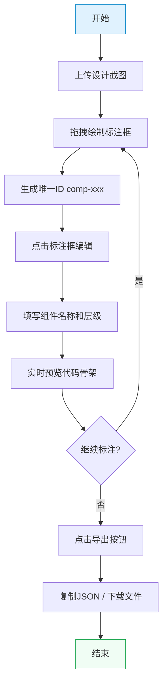

## 1. 产品概述

DesignScribe 是一款面向设计师与前端开发者的协作工具，解决视觉设计稿难以快速映射为结构化HTML/CSS组件层次的痛点。用户上传设计截图后，通过可视化框选标注生成组件代码框架，大幅降低沟通成本，提升开发效率。

- 目标用户：UI设计师、前端开发者、产品经理
- 核心价值：将视觉设计 → 结构化组件代码框架的一键转换桥梁

## 2. 核心功能

### 2.1 用户角色

| 角色 | 使用场景 | 核心能力 |
|------|----------|----------|
| 设计师 | 交付设计稿时标注组件结构 | 框选组件、命名层级、导出配置 |
| 前端开发者 | 接收设计稿快速搭建页面框架 | 查看标注、复制代码、下载配置 |

### 2.2 功能模块

1. **主工作页**：画布标注区、编辑面板、顶部导航、状态栏
2. **画布标注**：图片上传、矩形拖拽绘制、框选高亮、标签显示
3. **编辑面板**：组件命名、层级描述、代码骨架预览
4. **导出系统**：JSON配置复制、文件下载、Toast反馈
5. **历史系统**：撤销(Ctrl+Z)、重做(Ctrl+Shift+Z)、步骤追踪

### 2.3 页面详情

| 页面名称 | 模块名称 | 功能描述 |
|-----------|-------------|---------------------|
| 主工作页 | 顶部导航栏 | 应用Logo、项目标题、导出下拉按钮 |
| 主工作页 | 状态栏 | 当前步骤数显示、快捷键提示 |
| 主工作页 | 画布区域 | 图片显示、矩形拖拽绘制、标注框交互 |
| 主工作页 | 编辑面板 | 组件ID展示、名称输入、层级输入、代码预览 |
| 主工作页 | Toast层 | 操作反馈提示（复制成功、下载完成等） |

## 3. 核心流程

用户上传PNG/JPG设计截图，在画布上按住鼠标拖拽绘制矩形框，系统自动生成唯一ID并显示标签。点击标注框，右侧编辑面板滑入，填写组件名称和层级关系，系统实时预览代码骨架。完成所有标注后，点击导出按钮复制JSON到剪贴板或下载文件。操作过程中支持Ctrl+Z撤销、Ctrl+Shift+Z重做，状态栏实时追踪操作步骤。

## 4. 用户界面设计

### 4.1 设计风格
- **主色调**：工业风浅灰蓝，背景 #f4f6f9，标注框 #3b82f6，聚焦青色 #06b6d4
- **按钮风格**：圆角4px，悬停0.2s背景色过渡，按下轻微缩放
- **字体**：系统等宽字体用于代码预览，无衬线字体用于界面文本
- **布局风格**：顶部固定导航 + 左右分栏（70%画布 / 30%面板）
- **图标风格**：线性简洁图标，统一24px尺寸

### 4.2 页面设计概览

| 页面名称 | 模块名称 | UI元素 |
|-----------|-------------|-------------|
| 主工作页 | 顶部导航栏 | 深色渐变背景(#1e293b→#334155，白色Logo文字，导出按钮带下拉箭头 |
| 主工作页 | 画布区域 | 浅灰背景，图片居中，标注框半透明蓝填充(2px边框，左上角标签白底带ID |
| 主工作页 | 编辑面板 | 白底阴影卡片，输入框聚焦亮青光晕，代码区深色背景语法高亮 |
| 主工作页 | Toast层 | 顶部滑入，深灰背景白色文字，2秒淡出 |
| 主工作页 | 状态栏 | 画布上方半透明条，步骤计数，快捷键说明 |

### 4.3 响应式
- 桌面端(≥768px)：左右分栏布局，画布70%，面板30%
- 移动端(<768px)：画布全宽，编辑面板改为底部抽屉式弹出，遮罩层半透明黑
- 触摸优化：标注框最小触控区域44px，拖拽支持双指缩放画布
