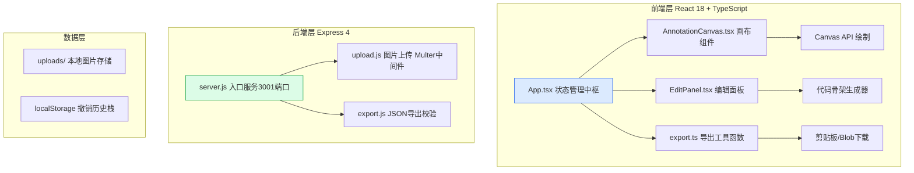
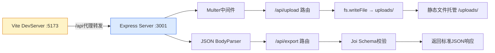

## 1. 架构设计



## 2. 技术说明

- **前端**：React 18 + TypeScript + Vite 5，无额外UI框架，纯CSS Modules实现工业风样式
- **初始化工具**：vite-init react-ts模板（手动调整以适配Express后端）
- **后端**：Express 4 + Multer 1.4 + uuid 9，端口3001提供REST API
- **构建脚本**：concurrently 并发启动前后端，dev脚本同时监听Vite 5173和Express 3001
- **代码高亮**：自定义正则实现轻量HTML语法高亮，无第三方依赖
- **状态管理**：React useState + useReducer实现撤销历史栈，Context共享全局状态

## 3. 路由定义

| 路由路径 | 用途 | 方法 |
|-----------|------|------|
| / | 前端主页面（Vite托管） | GET |
| /api/upload | 上传PNG/JPG设计截图 | POST |
| /api/export | 校验并生成JSON下载链接 | POST |
| /uploads/:filename | 访问已上传图片 | GET |

## 4. API定义

### 4.1 类型定义

```typescript
interface Annotation {
  id: string;
  x: number;
  y: number;
  width: number;
  height: number;
  componentName: string;
  parentName: string;
  tagType: 'div' | 'button' | 'img' | 'nav' | 'header' | 'section';
  createdAt: number;
}

interface HistoryState {
  past: Annotation[][];
  present: Annotation[];
  future: Annotation[][];
  step: number;
  totalSteps: number;
}

interface ExportPayload {
  imageUrl: string;
  timestamp: number;
  annotations: Annotation[];
}
```

### 4.2 请求/响应格式

**POST /api/upload**
- Request: multipart/form-data, field: `image`
- Response: `{ success: true, url: "/uploads/xxx.png", filename: "xxx.png" }`

**POST /api/export**
- Request: `{ annotations: Annotation[], imageName: string }`
- Response: `{ success: true, filename: "annotations_17188xxxxx.json", data: ExportPayload }`

## 5. 服务端架构图



## 6. 核心文件组织

```
项目根目录
├── package.json          # 前后端统一依赖，concurrently启动脚本
├── index.html            # Vite入口HTML，挂载#root
├── tsconfig.json         # TypeScript严格模式
├── vite.config.js        # Vite代理配置，/api→:3001
├── server/
│   ├── server.js         # Express入口，3001端口
│   ├── upload.js         # Multer图片上传路由
│   └── export.js         # JSON导出校验路由
├── uploads/              # 图片存储目录（git忽略）
└── src/
    ├── App.tsx           # 主组件，撤销重做状态管理
    ├── AnnotationCanvas.tsx  # 画布，Canvas API绘标注框
    ├── EditPanel.tsx     # 右侧滑入面板，代码骨架预览
    └── export.ts         # 复制剪贴板，下载Blob工具
```
