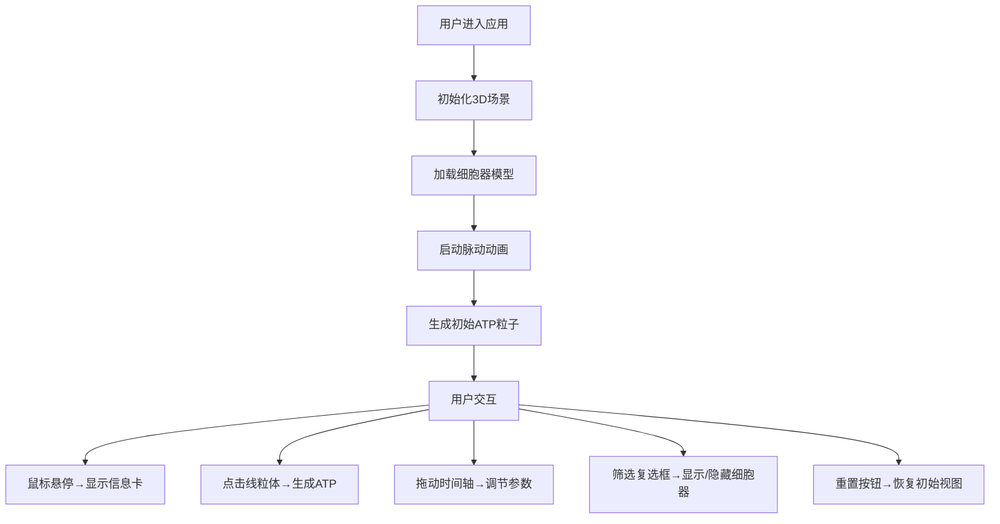

## 1. 产品概述

细胞微环境3D可视化模拟器是一款面向生物学家的交互式教学演示工具，通过三维可视化技术直观展示细胞内部细胞器的结构、位置关系及动态物质交换过程。

- 主要用途：教学演示、学术报告中的细胞结构展示
- 目标用户：生物教师、研究人员、学生
- 核心价值：将抽象的微观细胞结构转化为直观可交互的3D模型，提升学习和展示效果

## 2. 核心功能

### 2.1 功能模块

1. **主界面**：3D细胞场景渲染区、右侧控制面板、顶部进度条、底部时间轴
2. **3D交互模块**：旋转缩放查看、悬停信息显示、点击触发ATP生成
3. **动画模拟模块**：细胞器脉动动画、ATP粒子运输动画、时间轴调速
4. **数据可视化模块**：D3.js力导向图展示细胞器分布关系

### 2.2 页面详情

| 页面名称 | 模块名称 | 功能描述 |
|-----------|-------------|---------------------|
| 主界面 | 3D渲染区 | 展示透明细胞膜及内部6种细胞器的立体结构，支持鼠标旋转缩放 |
| 主界面 | 悬停信息卡 | 鼠标悬停0.5秒后显示细胞器名称、功能描述和大小占比 |
| 主界面 | ATP进度条 | 顶部显示当前活跃ATP粒子数量（0-30） |
| 主界面 | 时间轴滑块 | 底部300px宽度滑块，控制0-10秒模拟时间，调节代谢速度 |
| 主界面 | 右侧控制面板 | 细胞器筛选、视图重置、当前速度倍率显示 |

## 3. 核心流程

## 4. 用户界面设计

### 4.1 设计风格

- **主色调**：深色背景 #1a1a2e，蓝紫渐变 #4a4e69 到 #6c63ff
- **辅助色**：细胞器专属色（细胞核红、线粒体橙红、叶绿体绿、高尔基体紫、内质网浅蓝、液泡淡紫）
- **字体**：现代无衬线字体，标题加粗，正文清晰易读
- **UI控件**：圆角设计，半透明磨砂效果，悬停放大动画，点击涟漪反馈
- **整体风格**：科技感、专业、沉浸感强的科研可视化风格

### 4.2 页面设计概述

| 页面名称 | 模块名称 | UI Elements |
|-----------|-------------|-------------|
| 主界面 | 3D渲染区 | 深色星空背景，线框细胞膜，发光细胞器，金色ATP粒子 |
| 主界面 | 信息卡 | 半透明白色背景，圆角8px，跟随鼠标偏移15px，淡入动画0.3s |
| 主界面 | 控制面板 | 宽度240px，backdrop-filter: blur(8px)，内部控件间距统一 |
| 主界面 | 时间轴 | 白色细线轨道，滑块带实时数值标签，刻度标记0-10秒 |
| 主界面 | 进度条 | 顶部细条，金色填充，显示ATP数量比例 |

### 4.3 响应式设计

- **桌面端**（≥1024px）：控制面板固定右侧，3D场景自适应剩余空间
- **平板端**（768-1024px）：控制面板宽度缩减至200px
- **移动端**（<768px）：控制面板折叠为底部抽屉，点击展开

### 4.4 3D场景设计

- **环境**：深色渐变背景，微弱点光模拟微观环境
- **光照**：环境光+方向光+点光源组合，突出细胞器立体感
- **相机**：PerspectiveCamera，初始距离15单位，支持OrbitControls
- **动画**：细胞器脉动（幅度0.05-0.15，周期2秒），ATP粒子匀速运动
- **后处理**：Bloom效果增强发光感，抗锯齿处理
- **性能预算**：6个细胞器+50个ATP粒子，稳定45FPS以上
