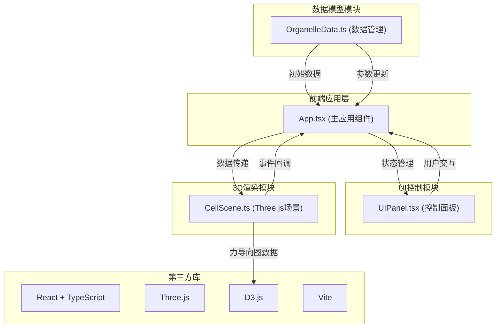
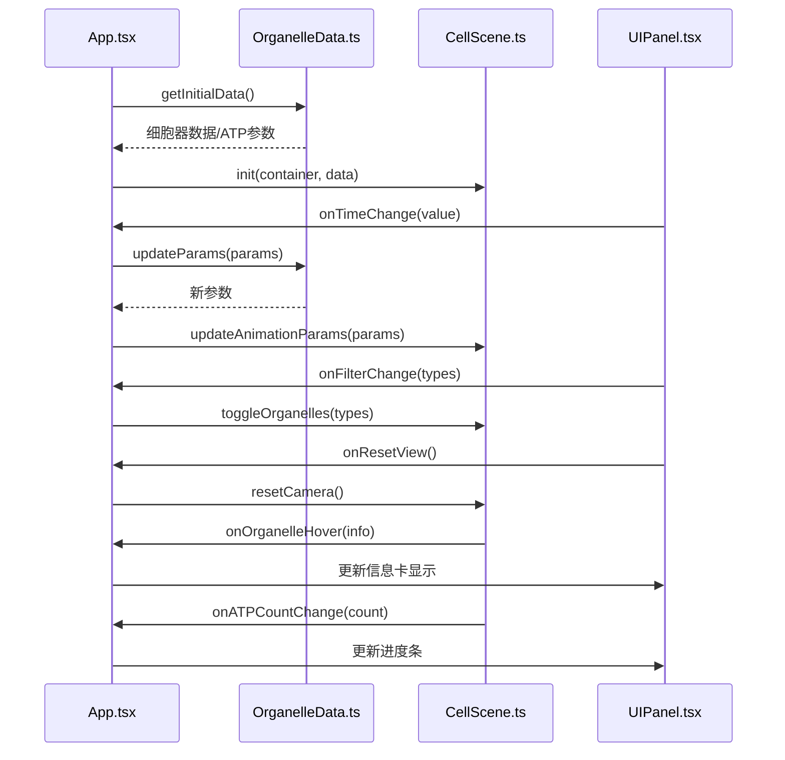

## 1. 架构设计



## 2. 技术栈说明

- **前端框架**：React 18 + TypeScript 5
- **3D渲染**：Three.js 0.160（含OrbitControls）
- **数据可视化**：D3.js 7
- **构建工具**：Vite 5
- **状态管理**：React useState/useRef（轻量级，无需额外状态库）
- **工具库**：uuid（生成唯一ID）
- **样式方案**：原生CSS + CSS变量（不使用Tailwind，避免与Three.js场景冲突）

## 3. 模块调用关系



## 4. 文件结构

```
project-root/
├── package.json
├── vite.config.js
├── tsconfig.json
├── index.html
└── src/
    ├── main.tsx          # React入口
    ├── App.tsx           # 主应用组件
    ├── index.css         # 全局样式
    └── modules/
        ├── OrganelleData.ts   # 数据模型模块
        ├── CellScene.ts     # 3D渲染模块
        └── UIPanel.tsx     # UI控制模块
```

## 5. 数据模型定义

### 5.1 细胞器数据结构

```typescript
interface Organelle {
  id: string;
  type: 'nucleus' | 'mitochondrion' | 'chloroplast' | 'golgi' | 'er' | 'vacuole';
  name: string;
  position: { x: number; y: number; z: number };
  radius: number;
  radiusY?: number;
  color: string;
  description: string;
  sizePercentage: number;
  count?: number;
}

interface ATPParams {
  generationInterval: number;  // 生成间隔(ms)
  moveSpeed: number;          // 移动速度(单位/秒)
  maxCount: number;           // 最大同时存在数
}

interface AnimationParams {
  pulseAmplitude: number;    // 脉动幅度
  pulsePeriod: number;      // 脉动周期(秒)
}
```

### 5.2 数据流向

1. **OrganelleData.ts** → 提供静态细胞器初始数据和ATP参数
2. **App.tsx** → 接收数据并管理应用状态
3. **CellScene.ts** → 使用数据渲染3D场景
4. **UIPanel.tsx** → 展示数据并接收用户输入
5. 用户交互 → 更新App状态 → 同步到各模块

## 6. 性能优化策略

1. **3D渲染优化**：
   - 使用BufferGeometry替代Geometry
   - ATP粒子复用对象池，避免频繁创建销毁
   - 悬停检测使用Raycaster，限制检测频率
   - 动画循环使用requestAnimationFrame，合并更新
   - 离屏渲染减少绘制调用

2. **React性能优化**：
   - 使用useMemo缓存计算结果
   - 使用useCallback避免不必要重渲染
   - 信息卡使用CSS transform提升渲染层

3. **帧率保证**：
   - 目标帧率：稳定45FPS以上
   - 悬停时帧率下降≤5%
   - 使用Chrome DevTools Performance面板监控

## 7. 核心算法说明

### 7.1 ATP粒子运动算法
- 粒子从线粒体表面随机方向射出
- 目标点为细胞膜上随机点
- 匀速运动，到达后淡出销毁
- 超出最大数量时停止生成

### 7.2 时间轴参数插值算法
- 时间值0-10秒线性映射
- ATP生成间隔：500ms → 200ms
- ATP移动速度：0.3 → 0.8
- 脉动幅度：0.05 → 0.15
- 使用线性插值：current = start + (end - start) * (time / 10)

### 7.3 悬停检测算法
- Raycaster检测鼠标与物体相交
- 0.5秒防抖延迟显示
- 发光效果通过 emissiveIntensity 实现
