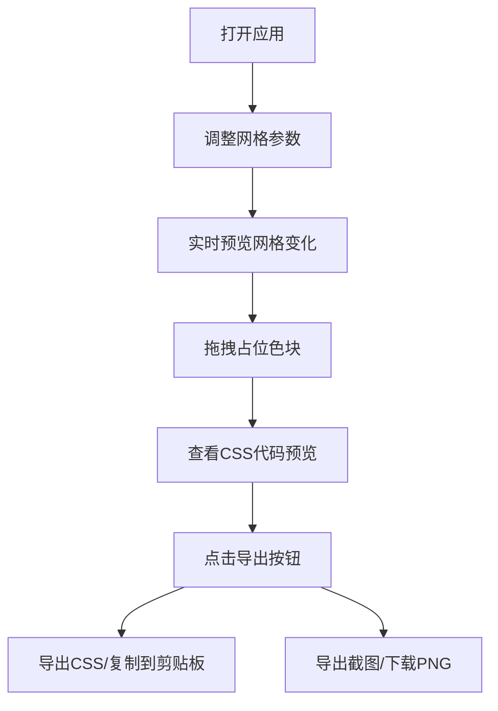

## 1. 产品概述
CSS Grid Layout Designer 是一款面向前端开发者和设计师的交互式CSS网格布局可视化设计工具。用户通过拖拽与数值输入即可自由编辑响应式网格系统的各项参数，实时预览布局效果，并一键导出可使用的CSS代码与布局截图。

- 主要目标：解决传统网格布局调试中"改代码-刷新-查看"循环效率低下的痛点
- 目标用户：Web开发者、UI/UX设计师、前端学习者

## 2. 核心功能

### 2.1 用户角色
| 角色 | 注册方式 | 核心权限 |
|------|----------|----------|
| 访客用户 | 无需注册 | 使用全部设计、预览、导出功能 |

### 2.2 功能模块
1. **控制面板模块**：列数滑块、间距滑块、内边距滑块、列偏移输入框、导出菜单
2. **网格预览模块**：12列可视化网格渲染、可拖拽占位色块、目标列高亮提示
3. **代码预览模块**：实时CSS代码生成、语法高亮显示
4. **导出模块**：CSS代码复制到剪贴板、布局截图导出PNG

### 2.3 页面详情
| 页面名称 | 模块名称 | 功能描述 |
|----------|----------|----------|
| 主设计页 | 控制面板 | 提供滑块和输入框调整网格参数（列数4-24、间距0-48px、内边距0-48px、列偏移），支持导出操作 |
| 主设计页 | 网格预览区 | 实时渲染CSS Grid布局，显示带边框的网格单元格，支持拖拽占位色块调整列宽和偏移 |
| 主设计页 | 代码预览区 | 实时显示当前配置对应的CSS代码，关键字和数值语法高亮 |

## 3. 核心流程
用户打开应用 → 调整控制面板参数（滑块/输入框）→ 实时查看网格预览变化 → 拖拽占位色块调整布局 → 查看生成的CSS代码 → 点击导出按钮 → 选择导出CSS（复制到剪贴板）或导出截图（下载PNG文件）

## 4. 用户界面设计

### 4.1 设计风格
- 主色调：#6366f1（靛蓝色）
- 辅助色：#facc15（黄色-代码高亮）、#22c55e（绿色-数值高亮）
- 背景色：页面#e2e8f0、控制面板#ffffff、预览区#f0f4f8、代码区#1e293b
- 按钮风格：圆角8px，主色背景，悬停变深
- 字体：等宽字体'Fira Code'用于代码展示，系统无衬线字体用于界面文字
- 布局风格：左右两栏布局，桌面端并排，移动端上下堆叠
- 阴影风格：柔和阴影 box-shadow: 0 4px 12px rgba(0,0,0,0.05)

### 4.2 页面设计概述
| 页面名称 | 模块名称 | UI元素 |
|----------|----------|--------|
| 主设计页 | 控制面板 | 300px宽度、白色背景、圆角16px、功能分组带分隔线、滑块主题色#6366f1、滑块把手半径10px |
| 主设计页 | 网格预览区 | 占右侧70%宽度、最小500px、浅蓝灰背景#f0f4f8、网格边框#cbd5e1 1px、占位色块不同颜色圆角8px |
| 主设计页 | 代码预览区 | 深色背景#1e293b、Fira Code等宽字体、关键字黄色高亮、数值绿色高亮 |

### 4.3 响应式
- Desktop-first设计，窗口宽度≥900px时左右两栏并排
- 窗口宽度<900px时改为上下堆叠布局，控制面板在上，预览区在下
- 控制面板宽度自适应100%，内部控件布局折行
- 触控操作优化：滑块和按钮尺寸适合触摸操作

### 4.4 动效设计
- 所有交互控件带平滑过渡：transition: all 0.2s ease
- 滑块把手hover时放大1.2倍
- 占位色块hover时上浮6px并加深阴影
- 拖拽过程中目标列显示半透明蓝色高亮（#6366f1，透明度0.3）
- 复制成功提示3秒后自动消失
- 导出截图时显示旋转环形加载动画
