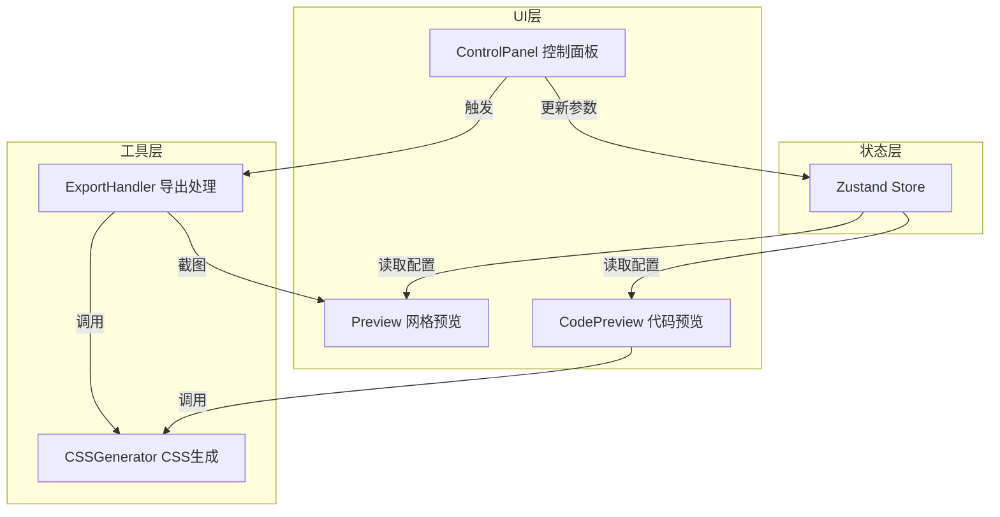

## 1. 架构设计


## 2. 技术说明
- 前端框架：React@18 + TypeScript@5 + Vite@5
- 状态管理：zustand@4
- 构建工具：Vite@5 + @vitejs/plugin-react
- 截图导出：html-to-image@1
- 文件下载：file-saver@2
- 样式方案：原生CSS（不使用Tailwind CSS，按需求使用自定义CSS）
- 不包含后端和数据库

## 3. 路由定义
| 路由 | 用途 |
|------|------|
| / | 主设计页面（单页应用，无其他路由） |

## 4. API定义
本项目为纯前端应用，无后端API。

## 5. 数据模型

### 5.1 网格参数状态模型
```typescript
interface GridBlock {
  id: string;
  color: string;
  columnStart: number;
  columnSpan: number;
  rowStart: number;
  rowSpan: number;
}

interface GridState {
  columns: number;        // 网格列数 4-24
  gap: number;            // 列间距 0-48px
  padding: number;        // 容器内边距 0-48px
  columnOffset: number;   // 列偏移量
  blocks: GridBlock[];    // 占位色块数组
  
  // Actions
  setColumns: (n: number) => void;
  setGap: (n: number) => void;
  setPadding: (n: number) => void;
  setColumnOffset: (n: number) => void;
  updateBlock: (id: string, updates: Partial<GridBlock>) => void;
  addBlock: () => void;
  removeBlock: (id: string) => void;
}
```

## 6. 目录结构
```
.
├── index.html                  # 入口页面
├── package.json                # 依赖与脚本
├── vite.config.ts              # Vite构建配置
├── tsconfig.json               # TypeScript配置（严格模式，ES2020）
└── src/
    ├── App.tsx                 # 主组件，组装控制面板与预览区域
    ├── store.ts                # Zustand状态管理
    ├── components/
    │   ├── Preview.tsx         # 网格预览渲染组件
    │   ├── ControlPanel.tsx    # 控制面板组件
    │   └── CodePreview.tsx     # CSS代码预览组件
    └── utils/
        ├── CSSGenerator.ts     # CSS代码生成工具
        └── ExportHandler.ts    # 导出功能（截图+代码复制）
```

## 7. 数据流说明
1. ControlPanel 通过 Zustand 的 actions 更新 store 中的网格参数
2. Preview 组件订阅 store，读取最新配置并渲染 12 列网格和可拖拽色块
3. CodePreview 组件订阅 store，将参数传给 CSSGenerator 获取格式化 CSS 字符串并渲染
4. ExportHandler 接收 store 参数和 Preview 的 DOM 引用：
   - 调用 CSSGenerator 生成 CSS 并复制到剪贴板
   - 调用 html-to-image 将 Preview 区域转为 PNG 并通过 file-saver 下载

## 8. 性能约束
- 滑块拖动更新延迟 < 50ms（使用 requestAnimationFrame 驱动渲染）
- 截图导出完成时间 < 2秒，超时显示提示
