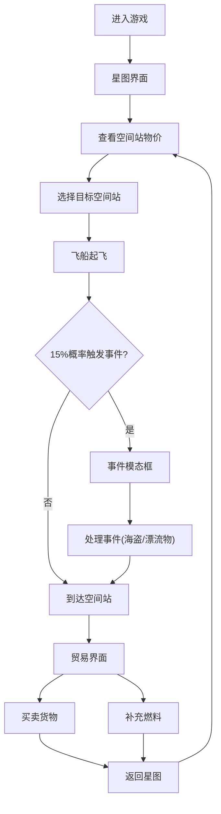

## 1. 产品概述

像素风星际贸易跑商游戏，玩家驾驶飞船在随机生成的星域中进行货物贸易，通过低买高卖赚取信用点，途中可能遭遇星际海盗和随机事件，最终目标是升级飞船或积累足够财富退休。

- 核心玩法：空间贸易模拟 + 随机事件探索
- 目标用户：喜欢策略经营、休闲探索类游戏的玩家
- 产品价值：提供轻松有趣的太空贸易体验，结合像素风格与现代动效

## 2. 核心功能

### 2.1 用户角色

| 角色 | 注册方式 | 核心权限 |
|------|----------|----------|
| 玩家 | 无需注册，本地存储 | 完整游戏体验，数据本地持久化 |

### 2.2 功能模块

1. **星图主界面**：2D星图展示、空间站分布、飞船导航、粒子背景
2. **贸易系统**：货物买卖、价格浮动、货仓管理、资金结算
3. **事件系统**：海盗遭遇、漂流货物、随机判定
4. **状态管理**：信用点、燃料、飞船属性、游戏进度

### 2.3 页面详情

| 页面名称 | 模块名称 | 功能描述 |
|---------|---------|----------|
| 星图主界面 | 星图渲染 | Canvas绘制星空背景和空间站，支持点击导航 |
| 星图主界面 | 飞船飞行 | 点击空间站触发飞船飞行动画，1-3秒到达 |
| 星图主界面 | 随机事件 | 飞行途中15%概率触发遭遇事件模态框 |
| 贸易面板 | 空间站货物 | 左侧展示货物列表、买入价、持有量，价格浮动动画 |
| 贸易面板 | 玩家货仓 | 右侧展示8格货仓，每格堆叠上限99 |
| 贸易面板 | 买卖交易 | 点击货物买入/卖出，资金数字滚动动画 |
| 贸易面板 | 状态显示 | 顶部显示信用点余额和燃料值，燃料补充功能 |
| 事件模态框 | 海盗勒索 | 选择支付信用点或战斗，文字选项判定 |
| 事件模态框 | 漂流货物 | 免费获得1-3个随机货物 |

## 3. 核心流程

玩家进入游戏 → 查看星图上的空间站和物价 → 选择目标空间站点击 → 飞船起飞（可能触发随机事件）→ 到达空间站 → 打开贸易界面 → 买卖货物 → 补充燃料 → 前往下一个空间站 → 循环积累财富。

## 4. 用户界面设计

### 4.1 设计风格

- **主色调**：深空蓝紫色渐变背景 (#1a0a2e → #0d1b2a)
- **强调色**：霓虹蓝绿渐变按钮 (#00f5d4 → #00bbf9)
- **势力配色**：
  - 联邦：蓝色 (#4ea8de)
  - 帝国：红色 (#e63946)
  - 商会：金色 (#ffd166)
  - 自由港：绿色 (#06d6a0)
  - 科技联盟：紫色 (#9d4edd)
- **按钮样式**：圆角8px，霓虹渐变，悬停放大1.05倍+发光阴影
- **字体**：像素风格字体 "Press Start 2P" + 无衬线字体 "Noto Sans SC"
- **面板风格**：半透明毛玻璃 (backdrop-filter: blur(12px))，浅色边框，透明度0.85

### 4.2 页面设计概述

| 页面名称 | 模块名称 | UI元素 |
|---------|---------|--------|
| 星图主界面 | Canvas粒子层 | 缓慢飘移的星星，蓝白双色，大小随机 |
| 星图主界面 | 空间站 | 不同颜色圆点，呼吸灯脉冲效果，悬停显示名称和物价tooltip |
| 星图主界面 | 飞船 | 白色小三角，跟随鼠标悬停有发光效果 |
| 星图主界面 | 顶部状态栏 | 半透明条，显示信用点和燃料百分比 |
| 贸易面板 | 左右分栏 | 左侧空间站货物列表，右侧玩家货仓，毛玻璃面板 |
| 贸易面板 | 货物卡片 | 像素风格边框，价格数字上下浮动动画 |
| 贸易面板 | 资金动画 | 买入/卖出时数字逐位滚动效果 |
| 事件模态框 | 半透明遮罩 | 背景模糊，打字机文字效果，选项按钮 |

### 4.3 响应式

- 桌面优先设计，最小适配分辨率1024x768
- 使用CSS Grid和Flexbox进行响应式布局
- 移动端简化布局，调整字体大小和间距

### 4.4 动画性能

- 场景切换动画帧率≥30fps
- 使用CSS transform和opacity属性实现GPU加速动画
- Canvas粒子层使用requestAnimationFrame优化渲染
