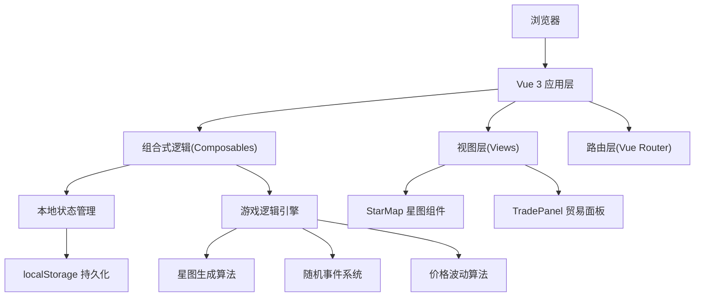

## 1. 架构设计



## 2. 技术描述

- **前端框架**: Vue 3.4 + TypeScript 5.3 (Composition API)
- **构建工具**: Vite 5.0 + @vitejs/plugin-vue 5.0
- **路由管理**: Vue Router 4.2
- **状态管理**: Vue 3 响应式系统 (ref/reactive) + 自定义 composables
- **样式方案**: CSS3 + CSS Variables + Scoped Styles
- **图形渲染**: HTML5 Canvas API (星空粒子、飞船、空间站)
- **数据持久化**: localStorage (游戏进度、星图种子)
- **动画方案**: CSS3 Animations/Transitions + requestAnimationFrame

## 3. 目录结构

```
src/
├── main.ts                    # 应用入口，挂载路由和全局状态
├── App.vue                    # 根组件，Canvas粒子层和路由视图
├── router/
│   └── index.ts              # 路由配置
├── views/
│   ├── StarMap.vue           # 星图主界面
│   └── TradePanel.vue        # 贸易面板
├── composables/
│   ├── useGameState.ts       # 游戏状态管理
│   └── useStarMap.ts         # 星图生成逻辑
├── types/
│   └── game.ts               # TypeScript 类型定义
└── utils/
    ├── seed.ts               # 种子随机数生成器
    └── storage.ts            # localStorage 封装
```

## 4. 路由定义

| 路由 | 页面 | 用途 |
|------|------|------|
| / | StarMap | 星图主界面，展示星域和空间站 |
| /trade/:stationId | TradePanel | 贸易面板，与指定空间站交易 |

## 5. 数据模型

### 5.1 类型定义

```typescript
interface Position {
  x: number;
  y: number;
}

interface Faction {
  id: string;
  name: string;
  color: string;
}

interface CargoItem {
  goodsId: string;
  quantity: number;
}

interface PlayerState {
  credits: number;
  fuel: number;
  position: Position;
  currentStationId: string | null;
  cargo: CargoItem[];
  maxCargoSlots: number;
  maxStackSize: number;
}

interface Station {
  id: string;
  name: string;
  factionId: string;
  position: Position;
  goods: StationGoods[];
}

interface StationGoods {
  goodsId: string;
  buyPrice: number;
  sellPrice: number;
  stock: number;
}

interface Goods {
  id: string;
  name: string;
  basePrice: number;
  icon: string;
}

interface GameEvent {
  type: 'pirate' | 'drift';
  title: string;
  description: string;
}
```

### 5.2 数据持久化

- 存储键名: `stellar_trader_save`
- 存储内容: 玩家状态、星图种子、已访问空间站
- 自动保存时机: 每次交易完成、每次到达空间站

## 6. 核心算法

### 6.1 星图生成算法

1. 使用固定种子生成12-15个空间站位置
2. 位置分布: Poisson Disk Sampling 确保空间站间距合理
3. 势力分配: 随机分配5种势力，确保分布均衡
4. 价格生成: 基于基础价格 ±30% 随机浮动

### 6.2 随机事件系统

1. 飞行途中15%概率触发事件
2. 事件类型: 海盗勒索(60%)、漂流货物(40%)
3. 海盗战斗判定: 40%成功率，失败损失50%信用点
4. 漂流货物: 1-3个随机货物，随机类型

### 6.3 价格波动算法

1. 每个空间站每种货物价格每10秒浮动一次
2. 浮动范围: 当前价格的 ±5%
3. 趋势模拟: 连续3次同向浮动后反转趋势
