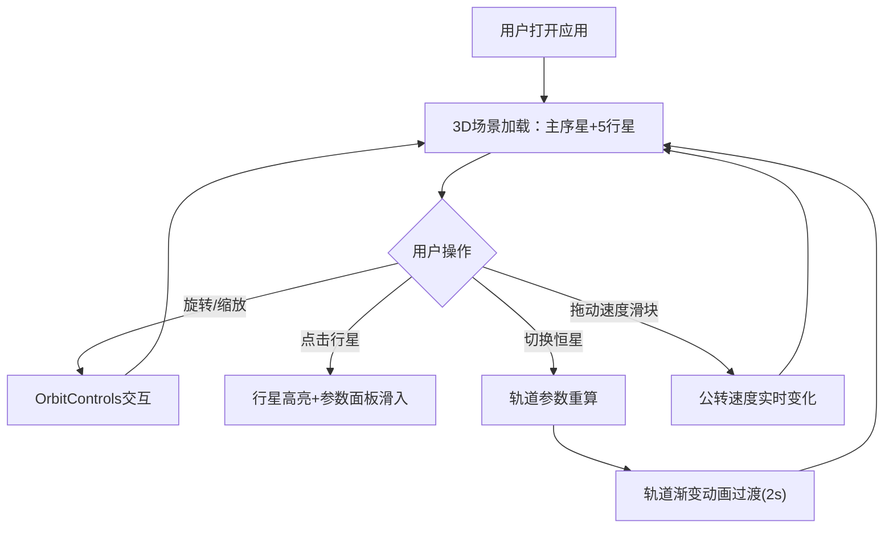

## 1. 产品概述

行星轨道运转模拟器是一款沉浸式3D可视化工具，面向天体物理学家和天文爱好者，展示不同行星围绕恒星运行的轨道倾角与周期差异，通过交互方式直观理解开普勒定律。
- 核心价值：将抽象的轨道力学参数转化为可交互的3D可视化体验，支持不同恒星类型切换以观察轨道变化

## 2. 核心功能

### 2.1 功能模块

1. **3D轨道场景页**：恒星（带自发光光晕）、5颗行星（带纹理和自转）、椭圆轨道线（半透明带标记点）、速度指示箭头动画
2. **交互控制面板**：恒星类型选择、行星参数面板、速度控制滑块、视角重置

### 2.2 页面详情

| 页面名称 | 模块名称 | 功能描述 |
|----------|----------|----------|
| 3D轨道场景 | 恒星渲染 | 根据恒星类型（主序星/红巨星/白矮星）渲染不同外观，带动态光晕效果 |
| 3D轨道场景 | 行星渲染 | 5颗不同大小颜色的行星沿椭圆轨道公转，带自转动画，点击高亮发光 |
| 3D轨道场景 | 轨道线渲染 | 半透明蓝色椭圆线，每隔15度白色小点标记，切换恒星时轨道渐变过渡 |
| 3D轨道场景 | 相机控制 | OrbitControls鼠标拖拽旋转、滚轮缩放、视角重置 |
| 交互控制面板 | 恒星选择 | 下拉菜单切换主序星/红巨星/白矮星，触发轨道参数重算和动画过渡 |
| 交互控制面板 | 行星参数面板 | 右侧滑入半透明面板，显示行星名称、半径、公转周期、离心率、倾角、天文描述 |
| 交互控制面板 | 速度控制 | 滑块0.1x-5x，实时调节公转速度，渐变蓝色填充 |
| 交互控制面板 | 悬浮信息 | 视角重置按钮与悬浮信息窗口 |

## 3. 核心流程

用户打开应用→3D场景加载，默认显示主序星和5颗行星→用户可鼠标旋转缩放观察→点击行星弹出参数面板→切换恒星类型→轨道参数重算并动画过渡→拖动速度滑块调节公转速度

## 4. 界面设计

### 4.1 设计风格

- 主色调：深空蓝到暗紫径向渐变背景
- 强调色：星光金色(#FFD700)、轨道蓝(#4488FF)
- 按钮风格：半透明毛玻璃圆角按钮，悬停时背景变为半透明白色(0.2→0.3)
- 字体：Orbitron(科技感显示字体) + Noto Sans SC(中文UI字体)
- 布局风格：全屏3D画布，UI控件浮于画布上方
- 图标风格：简洁线条图标

### 4.2 页面设计概览

| 页面名称 | 模块名称 | UI元素 |
|----------|----------|--------|
| 3D场景 | 画布区域 | 深蓝-暗紫径向渐变背景，恒星居中发光，行星公转动画 |
| 3D场景 | 恒星光晕 | 中心动态光晕，由小到大循环闪烁 |
| 控制面板 | 恒星选择器 | 左上角下拉菜单，毛玻璃背景，圆角12px |
| 控制面板 | 速度滑块 | 底部水平滑块，渐变蓝色填充，右侧倍率数字 |
| 控制面板 | 行星参数面板 | 右侧滑入面板，半透明深色毛玻璃，0.4秒缓动动画，数值滚动动画0.3秒 |
| 控制面板 | 视角重置 | 右下角圆形按钮 |

### 4.3 响应式设计

- 桌面优先设计，全屏3D画布+浮动UI控件
- 移动设备（宽度<768px）：UI控件变为底部固定栏布局
- 面板尺寸自适应屏幕宽度

### 4.4 3D场景指导

- 环境：深空场景，无HDRI，使用程序化星空背景
- 灯光：恒星自发光作为主光源，微弱环境光
- 相机：透视相机，初始距离25，OrbitControls允许旋转和缩放
- 构图：恒星居中，行星轨道围绕中心展开
- 交互：鼠标拖拽旋转，滚轮缩放，点击行星高亮
- 动画：行星公转+自转，恒星光晕脉动，轨道切换渐变过渡
- 性能预算：5行星+粒子效果，保持30fps以上
