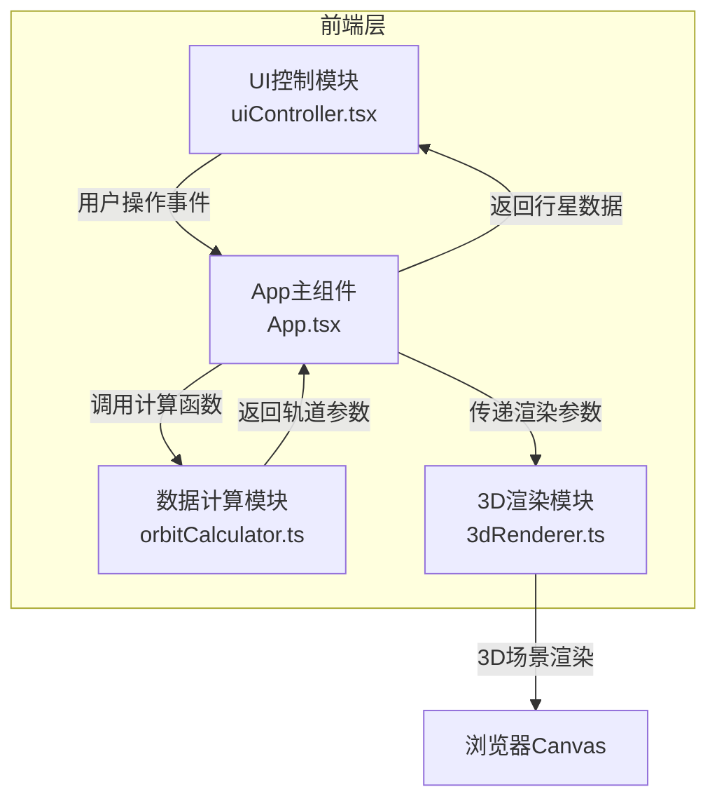
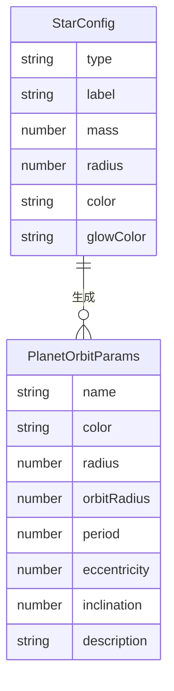

## 1. 架构设计



**数据流向**：用户输入 → UI控制模块 → App组件 → 数据计算模块 → App组件 → 3D渲染模块 → Canvas

## 2. 技术说明

- 前端框架：React@18 + TypeScript
- 构建工具：Vite
- 3D渲染：Three.js（直接使用，非React Three Fiber，以获得更细粒度的渲染控制）
- 状态管理：React useState/useCallback（组件内状态管理）
- 样式：CSS-in-JS（内联样式 + CSS模块）
- 初始化工具：vite-init（react-ts模板）

## 3. 路由定义

| 路由 | 用途 |
|------|------|
| / | 单页应用，3D轨道模拟器主界面 |

## 4. API定义

无后端API，所有数据由前端orbitCalculator.ts模块计算生成。

### 4.1 核心类型定义

```typescript
type StarType = "main-sequence" | "red-giant" | "white-dwarf";

interface StarConfig {
  type: StarType;
  label: string;
  mass: number;
  radius: number;
  color: string;
  glowColor: string;
}

interface PlanetOrbitParams {
  name: string;
  color: string;
  radius: number;
  orbitRadius: number;
  period: number;
  eccentricity: number;
  inclination: number;
  description: string;
}

interface OrbitalSystemParams {
  star: StarConfig;
  planets: PlanetOrbitParams[];
}
```

### 4.2 模块接口

**orbitCalculator.ts**：
- `calculateOrbitalSystem(starType: StarType): OrbitalSystemParams` — 根据恒星类型计算完整轨道参数
- `calculateKeplerPeriod(starMass: number, orbitRadius: number): number` — 开普勒第三定律计算周期
- `calculateEccentricity(baseOrbitRadius: number, index: number): number` — 计算离心率

**3dRenderer.ts**：
- `createScene(container: HTMLElement): SceneHandle` — 创建Three.js场景
- `updateOrbitalSystem(handle: SceneHandle, params: OrbitalSystemParams): void` — 更新轨道系统
- `setSpeedMultiplier(handle: SceneHandle, speed: number): void` — 设置速度倍率
- `highlightPlanet(handle: SceneHandle, planetIndex: number): void` — 高亮行星
- `resetCamera(handle: SceneHandle): void` — 重置相机
- `dispose(handle: SceneHandle): void` — 销毁场景

**uiController.tsx**：
- React组件，通过props接收回调和数据
- `onStarTypeChange(starType: StarType): void`
- `onSpeedChange(speed: number): void`
- `onResetCamera(): void`

## 5. 服务器架构图

无后端服务。

## 6. 数据模型

### 6.1 数据模型定义



### 6.2 数据定义

恒星配置预设数据：

| 恒星类型 | 质量(太阳质量) | 半径 | 颜色 | 光晕颜色 |
|----------|---------------|------|------|----------|
| 主序星 | 1.0 | 1.5 | #FFF5E0 | #FFD700 |
| 红巨星 | 1.5 | 3.0 | #FF6B35 | #FF4500 |
| 白矮星 | 0.6 | 0.5 | #E8E8FF | #AAAAFF |

行星基础数据：

| 行星 | 颜色 | 基础半径 | 基础轨道半径 | 基础周期(地球日) | 离心率 | 倾角范围 |
|------|------|----------|-------------|-----------------|--------|----------|
| 水星型 | 灰(#A0A0A0) | 0.3 | 4 | 88 | 0.205 | -5°~15° |
| 金星型 | 金(#DAA520) | 0.5 | 6 | 225 | 0.007 | -5°~15° |
| 地球型 | 蓝(#4488FF) | 0.55 | 8 | 365 | 0.017 | -5°~15° |
| 火星型 | 红(#CC4422) | 0.4 | 10 | 687 | 0.093 | -5°~15° |
| 海王星型 | 青(#00CED1) | 0.7 | 14 | 60190 | 0.009 | -5°~15° |
