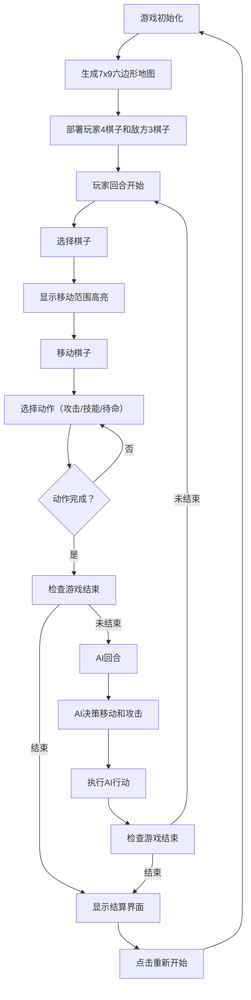

## 1. 产品概述

元素棋局是一款基于六边形网格地图的回合制战棋游戏，玩家操控火、水、土、风四种属性的元素棋子进行策略对战。游戏融合元素克制、地形影响、组合技等创新机制，为玩家带来深度策略体验。

- 核心玩法：回合制战棋对战，每回合可移动一个棋子并执行一个动作
- 目标用户：喜欢策略游戏、战棋游戏的休闲与核心玩家
- 市场价值：填补3D可视化元素战棋游戏的市场空白，以精美的视觉特效和深度策略吸引玩家

## 2. 核心功能

### 2.1 用户角色

| 角色 | 说明 | 核心权限 |
|------|------|----------|
| 玩家 | 操控玩家方4个元素棋子 | 移动棋子、释放技能、触发组合技、结束回合 |
| AI对手 | 自动控制敌方3个棋子 | 自动决策移动和攻击 |

### 2.2 功能模块

1. **地图系统**：7x9六边形网格地图，随机生成4种地形
2. **棋子系统**：4种属性棋子，各有独特属性和技能
3. **战斗系统**：回合制战斗、元素克制、地形加成、弹道动画
4. **组合技系统**：火+风相邻触发火焰风暴组合技
5. **AI系统**：敌方AI基于优先级评分自动决策
6. **UI系统**：回合信息、属性面板、敌人概览、结算画面

### 2.3 页面详情

| 页面名称 | 模块名称 | 功能描述 |
|---------|---------|----------|
| 游戏主界面 | 3D棋盘场景 | 居中显示7x9六边形地图，带地形纹理和高亮动画 |
| 游戏主界面 | 棋子渲染 | 4种属性棋子3D模型，带粒子特效和选中光环 |
| 游戏主界面 | 回合信息面板 | 左下显示回合数、倒计时进度条（红→绿渐变） |
| 游戏主界面 | 属性面板 | 右下显示选中棋子详细属性，毛玻璃背景 |
| 游戏主界面 | 敌人概览 | 右上显示敌方3个棋子头像和血条 |
| 游戏主界面 | 结算界面 | 游戏结束显示胜利方徽章，右下角重新开始按钮 |
| 游戏主界面 | 战斗动画 | 弹道飞行、受击闪烁、血量下降、碎片粒子特效 |

## 3. 核心流程

玩家进入游戏后，首先初始化地图和棋子。玩家方先手，每回合可选择一个棋子移动（在移动范围内），然后执行一个动作（攻击、技能或待命）。敌方AI回合自动决策并执行行动。战斗持续到一方棋子全部被击败，触发结算界面。

## 4. 用户界面设计

### 4.1 设计风格

- **主色调**：深蓝紫渐变夜空背景（#0a0a2e → #1a1a4e）
- **强调色**：金色边框（#ffd700）、属性色（火#ff4500、水#1e90ff、土#8b4513、风#32cd32）
- **按钮风格**：圆角玻璃质感（backdrop-filter: blur），悬停0.2秒发光上浮
- **字体**：Cinzel（标题装饰字体）+ Noto Sans SC（中文正文字体）
- **布局风格**：棋盘居中占70%屏幕，四角功能面板，毛玻璃半透明背景
- **图标风格**：几何体符号（火焰、水滴、石块、旋风）

### 4.2 页面设计概览

| 页面名称 | 模块名称 | UI元素 |
|---------|---------|--------|
| 游戏主界面 | 3D棋盘 | 六边形网格、地形颜色纹理、半透明高亮呼吸动画、摄像机微悬浮 |
| 游戏主界面 | 棋子渲染 | 属性颜色光晕几何体、粒子系统、选中星座环光效、底座冷却进度环 |
| 游戏主界面 | 回合面板 | 回合数文字、倒计时进度条（红→绿渐变）、毛玻璃面板 |
| 游戏主界面 | 属性面板 | 棋子头像、生命值/攻击力/移动范围彩色进度条、技能图标、毛玻璃背景 |
| 游戏主界面 | 敌人概览 | 3个头像横向排列、属性色边框、血条纹、毛玻璃面板 |
| 游戏主界面 | 结算界面 | 胜利属性徽章飘浮旋转、连胜火焰背景特效、重新开始按钮渐变出现 |
| 游戏主界面 | 动画系统 | 弹道飞行动画、受击闪烁、血量下降、碎片粒子、组合技龙卷风 |

### 4.3 响应式设计

- Desktop-first 设计，适配1920x1080及以上分辨率
- 棋盘区域自适应缩放，保持六边形比例
- 面板最小尺寸固定，超宽屏时面板靠边居中
- 触控设备支持点击选中和拖拽视角

### 4.4 3D场景指引

- **环境**：深蓝紫夜空渐变背景，微弱星空粒子，柔和环境光
- **光照**：主光源金色方向光（模拟月光）+ 四属性颜色点光源（跟随棋子）
- **摄像机**：45°俯视倾斜角度，OrbitControls允许轻度旋转缩放，聚焦棋盘中心
- **构图**：棋盘位于屏幕中央偏下，上方留出天空区域，四角UI面板不遮挡主要战斗区域
- **交互**：点击棋子选中高亮、点击格子移动、技能范围预览
- **后期处理**：Bloom发光效果（棋子光晕、弹道、组合技）、轻微景深模糊、色彩微调
- **性能预算**：棋子移动时≥45fps，回合动画≤0.5秒播放完成
