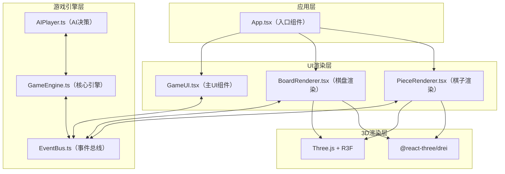

## 1. 架构设计



## 2. 技术描述

- **前端框架**：React 18 + TypeScript 5
- **构建工具**：Vite 5 + @vitejs/plugin-react
- **3D渲染**：three.js + @react-three/fiber + @react-three/drei
- **状态管理**：GameEngine内部状态 + EventBus发布订阅
- **唯一ID**：uuid
- **类型检查**：prop-types
- **样式方案**：CSS3 + Tailwind CSS（内联样式与CSS Modules结合）
- **后端**：无（纯前端游戏）
- **数据库**：无（内存状态管理）

## 3. 目录结构

```
e:\solo\SoloAutoDemo\tasks\auto159\
├── package.json
├── index.html
├── tsconfig.json
├── vite.config.js
└── src/
    ├── App.tsx
    ├── game/
    │   └── modules/
    │       ├── EventBus.ts
    │       ├── GameEngine.ts
    │       └── AIPlayer.ts
    └── render/
        ├── scene/
        │   ├── BoardRenderer.tsx
        │   └── PieceRenderer.tsx
        └── ui/
            └── GameUI.tsx
```

## 4. 核心数据模型

### 4.1 类型定义

```typescript
// 元素属性
type ElementType = 'fire' | 'water' | 'earth' | 'wind';

// 地形类型
type TerrainType = 'grass' | 'rock' | 'water' | 'volcano';

// 六边形坐标（轴向坐标系）
interface HexCoord {
  q: number;
  r: number;
}

// 棋子技能
interface Skill {
  id: string;
  name: string;
  description: string;
  damage: number;
  range: number;
  cooldown: number;
  currentCooldown: number;
  aoeRadius?: number;
}

// 棋子
interface Piece {
  id: string;
  element: ElementType;
  owner: 'player' | 'enemy';
  position: HexCoord;
  hp: number;
  maxHp: number;
  attack: number;
  moveRange: number;
  skills: Skill[];
  hasMoved: boolean;
  hasActed: boolean;
  comboCooldown: number;
}

// 地图格子
interface HexTile {
  coord: HexCoord;
  terrain: TerrainType;
  pieceId?: string;
}

// 游戏状态
interface GameState {
  turn: number;
  currentPlayer: 'player' | 'enemy';
  phase: 'idle' | 'selecting' | 'moving' | 'action' | 'animating' | 'gameover';
  turnTimeLeft: number;
  selectedPieceId?: string;
  winner?: 'player' | 'enemy';
  pieces: Piece[];
  board: HexTile[][];
}

// 事件类型
type GameEvent =
  | { type: 'PIECE_SELECTED'; pieceId: string }
  | { type: 'PIECE_MOVED'; pieceId: string; from: HexCoord; to: HexCoord }
  | { type: 'ATTACK'; attackerId: string; targetId: string; damage: number }
  | { type: 'SKILL_CAST'; casterId: string; skillId: string; targets: string[]; damage: number }
  | { type: 'COMBO_TRIGGERED'; pieceIds: string[]; comboType: string; damage: number }
  | { type: 'PIECE_DEFEATED'; pieceId: string }
  | { type: 'TURN_CHANGED'; turn: number; player: 'player' | 'enemy' }
  | { type: 'GAME_OVER'; winner: 'player' | 'enemy' }
  | { type: 'RESTART' };
```

### 4.2 元素克制关系

| 攻击方 | 被克制方 | 伤害加成 |
|--------|----------|----------|
| 火 | 风 | +50% |
| 风 | 土 | +50% |
| 土 | 水 | +50% |
| 水 | 火 | +50% |

### 4.3 地形影响

| 地形 | 效果 |
|------|------|
| 草地 | 无特殊效果 |
| 岩石 | 土属性伤害+25% |
| 水域 | 水属性伤害+25%，火属性伤害-50% |
| 火山口 | 火属性伤害+25%，水属性伤害-50% |

## 5. 模块职责

### 5.1 EventBus.ts
- 实现发布-订阅模式
- 提供 `on(event, handler)`、`off(event, handler)`、`emit(event)` 方法
- 引擎与UI模块之间唯一通信渠道

### 5.2 GameEngine.ts
- 初始化7x9六边形地图和随机地形
- 管理双方棋子状态和回合调度
- 计算移动范围、攻击范围、技能范围
- 处理战斗结算（元素克制、地形加成）
- 检测组合技触发条件（火+风相邻）
- 检测游戏结束条件
- 通过EventBus发布所有状态变更事件

### 5.3 AIPlayer.ts
- 基于优先级评分选择最优行动
- 评分维度：击杀优先 > 伤害输出 > 血量保护 > 地形优势
- 计算每个可行动作的评分，选择最高分行动执行

### 5.4 BoardRenderer.tsx
- 使用Three.js绘制六边形网格
- 根据地形类型渲染不同颜色纹理
- 实现移动范围半透明高亮 + 呼吸动画
- 处理格子点击事件

### 5.5 PieceRenderer.tsx
- 渲染4种属性棋子3D模型（几何体+颜色+光晕）
- 实现粒子特效（火焰、波纹、碎裂、气流）
- 实现选中光环（星座环旋转光效）
- 实现组合技冷却进度环
- 处理弹道动画、受击闪烁、碎片粒子效果

### 5.6 GameUI.tsx
- 左下：回合数 + 倒计时进度条（红→绿渐变）
- 右下：选中棋子详细属性面板（毛玻璃背景）
- 右上：敌方棋子头像概览（属性色边框+血条）
- 结算界面：胜利徽章飘浮旋转 + 重新开始按钮
- 所有面板0.4秒缓动切换动画

### 5.7 App.tsx
- 整合GameEngine实例
- 初始化Canvas和3D场景
- 连接UI层与渲染层
- 启动游戏主循环
