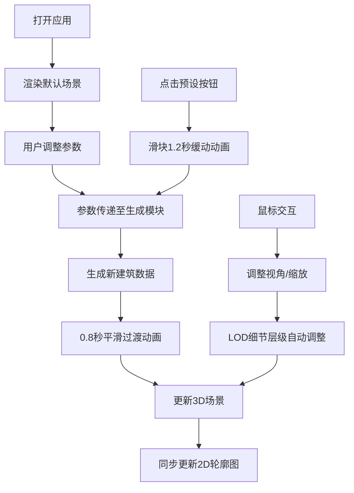

## 1. 产品概述

城市天际线生成器是一个面向建筑师的交互式3D可视化工具，用于在概念设计阶段快速展示不同建筑密度和高度对天际线轮廓的影响，帮助进行视觉比较和方案评估。

- 核心价值：通过实时参数化调整，直观呈现城市设计方案的天际线效果
- 目标用户：建筑师、城市规划师、景观设计师
- 解决问题：传统2D草图无法直观展示3D天际线效果，物理模型制作耗时费力

## 2. 核心功能

### 2.1 用户角色

| 角色 | 注册方式 | 核心权限 |
|------|----------|----------|
| 建筑师 | 无需注册 | 完整使用所有生成、调整、预设功能 |

### 2.2 功能模块

1. **3D场景渲染**：Three.js实时渲染建筑群，支持视角交互控制
2. **参数控制面板**：密度、高度范围、建筑风格滑块与预设按钮
3. **建筑动态生成**：参数变化时建筑群平滑过渡动画
4. **天际线轮廓分析**：2D Canvas实时绘制天际线高度轮廓
5. **预设场景管理**：三种预设场景一键切换

### 2.3 页面详情

| 页面名称 | 模块名称 | 功能描述 |
|----------|----------|----------|
| 主界面 | 3D渲染区域 | 显示3D城市建筑群，支持鼠标旋转、平移、缩放 |
| 主界面 | 左侧控制面板 | 参数滑块、风格选择、预设按钮 |
| 主界面 | 天际线轮廓图 | 左下角半透明2D轮廓分析图 |
| 主界面 | 视觉遮罩 | 右侧渐变遮罩引导视线聚焦 |

## 3. 核心流程

用户打开应用 → 查看默认天际线场景 → 调整密度/高度/风格参数 → 建筑群0.8秒平滑过渡 → 天际线轮廓同步更新 → 可选择预设场景快速切换 → 从不同角度观察天际线效果

## 4. 用户界面设计

### 4.1 设计风格

- **主色调**：深蓝色渐变背景（#0a1628 至 #1a365d），白色与浅灰色控制面板
- **强调色**：蓝色系（#3b82f6 至 #1d4ed8）用于按钮和滑块激活状态
- **按钮风格**：圆角矩形预设按钮，悬停时上移3px并背景渐变
- **滑块风格**：细长圆角轨道，带阴影圆形滑块按钮，拖拽弹性反馈
- **字体**：无衬线字体，标题字重300，字号24px
- **面板效果**：半透明毛玻璃（backdrop-filter: blur(8px)）
- **过渡动画**：所有交互0.3秒缓动过渡

### 4.2 页面设计概述

| 页面名称 | 模块名称 | UI元素 |
|----------|----------|--------|
| 主界面 | 3D渲染区 | 全屏3D场景，右侧渐变遮罩，45度俯视初始视角 |
| 主界面 | 控制面板 | 固定左侧320px宽度，毛玻璃效果，三个参数滑块，三个预设按钮 |
| 主界面 | 轮廓分析 | 左下角半透明Canvas，绘制天际线折线，0.5秒描边动画 |

### 4.3 响应式

- 桌面端优先设计，控制面板固定宽度
- 3D场景自适应剩余空间
- 触控设备支持手势旋转和缩放

### 4.4 3D场景指导

- **环境与氛围**：随视角高度变化的背景色渐变（浅蓝→橙红），柔和环境光配合方向光
- **光照设置**：半球光+方向光组合，建筑投影开启，营造真实城市光影
- **相机设置**：PerspectiveCamera，初始45度俯视，OrbitControls控制交互
- **构图与焦点**：建筑群居中，右侧渐变遮罩引导视线，地面网格提供空间参照
- **交互与动画**：鼠标左键旋转、右键平移、滚轮缩放，建筑群0.8秒tween过渡，新建筑从地面升起
- **后处理效果**：轻微抗锯齿，背景色动态渐变
- **性能预算**：100栋建筑时帧率≥45fps，LOD三级细节，每栋建筑不超过200个三角形

## 5. 性能约束

- 100栋建筑渲染帧率 ≥ 45fps
- 视角旋转/缩放响应延迟 ≤ 50ms
- 建筑数量范围：10-200栋
- 过渡动画时长：0.8秒（建筑）、0.5秒（轮廓）、1.2秒（预设滑块）
