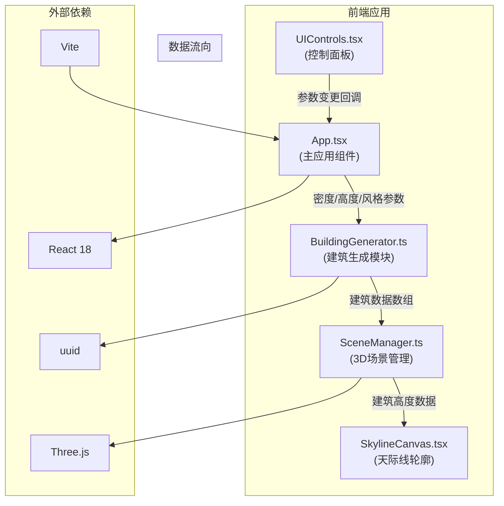

## 1. 架构设计



## 2. 技术描述

- **前端框架**：React@18 + TypeScript@5
- **3D渲染**：Three.js + @types/three
- **构建工具**：Vite@5 + @vitejs/plugin-react
- **唯一标识**：uuid
- **样式方案**：原生CSS + CSS变量，不使用Tailwind（按用户指定文件结构）
- **初始化方式**：Vite + react-ts模板

**数据流说明**：
1. 用户通过 [UIControls.tsx](file:///e:/solo/SoloAutoDemo/tasks/auto160/src/UIControls.tsx) 调整参数
2. 回调函数传递至 [App.tsx](file:///e:/solo/SoloAutoDemo/tasks/auto160/src/App.tsx)
3. [App.tsx](file:///e:/solo/SoloAutoDemo/tasks/auto160/src/App.tsx) 将参数传递给 [BuildingGenerator.ts](file:///e:/solo/SoloAutoDemo/tasks/auto160/src/BuildingGenerator.ts)
4. [BuildingGenerator.ts](file:///e:/solo/SoloAutoDemo/tasks/auto160/src/BuildingGenerator.ts) 生成建筑数据数组
5. [SceneManager.ts](file:///e:/solo/SoloAutoDemo/tasks/auto160/src/SceneManager.ts) 接收数据并更新3D场景
6. 天际线轮廓组件从场景获取建筑高度数据进行绘制

## 3. 路由定义

| 路由 | 用途 |
|------|------|
| / | 主应用页面（天际线生成器） |

## 4. 数据模型

### 4.1 类型定义

```typescript
// BuildingGenerator.ts 中定义
export interface BuildingData {
  id: string;
  position: { x: number; y: number; z: number };
  dimensions: { width: number; depth: number; height: number };
  color: string;
  style: 'modern' | 'classic' | 'futuristic';
  roofShape: 'flat' | 'pointed' | 'dome' | 'angular';
}

export interface GeneratorParams {
  density: number;           // 0-100
  minHeight: number;         // 3-30
  maxHeight: number;         // 30-150
  style: 'modern' | 'classic' | 'futuristic';
}

// 预设场景配置
export interface PresetConfig {
  name: string;
  density: number;
  minHeight: number;
  maxHeight: number;
  style: 'modern' | 'classic' | 'futuristic';
}

// 建筑风格主题
export interface StyleTheme {
  name: string;
  colors: string[];
  roofShapes: Array<'flat' | 'pointed' | 'dome' | 'angular'>;
}
```

### 4.2 文件结构

```
e:\solo\SoloAutoDemo\tasks\auto160\
├── .trae\
│   └── documents\
│       ├── PRD.md
│       └── technical-architecture.md
├── index.html
├── package.json
├── tsconfig.json
├── vite.config.js
└── src\
    ├── App.tsx                 # 主应用组件
    ├── main.tsx                # 应用入口
    ├── index.css               # 全局样式
    ├── BuildingGenerator.ts    # 建筑生成模块
    ├── SceneManager.ts         # 3D场景管理模块
    ├── UIControls.tsx          # 控制面板组件
    └── SkylineCanvas.tsx       # 天际线轮廓组件
```

## 5. 核心模块职责

### 5.1 BuildingGenerator.ts

**职责**：根据输入参数生成建筑数据
- `generateBuildings(params: GeneratorParams): BuildingData[]` - 核心生成函数
- `getStyleTheme(style: string): StyleTheme` - 获取风格主题配置
- `calculateBuildingCount(density: number): number` - 根据密度计算建筑数量（10-200）

### 5.2 SceneManager.ts

**职责**：Three.js场景管理与渲染
- `init(container: HTMLElement): void` - 初始化场景、相机、渲染器
- `updateBuildings(buildings: BuildingData[], animate?: boolean): void` - 更新建筑群
- `updateCameraLOD(): void` - 根据相机距离调整LOD
- `updateBackgroundColor(): void` - 根据视角高度渐变背景色
- `dispose(): void` - 资源清理

### 5.3 UIControls.tsx

**职责**：用户交互控制面板
- 密度滑块（0-100%）
- 高度范围滑块组（最低3-30m，最高30-150m）
- 风格选择按钮（现代/古典/未来）
- 预设场景按钮（低密度住宅区/高密度商务区/混合开发区）
- 所有控件带0.3秒缓动动画

### 5.4 SkylineCanvas.tsx

**职责**：绘制2D天际线轮廓
- `updateSkyline(heights: number[]): void` - 更新轮廓数据
- 0.5秒画笔描边动画
- 半透明背景叠加
