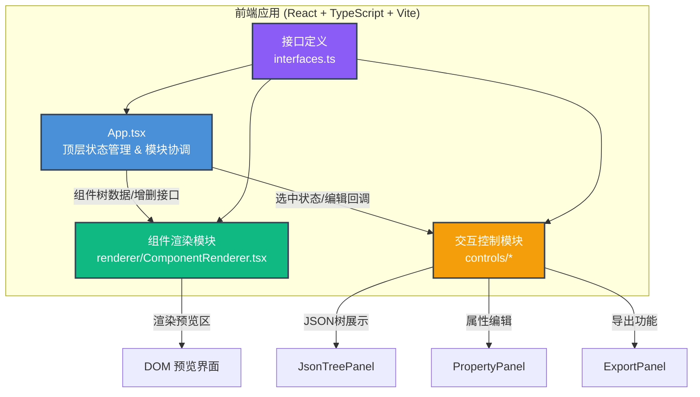

## 1. 架构设计



## 2. 技术说明

- **前端框架**：React@18 + TypeScript@5 + Vite@5
- **JSON树展示**：react-json-tree（可折叠、可自定义主题）
- **工具库**：lodash（深拷贝、数据操作）、uuid（生成唯一组件ID）
- **样式方案**：原生CSS + CSS Modules（组件级样式隔离），CSS变量统一主题色
- **状态管理**：React useState + useCallback（局部状态，避免过度工程化）
- **构建工具**：Vite（极速HMR，@vitejs/plugin-react 支持）
- **代码生成**：模板字符串拼接 React JSX / HTML 代码

## 3. 项目文件结构

```
├── package.json              # 依赖与启动脚本
├── tsconfig.json             # TypeScript严格模式配置
├── vite.config.js            # Vite + React插件配置
├── index.html                # 入口HTML页面
└── src/
    ├── interfaces.ts         # 组件节点类型定义
    ├── App.tsx               # 主应用组件，状态管理中心
    ├── App.css               # 主应用全局样式
    ├── renderer/
    │   ├── ComponentRenderer.tsx   # 递归渲染组件树
    │   └── ComponentRenderer.css   # 渲染器样式
    └── controls/
        ├── JsonTreePanel.tsx       # JSON树展示面板
        ├── JsonTreePanel.css       # 树形面板样式
        ├── PropertyPanel.tsx       # 属性编辑面板
        ├── PropertyPanel.css       # 属性面板样式
        ├── ExportPanel.tsx         # 导出功能面板
        └── ExportPanel.css         # 导出面板样式
```

## 4. 核心数据模型

### 4.1 组件节点类型 (ComponentNode)

```typescript
interface ComponentNode {
  id: string;           // uuid唯一标识
  type: 'Button' | 'Card' | 'Input' | 'Image' | 'Badge' | 'Container' | 'Text';
  props: Record<string, any>;     // 组件属性（文字内容、占位符等）
  style: React.CSSProperties;     // 内联样式（颜色、大小、间距等）
  children: ComponentNode[] | string;  // 子节点（数组或文本）
}
```

### 4.2 应用状态模型

```typescript
interface AppState {
  componentTree: ComponentNode;       // 根组件节点
  selectedId: string | null;          // 当前选中组件ID
  isAdding: boolean;                  // 是否在添加模式
  screenWidth: number;                // 屏幕宽度（响应式判断）
}
```

## 5. 核心模块设计

### 5.1 App.tsx 状态管理中心

| 方法/状态 | 说明 |
|-----------|------|
| `componentTree` | useState存储根组件树，所有子模块的数据源 |
| `selectedId` | 当前选中组件ID，同步树面板和预览区 |
| `handleSelect(id)` | 选中组件回调，同步高亮 |
| `handleUpdate(id, patch)` | 更新指定节点props/style，使用lodash深拷贝后返回新引用 |
| `handleAdd(parentId, type)` | 在父节点下新增指定类型子节点（末尾插入） |
| `handleDelete(id)` | 删除指定节点，含0.3s动画延迟后从数据移除 |
| `handleExportJson()` | 序列化为JSON Blob触发下载 |
| `generateReactCode()` | 遍历组件树生成React JSX代码字符串 |
| `generateHtmlCode()` | 遍历组件树生成HTML代码字符串 |

### 5.2 ComponentRenderer.tsx 渲染逻辑

- 使用 switch(type) 分支渲染不同预设组件
- 递归渲染 children 数组
- 为每个渲染元素绑定 onClick 触发选中，绑定 data-id 属性用于DOM定位
- 删除动画：CSS transition + opacity/transform，动画结束后通过 onTransitionEnd 触发真正数据删除
- 悬停效果：CSS hover 伪类 box-shadow + translateY(-2px)

### 5.3 JsonTreePanel.tsx 树面板

- 使用 react-json-tree 库，配置 theme 匹配深蓝灰主题
- 自定义 onClickItem 获取点击节点路径，匹配到 ComponentNode.id
- 支持新增子节点：选中父节点后，弹出组件类型选择菜单（Button/Card/Input/Image/Badge）
- 删除按钮：每个节点旁悬浮显示垃圾桶图标，点击触发删除

### 5.4 PropertyPanel.tsx 属性编辑

- 根据 selectedId 在组件树中查找节点
- 分两个分组：Props（组件属性，如children文本、placeholder）和 Style（样式字段，如color、fontSize、padding）
- 字段类型适配：颜色用 color input，数值用 number input，文本用 text input
- 修改时通过 debounce 或 onChange 即时回调 App.handleUpdate
- <1200px时面板隐藏，由浮动按钮触发抽屉显示

### 5.5 ExportPanel.tsx 导出模块

- 导出JSON：使用 JSON.stringify(tree, null, 2)，Blob + URL.createObjectURL + a.click下载
- 代码预览：Tab切换 JSON / React JSX / HTML 三种视图
- 代码高亮：使用 <pre><code> 包裹，深色主题背景
- 一键复制：navigator.clipboard.writeText 复制到剪贴板

## 6. 性能优化策略

1. **memo优化**：ComponentRenderer 使用 React.memo 包裹，仅当节点数据变更时重渲染
2. **批量更新**：属性编辑避免不必要的全树深拷贝，使用路径定位局部更新
3. **CSS加速**：动画使用 transform/opacity，开启 GPU 加速（will-change）
4. **虚拟滚动**：若JSON树节点过多，react-json-tree自带懒渲染能力
5. **防抖编辑**：输入框使用 50ms debounce，减少连续击键的渲染次数
