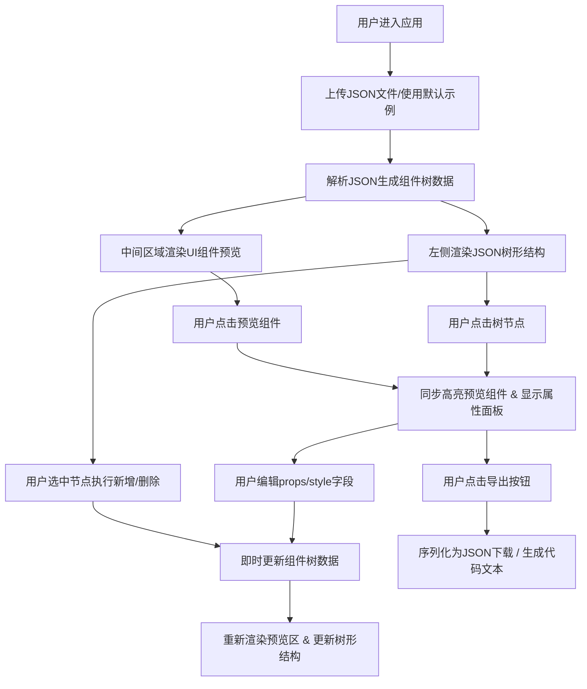

## 1. 产品概述

JSON UI组件预览器是一款面向设计师和前端开发者的协同工具，通过将JSON格式的组件描述文件即时转换为可视化UI预览，解决团队间因组件定义不统一导致的反复沟通与手动还原问题。

- 核心价值：打通设计稿与代码实现之间的壁垒，实现组件定义的可视化、可编辑、可导出
- 目标用户：UI设计师、前端开发工程师、产品原型设计者

## 2. 核心功能

### 2.1 功能模块

1. **JSON解析与树形展示**：拖拽/点击上传JSON，左侧展示可折叠树形结构，点击节点同步高亮预览组件
2. **可视化渲染预览**：中间区域实时渲染组件树，支持浅灰色网格背景，组件居中显示带边缘留白
3. **交互属性编辑**：点击预览区组件选中（蓝色虚线边框高亮），右侧属性面板编辑props/style即时生效
4. **组件增删管理**：树形结构中支持选中父节点后插入预设组件（Button、Card、Input、Image、Badge），选中节点可删除（带0.3s缩放缩小动画）
5. **代码导出功能**：导出JSON文件下载，支持切换代码预览选项卡生成React/HTML代码文本

### 2.2 页面详情

| 页面名称 | 模块名称 | 功能描述 |
|-----------|-------------|---------------------|
| 主工作台 | 文件上传区 | 拖拽或点击上传JSON组件描述文件，格式校验 |
| 主工作台 | JSON树面板 | 左侧窄栏，带缩进和折叠箭头，点击选中同步高亮，支持新增/删除节点操作 |
| 主工作台 | 预览渲染区 | 中间主区域，浅灰网格背景，组件居中渲染，点击选中带虚线边框 |
| 主工作台 | 属性编辑面板 | 右侧毛玻璃半透明面板，展示选中组件props/style字段，支持编辑即时刷新 |
| 主工作台 | 导出面板 | 顶部工具栏导出JSON，切换代码预览Tab生成React/HTML代码 |

## 3. 核心流程

## 4. 用户界面设计

### 4.1 设计风格

- **主色调**：深蓝灰为主（#1E293B、#334155），选中高亮使用 #4A90D9 蓝色
- **按钮风格**：圆角8px，悬停带上浮阴影，按下缩小反馈
- **字体选择**：标题使用 "SF Pro Display" / "PingFang SC"，正文使用 "Inter" / "Microsoft YaHei"，字号层级为 12px(辅助) / 14px(正文) / 16px(小标题) / 20px(主标题)
- **布局风格**：三栏式布局（左280px + 自适应中间 + 右320px），卡片圆角12px，细腻阴影层次
- **图标风格**：线性图标（SVG），展开/折叠使用箭头图标，带0.2s缓动旋转动画
- **动效规范**：树形节点展开折叠 0.2s ease，组件悬停 0.15s 阴影上浮，属性面板字段切换 0.2s 滑入，删除组件 0.3s scale缩小至中心

### 4.2 页面设计详情

| 页面名称 | 模块名称 | UI元素描述 |
|-----------|-------------|-------------|
| 主工作台 | 文件上传区 | 顶部工具条，拖拽区域虚线边框，上传按钮主色填充 |
| 主工作台 | JSON树面板 | 深蓝灰背景(#1E293B)，白色文字，缩进层级指示线，展开箭头旋转动画，选中节点背景#4A90D9 |
| 主工作台 | 预览渲染区 | 浅灰网格背景(#F8FAFC + grid图案)，白色卡片容器，组件居中，点击虚线#4A90D9边框 |
| 主工作台 | 属性编辑面板 | 毛玻璃半透明(backdrop-filter: blur(12px)，背景rgba(255,255,255,0.7))，输入框浅灰底，滑入动画 |
| 主工作台 | 导出面板 | 顶部右侧导出按钮组，Tab切换(JSON/React/HTML)，代码区等宽字体深色主题 |

### 4.3 响应式适配

- **桌面端(≥1200px)**：标准三栏式布局完整展示
- **中小屏(<1200px)**：右侧属性面板收起为浮动按钮（右下角圆形悬浮），点击弹出抽屉式面板
- **触控优化**：点击区域≥44px，滚动平滑，缩放禁用

### 4.4 性能指标

- JSON解析到首屏渲染完成 ≤ 800ms（20个嵌套节点基准）
- 属性编辑到预览刷新 ≤ 100ms
- 组件删除动画流畅度 ≥ 60fps
