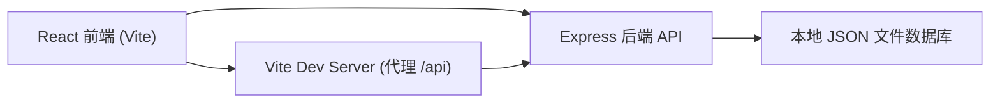
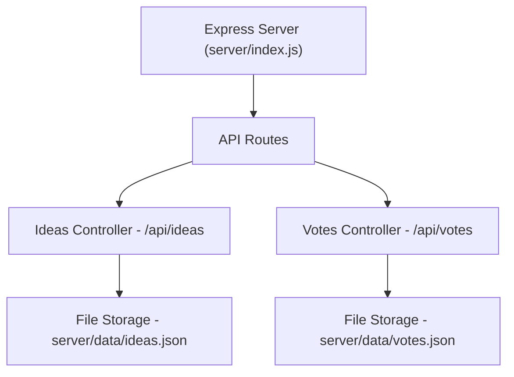
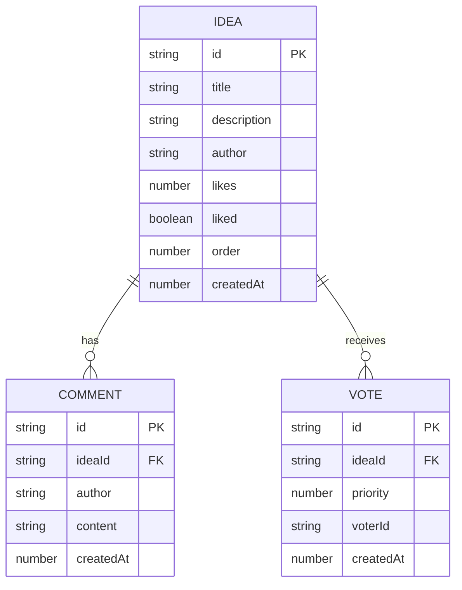

## 1. 架构设计



## 2. 技术描述

- 前端框架：React 18 + TypeScript
- 构建工具：Vite 5 + @vitejs/plugin-react
- 状态管理：React Context + useState（轻量级全局状态）
- 路由：react-router-dom
- 后端框架：Express 4
- 数据库：本地 JSON 文件模拟（server/data/ideas.json, server/data/votes.json）
- 中间件：cors、body-parser
- 工具库：uuid（生成唯一ID）
- 图标：lucide-react
- 动画：CSS transitions + keyframes

## 3. 路由定义

| 路由 | 用途 |
|------|------|
| / | 白板页面，展示创意卡片网格 |
| /voting | 投票页面，优先级投票与排行榜 |

## 4. API 定义

### 4.1 TypeScript 类型定义

```typescript
interface Comment {
  id: string;
  author: string;
  content: string;
  createdAt: number;
}

interface Idea {
  id: string;
  title: string;
  description: string;
  author: string;
  likes: number;
  liked: boolean;
  comments: Comment[];
  order: number;
  createdAt: number;
}

interface Vote {
  ideaId: string;
  priority: number; // 1-5
  voterId: string;
  createdAt: number;
}

interface VoteResult {
  ideaId: string;
  ideaTitle: string;
  avgPriority: number;
  voteCount: number;
}
```

### 4.2 API 端点

| 方法 | 路径 | 描述 | 请求体 | 响应 |
|------|------|------|--------|------|
| GET | /api/ideas | 获取所有创意列表 | - | Idea[] |
| POST | /api/ideas | 创建新创意 | { title, description, author } | Idea |
| PUT | /api/ideas/:id | 更新创意（排序等） | { order? } | Idea |
| POST | /api/ideas/:id/like | 点赞/取消点赞 | { liked: boolean } | { likes: number, liked: boolean } |
| GET | /api/ideas/:id/comments | 获取评论列表 | - | Comment[] |
| POST | /api/ideas/:id/comments | 提交评论 | { author, content } | Comment |
| POST | /api/votes | 提交投票（批量） | { voterId, votes: [{ideaId, priority}] } | { success: boolean } |
| GET | /api/votes/results | 获取投票结果排行榜 | - | VoteResult[] |

## 5. 服务器架构图



## 6. 数据模型

### 6.1 数据模型 ER 图



### 6.2 JSON 数据结构

**ideas.json:**
```json
{
  "ideas": [
    {
      "id": "uuid-xxx",
      "title": "创意标题",
      "description": "创意详细描述",
      "author": "提交人",
      "likes": 0,
      "liked": false,
      "comments": [],
      "order": 0,
      "createdAt": 1718764800000
    }
  ]
}
```

**votes.json:**
```json
{
  "votes": [
    {
      "id": "uuid-xxx",
      "ideaId": "idea-uuid",
      "priority": 5,
      "voterId": "voter-1",
      "createdAt": 1718764800000
    }
  ]
}
```
