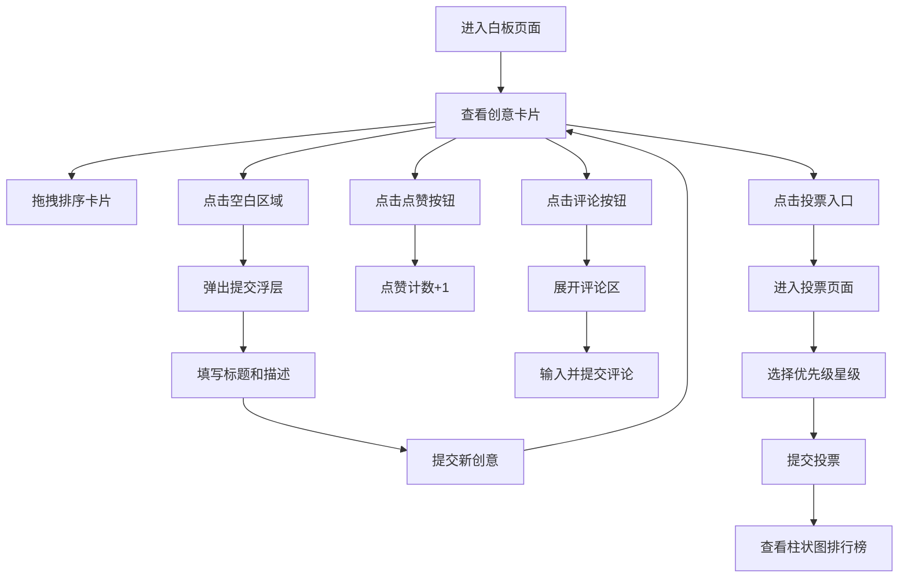

## 1. 产品概述

团队创意脑暴与投票系统，为团队提供一个虚拟白板协作平台，支持成员提交创意想法、点赞评论、按优先级投票，并生成可视化排名结果。

- 解决问题：传统脑暴会议效率低、创意难留存、投票结果不直观
- 目标用户：产品团队、设计团队、研发团队等需要创意协作的团队
- 产品价值：提升团队协作效率，让创意收集和决策过程数字化、可视化

## 2. 核心功能

### 2.1 用户角色

| 角色 | 注册方式 | 核心权限 |
|------|----------|----------|
| 团队成员 | 默认访客身份 | 提交创意、点赞、评论、投票、查看排行榜 |

### 2.2 功能模块

1. **白板页面**：创意卡片瀑布流展示、拖拽排序、创意提交浮层
2. **创意卡片**：标题/提交人/点赞数/评论数展示、点赞交互、评论展开
3. **投票页面**：创意列表、优先级星级选择、投票提交
4. **排行榜**：柱状图可视化展示投票结果、平均优先级评分

### 2.3 页面详情

| 页面名称 | 模块名称 | 功能描述 |
|----------|----------|----------|
| 白板页面 | 创意卡片网格 | 瀑布流排列，显示标题/提交人/点赞数/评论数 |
| 白板页面 | 拖拽排序 | 拖拽卡片调整顺序，弹性缩放动画 |
| 白板页面 | 提交浮层 | 点击空白弹出，标题+描述输入，0.3秒弹入动画 |
| 创意卡片 | 点赞按钮 | 心形图标，红色填充，弹跳动画，0.5秒防抖 |
| 创意卡片 | 评论按钮 | 气泡图标，展开评论列表和输入框 |
| 投票页面 | 投票列表 | 缩略标题+摘要，优先级1-5星下拉选择 |
| 投票页面 | 柱状图排行榜 | 横轴创意标题，纵轴平均评分，蓝橙渐变，最高分呼吸光效 |

## 3. 核心流程

用户打开应用进入白板页面 → 查看/拖拽已有创意卡片 → 点击空白区域提交新创意 → 对卡片点赞或展开评论 → 点击右上角投票入口 → 为各创意分配优先级星级 → 提交投票 → 查看柱状图排行榜结果

## 4. 用户界面设计

### 4.1 设计风格

- 主色调：深色背景 #1a1a2e，卡片 #16213e
- 文字颜色：#eee（浅灰），强调色：红色心形、蓝橙渐变柱子
- 按钮样式：圆角 6px，悬停微发光效果
- 字体：现代无衬线字体，层级分明
- 布局：8px 网格系统，卡片带微弱发光边框
- 图标风格：线性图标，点赞为心形、评论为气泡形

### 4.2 页面设计概览

| 页面名称 | 模块名称 | UI 元素 |
|----------|----------|----------|
| 白板页面 | 顶部导航 | 深色背景、右上角投票入口按钮 |
| 白板页面 | 卡片网格 | 瀑布流布局、卡片发光边框、悬浮上移动效 |
| 白板页面 | 提交浮层 | 半透明遮罩、渐变边框、居中弹入动画 |
| 创意卡片 | 卡片内容 | 标题/提交人/描述、底部操作栏（点赞+评论） |
| 创意卡片 | 评论区域 | 展开收缩动画、评论列表、输入框 |
| 投票页面 | 投票列表 | 卡片缩略、星级下拉选择 |
| 投票页面 | 柱状图 | 蓝橙渐变柱子、最高分呼吸光效、悬停tooltip |

### 4.3 响应式设计

- 桌面端：卡片多列瀑布流，柱状图垂直显示
- 移动端（< 768px）：卡片单列排列，柱状图转为水平条形图
- 触摸优化：增大点击区域，支持触摸拖拽

### 4.4 动画与交互动效

- 卡片拖拽：弹性缩放（scale 0.95 → 1.05 → 1.0）
- 浮层出现：0.3s 弹入（scale 0.8 → 1.0，透明度 0 → 1）
- 点赞：轻微弹跳（scale 1 → 1.3 → 1）
- 评论展开：高度 0 → auto 平滑过渡
- 新卡片：淡入上滑（translateY 20px → 0，透明度 0 → 1）
- 柱状图最高分：呼吸光效（box-shadow 透明度脉动）
