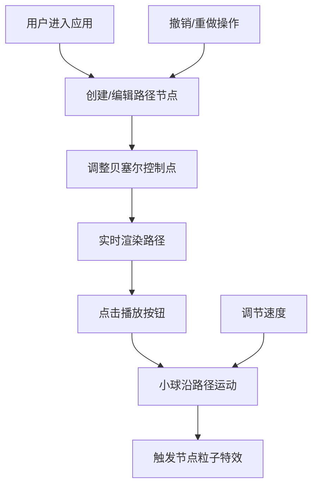

## 1. 产品概述

交互式CSS动画路径可视化工具，让用户通过拖拽节点和调整贝塞尔曲线控制点来设计复杂动画路径，并实时预览动画效果。

- 主要用途：帮助设计师和开发者可视化设计CSS动画路径，降低动画开发效率
- 目标用户：前端开发者、UI设计师、动画爱好者
- 核心价值：直观的可视化编辑，实时预览，支持复杂曲线设计

## 2. 核心功能

### 2.1 用户角色

| 角色 | 注册方式 | 核心权限 |
|------|----------|----------|
| 普通用户 | 无需注册 | 完整使用所有编辑和预览功能 |

### 2.2 功能模块

1. **路径编辑模块：节点创建、节点拖拽、贝塞尔控制点调整、Catmull-Rom平滑路径生成、曲率显示

2. **动画预览模块：小球沿路径运动、粒子特效、速度调节、播放控制

3. **数据管理模块：撤销/重做、状态持久化、历史记录管理

### 2.3 页面详情

| 页面名称 | 模块名称 | 功能描述 |
|-----------|----------|-------------|
| 主界面 | 顶部工具栏 | 撤销/重做按钮、速度选择下拉框 |
| 主界面 | 路径编辑区 | 路径编辑区（70%宽度，深灰背景#2d2d2d）、节点拖拽、贝塞尔手柄、路径渲染 |
| 主界面 | 动画预览区 | 动画预览区（30%宽度，白色背景#ffffff）、播放按钮、小球动画、粒子特效 |
| 主界面 | 底部信息栏 | 路径总长度、节点数量显示 |

## 3. 核心流程

## 4. 用户界面设计

### 4.1 设计风格

- 配色方案：
  - 主色：深蓝 #1e40af
  - 路径颜色：深蓝虚线 #1e3a8a
  - 背景色：编辑区 #2d2d2d，预览区 #ffffff
  - 节点色：圆形渐变填充
  - 手柄色：灰色半透明 #88888880

- 按钮风格：现代简约，圆角8px，悬停微动效

- 字体：Inter 字体家族，清晰易读

- 布局风格：左右分栏（桌面端），上下布局（移动端）

### 4.2 页面设计概述

| 页面名称 | 模块名称 | UI 元素 |
|-----------|----------|----------|
| 主界面 | 顶部工具栏 | 撤销按钮（左箭头图标）、重做按钮（右箭头图标）、速度选择器（0.5x/1x/2x/4x） |
| 主界面 | 路径编辑区 | SVG 画布、圆形节点（可拖拽）、贝塞尔控制手柄、虚线路径、曲率数值显示 |
| 主界面 | 动画预览区 | SVG 画布、渐变色小球、粒子特效、播放/暂停按钮 |
| 主界面 | 底部信息栏 | 路径长度、节点计数、缩放比例 |

### 4.3 响应式设计

- 桌面端（≥768px）：左右布局，编辑区70%，预览区30%
- 移动端（<768px）：上下布局，编辑区在上，预览区在下
- 触摸优化：增大触摸目标，支持触摸拖拽

### 4.4 交互特效

- 节点拖拽：光标变化，节点高亮
- 按钮悬停：背景色变化，缩放微动画
- 撤销/重做：按钮点击反馈动画
- 粒子特效：节点触发时散射粒子
- 缓动效果：小球运动0.3s缓动
