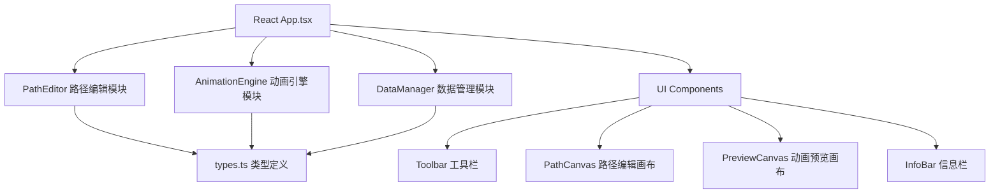

## 1. 架构设计



## 2. 技术描述

- 前端框架：React 18 + TypeScript
- 构建工具：Vite 5
- 状态管理：DataManager（自定义撤销重做）
- 渲染技术：SVG + Canvas 混合渲染
- 依赖库：uuid（唯一ID生成）

## 3. 模块职责划分

### 3.1 类型定义 (src/types.ts)
- PathNode: 路径节点接口
- BezierControl: 贝塞尔控制点接口
- AnimationConfig: 动画配置接口
- PathState: 路径状态接口

### 3.2 数据管理模块 (src/dataManager.ts)
- 管理路径状态
- 操作历史记录（最多20步）
- 撤销/重做功能
- 状态持久化

### 3.3 路径编辑模块 (src/pathEditor.ts)
- 节点创建、移动、删除
- 贝塞尔控制点调整
- Catmull-Rom 样条曲线算法
- 路径平滑处理
- 曲率计算

### 3.4 动画引擎模块 (src/animationEngine.ts)
- 路径关键帧插值计算
- CSS 动画驱动
- 小球位置计算
- 粒子特效系统
- 速度调节（无缝过渡）

### 3.5 主应用组件 (src/App.tsx)
- 组合所有模块
- 响应式布局
- 事件处理
- 键盘快捷键（Ctrl+Z, Ctrl+Shift+Z）
- 鼠标滚轮缩放

## 4. 文件结构

```
├── package.json
├── index.html
├── tsconfig.json
├── vite.config.ts
└── src/
    ├── App.tsx
    ├── types.ts
    ├── dataManager.ts
    ├── pathEditor.ts
    ├── animationEngine.ts
    └── components/
        ├── Toolbar.tsx
        ├── PathCanvas.tsx
        ├── PreviewCanvas.tsx
        └── InfoBar.tsx
```

## 5. 性能优化策略

### 5.1 渲染性能
- 使用 requestAnimationFrame 进行动画循环
- SVG 路径使用缓存，避免重复计算
- 粒子系统使用对象池复用
- 鼠标事件使用节流/防抖

### 5.2 内存管理
- 历史记录限制20步
- 粒子对象及时回收
- 事件监听器及时清理

### 5.3 动画流畅度
- 60FPS 目标
- 每帧渲染时间 <16ms（编辑状态）
- 每帧计算时间 <10ms（动画状态）

## 6. 数据模型

### 6.1 核心数据结构

```typescript
interface Point {
  x: number;
  y: number;
}

interface BezierControl {
  id: string;
  in: Point;
  out: Point;
}

interface PathNode {
  id: string;
  x: number;
  y: number;
  bezier?: BezierControl;
}

interface AnimationConfig {
  speed: number;
  duration: number;
  easing: string;
}

interface Particle {
  x: number;
  y: number;
  vx: number;
  vy: number;
  life: number;
  maxLife: number;
  color: string;
  size: number;
}
```
