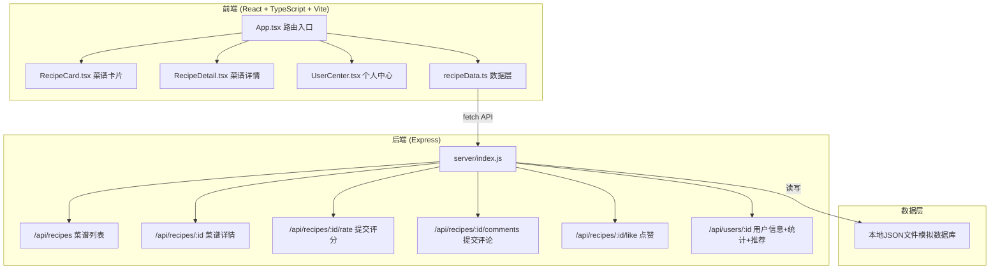
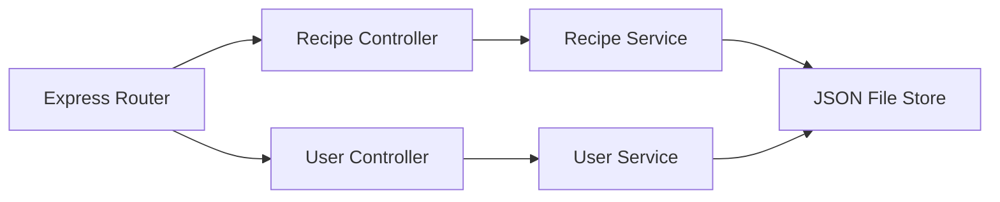
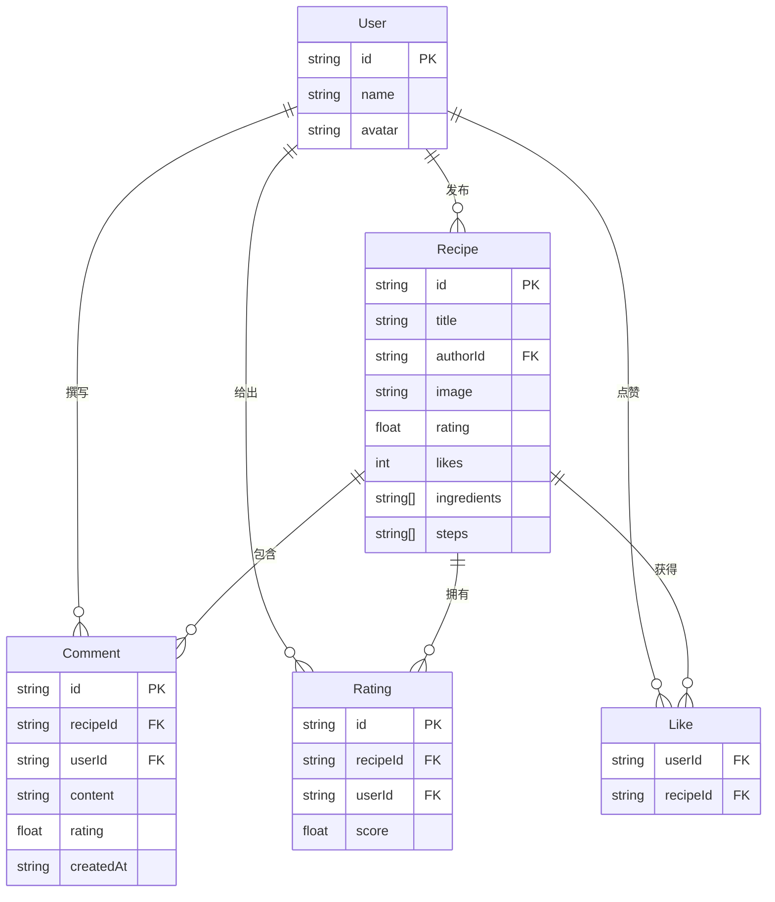

## 1. 架构设计



## 2. 技术说明
- 前端：React@18 + TypeScript + Vite
- 初始化工具：Vite
- 后端：Express@4 + cors + body-parser
- 数据库：本地JSON文件模拟（recipes.json, users.json）
- 路由：React Router（hash模式，兼容Vite开发服务器）
- 图表：纯CSS/SVG实现渐变柱状图（无需额外图表库）

## 3. 路由定义
| 路由 | 用途 |
|------|------|
| / | 主页瀑布流菜谱展示 |
| /recipe/:id | 菜谱详情页 |
| /user/:id | 个人中心页面 |

## 4. API定义

### 4.1 菜谱列表
- **GET** `/api/recipes`
- 响应：`{ id, title, author, authorAvatar, image, rating, likes, liked }[]`

### 4.2 菜谱详情
- **GET** `/api/recipes/:id`
- 响应：`{ id, title, author, authorAvatar, image, rating, likes, liked, ingredients, steps, comments: { id, userId, userName, userAvatar, content, rating, createdAt }[] }`

### 4.3 提交评分
- **POST** `/api/recipes/:id/rate`
- 请求：`{ userId, score: number }`
- 响应：`{ success, averageRating }`

### 4.4 提交评论
- **POST** `/api/recipes/:id/comments`
- 请求：`{ userId, content, rating }`
- 响应：`{ success, comment }`

### 4.5 点赞
- **POST** `/api/recipes/:id/like`
- 请求：`{ userId }`
- 响应：`{ success, liked, likes }`

### 4.6 用户信息
- **GET** `/api/users/:id`
- 响应：`{ id, name, avatar, stats: { publishedCount, totalLikes, averageRating }, recentRecipes, recommendations }`

### 4.7 删除评论
- **DELETE** `/api/recipes/:recipeId/comments/:commentId`
- 请求：`{ userId }`
- 响应：`{ success }`

### 4.8 编辑评论
- **PUT** `/api/recipes/:recipeId/comments/:commentId`
- 请求：`{ userId, content, rating }`
- 响应：`{ success, comment }`

## 5. 服务器架构图



## 6. 数据模型

### 6.1 数据模型定义



### 6.2 数据定义

#### recipes.json
```json
[
  {
    "id": "r1",
    "title": "红烧肉",
    "authorId": "u1",
    "image": "https://trae-api-cn.mchost.guru/api/ide/v1/text_to_image?prompt=braised%20pork%20belly%20chinese%20dish%20close%20up&image_size=square",
    "rating": 4.5,
    "likes": 12,
    "ingredients": ["五花肉 500g", "生抽 2勺", "老抽 1勺", "冰糖 30g", "料酒 2勺", "葱姜适量"],
    "steps": ["五花肉切块焯水", "锅中放油炒冰糖至焦糖色", "放入肉块翻炒上色", "加入调料和开水", "大火烧开后小火炖1小时", "大火收汁即可"]
  }
]
```

#### users.json
```json
[
  {
    "id": "u1",
    "name": "大厨小王",
    "avatar": "https://trae-api-cn.mchost.guru/api/ide/v1/text_to_image?prompt=chef%20avatar%20cartoon%20warm%20smile&image_size=square_hd"
  }
]
```

#### ratings.json - 用户评分记录
```json
[
  { "id": "rt1", "recipeId": "r1", "userId": "u2", "score": 5 }
]
```

#### likes.json - 用户点赞记录
```json
[
  { "userId": "u2", "recipeId": "r1" }
]
```

#### comments.json - 评论数据
```json
[
  { "id": "c1", "recipeId": "r1", "userId": "u2", "content": "太好吃了！", "rating": 5, "createdAt": "2026-06-18T10:00:00Z" }
]
```
