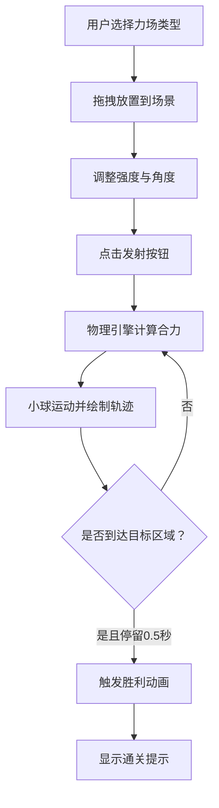

## 1. 产品概述

力场实验室是一款面向教育与娱乐的2D物理沙盒游戏，让玩家通过组合不同力场（重力、磁力、弹力）与障碍物，直观演示经典力学原理并完成关卡挑战。

- 目标用户：物理爱好者、学生、游戏策划师、教育工作者
- 核心价值：将抽象的力学概念转化为可视化的互动实验，寓教于乐

## 2. 核心功能

### 2.1 功能模块

1. **主场景（Canvas画布）**：物理模拟渲染、力场放置、小球运动轨迹、目标区域
2. **左侧工具栏**：力场发射器选择、参数调整、发射/重置控制
3. **右侧数据面板**：实时物理参数显示（速度、加速度、合力方向）
4. **关卡系统**：3个预设关卡（简单/中等/困难）及切换

### 2.2 页面详情

| 页面名称 | 模块名称 | 功能描述 |
|-----------|-------------|---------------------|
| 主场景页面 | Canvas场景 | 渲染力场范围、小球、轨迹点阵、目标区域、胜利动画 |
| 主场景页面 | 左侧工具栏 | 力场类型按钮（重力/磁力/弹力）、强度滑块、角度滑块、发射按钮、重置按钮、关卡切换 |
| 主场景页面 | 右侧数据面板 | 瞬时速度数值、加速度色条、合力方向箭头、参数浮动动画 |

## 3. 核心流程

用户选择力场类型 → 拖拽放置到场景 → 调整强度与角度参数 → 点击发射按钮 → 小球在复合力场作用下运动 → 实时显示轨迹与受力数据 → 小球进入目标区域并停留0.5秒 → 触发胜利动画与通关提示

## 4. 用户界面设计

### 4.1 设计风格

- **主背景色**：深蓝灰色 `#1a1a2e`
- **卡片背景色**：`#16213e`
- **重力场**：橙色半透明渐变圆
- **磁力场**：蓝色半透明渐变圆
- **弹力场**：绿色半透明渐变圆
- **小球**：红橙径向渐变，半径10px
- **目标区域**：绿色半透明圆/矩形
- **按钮样式**：圆角矩形（border-radius: 8px），渐变色背景，悬停放大1.1倍+阴影，按压缩放0.95倍（0.15s）
- **左侧工具栏**：浅灰半透明毛玻璃效果（backdrop-filter: blur(8px)）
- **右侧数据面板**：卡片式布局（圆角12px），等宽字体显示数据
- **字体**：数据文字使用等宽字体

### 4.2 页面设计概述

| 页面名称 | 模块名称 | UI元素 |
|-----------|-------------|-------------|
| 主场景 | Canvas区域 | 深蓝灰背景、力场范围圆、小球渐变、轨迹点阵（最多500点）、目标区域、胜利波纹、通关文字弹性动画 |
| 主场景 | 左侧工具栏 | 毛玻璃背景、力场选择按钮（3个渐变色按钮）、滑块控件（强度+角度）、发射/重置按钮、关卡选择下拉 |
| 主场景 | 右侧数据面板 | 卡片容器、速度显示（等宽字体+一位小数+浮动动画）、加速度色条（绿蓝渐变）、合力方向箭头（长度正比于大小） |

### 4.3 响应式设计

- **桌面端**（≥768px）：Canvas宽度占屏幕70%，左右侧边栏各占一部分
- **移动端**（<768px）：Canvas宽度100%，工具栏和数据面板垂直堆叠

## 5. 性能约束

- 物理模拟60FPS运行，帧渲染≤16ms
- Canvas使用requestAnimationFrame
- 帧率降级策略：帧渲染超过16ms时，点阵绘制密度降为一半
