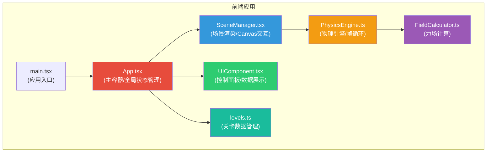

## 1. 架构设计



**数据流向说明**：
- `main.tsx` → `App.tsx`：挂载React应用
- `App.tsx` → `SceneManager.tsx`：传递关卡数据、力场列表、小球状态
- `App.tsx` → `UIComponent.tsx`：传递当前选中力场、参数值、物理数据、回调函数
- `App.tsx` → `levels.ts`：读取关卡预设数据
- `SceneManager.tsx` → `PhysicsEngine.ts`：提交物体列表，获取每帧更新结果
- `PhysicsEngine.ts` → `FieldCalculator.ts`：调用力场计算方法获取合力向量

## 2. 技术描述

- **前端框架**：React 18 + TypeScript
- **构建工具**：Vite 5 + @vitejs/plugin-react
- **渲染引擎**：Canvas2D（独立封装的物理渲染循环）
- **状态管理**：React useState/useRef（局部状态），无第三方状态库
- **工具库**：uuid（生成唯一ID）
- **样式方案**：原生CSS + CSS变量（响应式布局）

## 3. 项目文件结构

```
auto167/
├── package.json              # 依赖与启动脚本
├── index.html                # 入口HTML
├── tsconfig.json             # TypeScript配置（严格模式 + 路径别名）
├── vite.config.js            # Vite配置（React插件）
└── src/
    ├── main.tsx              # React应用入口
    ├── App.tsx               # 主容器组件
    ├── engine/
    │   ├── PhysicsEngine.ts  # 物理引擎（帧循环/碰撞/合力计算）
    │   └── FieldCalculator.ts # 力场计算模块
    ├── data/
    │   └── levels.ts         # 关卡数据管理
    ├── types/
    │   └── index.ts          # 全局类型定义
    └── components/
        ├── SceneManager.tsx  # 场景管理器（Canvas渲染/交互）
        └── UIComponent.tsx   # UI控制面板
```

## 4. 核心数据模型

### 4.1 类型定义

```typescript
// 力场类型
type FieldType = 'gravity' | 'magnetic' | 'elastic';

// 向量
interface Vector2 {
  x: number;
  y: number;
}

// 力场发射器
interface ForceField {
  id: string;
  type: FieldType;
  position: Vector2;
  strength: number;       // 重力5-20, 磁力10-50, 弹力50-200
  angle: number;          // 0-360度
  radius: number;         // 影响范围
}

// 小球
interface Ball {
  position: Vector2;
  velocity: Vector2;
  radius: number;         // 10px
  mass: number;           // 1kg
}

// 目标区域
interface TargetZone {
  type: 'circle' | 'rectangle';
  position: Vector2;
  size: { width?: number; height?: number; radius?: number };
}

// 关卡数据
interface Level {
  id: number;
  name: string;
  difficulty: 'easy' | 'medium' | 'hard';
  ballStart: Vector2;
  initialVelocity: Vector2;
  target: TargetZone;
  fields: ForceField[];
}

// 实时物理数据
interface PhysicsData {
  velocity: number;       // m/s
  acceleration: number;   // m/s²
  netForce: Vector2;      // 合力向量
  forceMagnitude: number; // 合力大小 N
}
```

## 5. 模块接口定义

### 5.1 PhysicsEngine

```typescript
class PhysicsEngine {
  constructor();
  // 设置物体列表
  setObjects(ball: Ball, fields: ForceField[]): void;
  // 单帧更新（dt秒）
  update(dt: number): { ball: Ball; data: PhysicsData };
  // 检测目标区域碰撞与停留
  checkTarget(ball: Ball, target: TargetZone, elapsedInTarget: number): boolean;
}
```

### 5.2 FieldCalculator

```typescript
// 计算重力场对小球的作用力
function calcGravityForce(ball: Ball, field: ForceField): Vector2;
// 计算磁力场对小球的作用力
function calcMagneticForce(ball: Ball, field: ForceField): Vector2;
// 计算弹力场对小球的作用力
function calcElasticForce(ball: Ball, field: ForceField): Vector2;
// 计算所有力场的合力
function calcNetForce(ball: Ball, fields: ForceField[]): Vector2;
```

## 6. 性能优化策略

- 使用 requestAnimationFrame 驱动渲染循环
- 轨迹点阵采用环形缓冲区（最多500点），避免数组频繁扩容
- 帧率监控：每帧记录渲染耗时，超过16ms时自动降低点阵绘制密度
- 力场影响范围预判断：仅对小球位置在半径范围内的力场进行计算
- Canvas绘制分层：静态元素（力场范围、目标区域）与动态元素（小球、轨迹）分批绘制
