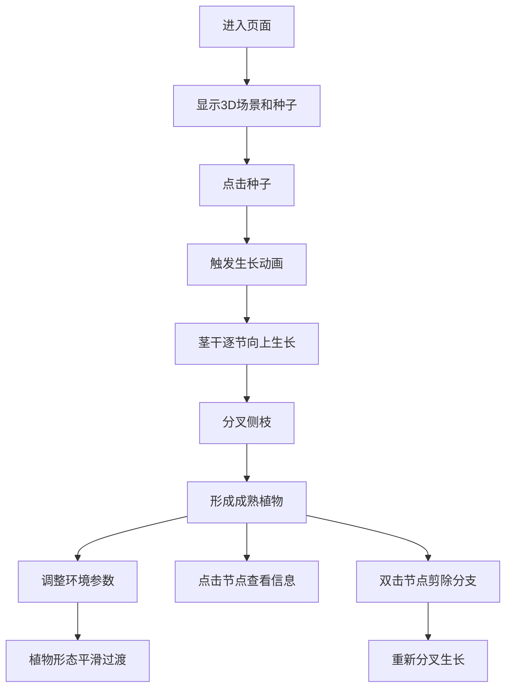

## 1. 产品概述

交互式3D植物生长模拟器是一款面向生物教学和数字艺术领域的可视化工具，通过直观的三维动画展示植物从种子到成熟的完整生长过程，以及环境因素对植物形态的动态影响。

- **核心问题**：传统教学难以直观展示植物生长过程和环境影响，数字艺术创作缺乏可交互的植物生长工具
- **目标用户**：生物教师、学生、数字艺术家、自然爱好者
- **产品价值**：将抽象的植物生长过程转化为可交互、可控制的三维可视化体验，支持自定义环境参数观察植物形态变化

## 2. 核心功能

### 2.1 用户角色
| 角色 | 注册方式 | 核心权限 |
|------|----------|----------|
| 普通用户 | 无需注册 | 使用所有交互功能，调整环境参数，观察植物生长 |

### 2.2 功能模块
1. **3D场景模块**：虚拟土地、种子模型、植物生长动画、视角控制
2. **生长引擎模块**：种子发芽、茎干生长、分支规则、弹性动画
3. **环境控制模块**：光照强度调节、水分调节、参数平滑过渡
4. **交互控制模块**：节点点击查看信息、双击剪除分支、重新分叉生长
5. **UI界面模块**：控制面板、信息浮窗、响应式布局

### 2.3 页面详情
| 页面名称 | 模块名称 | 功能描述 |
|----------|----------|----------|
| 主页面 | 3D场景区域 | 10x10单位绿色网格土地，支持鼠标拖拽旋转、滚轮缩放，展示种子到植物的完整生长过程 |
| 主页面 | 环境控制面板 | 光照强度滑块(0-100%)、水分滑块(0-100%)，实时影响植物颜色、大小、分支角度和光泽度 |
| 主页面 | 信息浮窗 | 点击节点弹出，显示分支年龄、分支角度、叶片数量，带动画效果 |

## 3. 核心流程

用户进入页面后，看到中央土地上的半透明种子模型，点击种子触发生长动画。植物在8秒内完成从种子到成熟树状植物的生长过程，期间用户可以调整光照和水分参数，观察植物形态的平滑变化。用户可以点击任意分支节点查看详细信息，双击节点可以剪除该分支，植物会在后续生长中绕过剪除位置重新分叉。

## 4. 用户界面设计

### 4.1 设计风格
- **主色调**：深绿色(#1a4d2e)、自然绿(#2d6a4f)、嫩绿(#95d5b2)、天蓝色(#4cc9f0)
- **辅色调**：淡黄色(#fdf0d5)、橙色(#f77f00)、深蓝色(#003049)
- **按钮样式**：白色圆角矩形滑块按钮，悬停时背景微亮
- **字体**：标题使用 'Playfair Display' 衬线字体，正文使用 'Inter' 无衬线字体
- **布局风格**：左侧70% 3D场景，右侧30%控制面板，采用深色半透明毛玻璃效果
- **视觉效果**：模糊半径10px的毛玻璃背景，渐变滑块轨道（浅蓝到橙黄），节点高亮半透明蓝色

### 4.2 页面设计概述
| 页面名称 | 模块名称 | UI元素 |
|----------|----------|----------|
| 主页面 | 3D场景 | 绿色网格土地、半透明种子、发光内核、茎干圆柱体、分支结构、叶片、夜晚模式深蓝色网格+星光粒子 |
| 主页面 | 控制面板 | 深色毛玻璃背景、光照滑块、水分滑块、参数数值显示、0.3秒淡入动画 |
| 主页面 | 信息浮窗 | 半透明蓝色背景、向上飞出动画、显示年龄/角度/叶片数 |

### 4.3 响应式设计
- 桌面端（≥768px）：左侧70% 3D场景，右侧30%控制面板
- 移动端（<768px）：控制面板折叠为底部可拖拽抽屉式面板，3D场景占满全屏

### 4.4 3D场景设计
- **环境与氛围**：自然光照环境，光照低于30%时切换为夜晚模式，深蓝色网格+星光粒子效果
- **光照设置**：环境光+方向光组合，支持光照强度0-100%调节
- **相机设置**：透视相机，支持鼠标拖拽旋转、滚轮缩放，初始视角为45度俯视
- **构图与焦点**：植物位于场景中心，土地平面提供空间参考
- **交互与动画**：种子点击触发生长动画，茎干0.5秒/节生长，弹性缩放效果0.2秒，参数调整3秒平滑过渡，剪除动画0.5秒
- **后处理效果**：抗锯齿、环境光遮蔽、辉光效果（发光种子内核）
- **性能**：目标帧率30fps以上，帧间隔不超过33ms

## 5. 技术规范
- 植物高度：4-6单位
- 分支数量：5-7个
- 每节茎干长度：0.4单位
- 每节生长时间：0.5秒
- 总生长时间：8秒
- 种子直径：0.3单位
- 土地尺寸：10x10单位
- 光照影响：叶子颜色淡黄→深绿，叶片大小随光照增大
- 水分影响：分支角度30°→80°，叶子光泽度随水分变化
