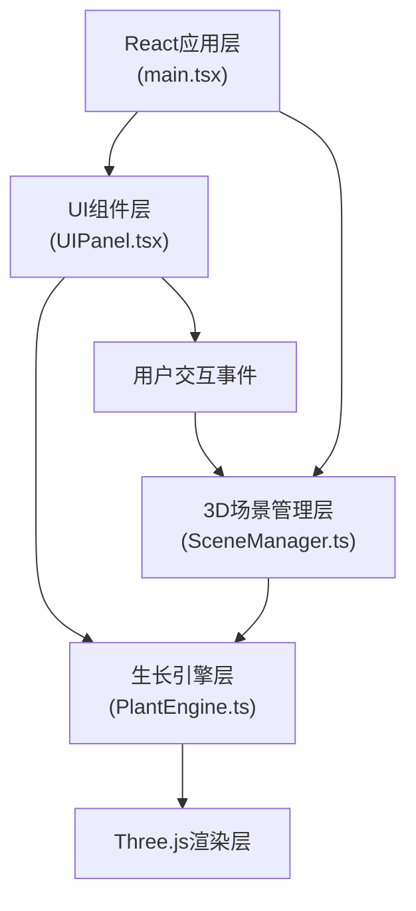

## 1. 架构设计



## 2. 技术描述

- **前端框架**：React 18 + TypeScript + Vite
- **3D渲染引擎**：Three.js
- **状态管理**：React useState/useRef 组件内状态
- **构建工具**：Vite 5
- **UI样式**：原生CSS + CSS变量 + 毛玻璃效果
- **唯一ID生成**：uuid

### 核心依赖版本
- react: ^18.2.0
- react-dom: ^18.2.0
- three: ^0.160.0
- @types/three: ^0.160.0
- typescript: ^5.3.0
- vite: ^5.0.0
- @vitejs/plugin-react: ^4.2.0
- uuid: ^9.0.0

## 3. 目录结构

```
├── src/
│   ├── main.tsx              # React应用入口
│   ├── PlantEngine.ts        # 植物生长逻辑引擎
│   ├── SceneManager.ts       # Three.js场景管理
│   └── UIPanel.tsx           # UI控制面板组件
├── package.json
├── index.html
├── tsconfig.json
└── vite.config.js
```

## 4. 模块定义

### 4.1 PlantEngine.ts - 植物生长引擎

**职责**：封装植物生长逻辑，与UI和渲染层解耦

**数据结构**：
```typescript
interface GrowthNode {
  id: string;
  parentId: string | null;
  position: { x: number; y: number; z: number };
  direction: { x: number; y: number; z: number };
  length: number;
  age: number;
  branchAngle: number;
  leafCount: number;
  isPruned: boolean;
  children: string[];
}

interface PlantState {
  nodes: Map<string, GrowthNode>;
  isGrowing: boolean;
  currentHeight: number;
  totalAge: number;
}

interface EnvironmentParams {
  light: number;      // 0-100
  moisture: number;   // 0-100
}
```

**核心方法**：
- `startGrowth()`: 开始生长动画
- `adjustEnvironment(params: EnvironmentParams)`: 调整环境参数
- `pruneNode(nodeId: string)`: 剪除节点
- `getNodeInfo(nodeId: string)`: 获取节点信息
- `onGrowth(callback)`: 生长事件回调

**生长算法**：
- L系统分支规则，每节生长0.4单位，耗时0.5秒
- 分支角度受水分影响：30° + (水分/100) * 50°
- 叶片数量和大小受光照影响
- 剪除后从父节点重新分叉

### 4.2 SceneManager.ts - 3D场景管理

**职责**：管理Three.js场景，创建和更新3D模型，处理用户交互

**核心属性**：
- `scene`: THREE.Scene
- `camera`: THREE.PerspectiveCamera
- `renderer`: THREE.WebGLRenderer
- `ground`: THREE.Mesh (土地平面)
- `seed`: THREE.Group (种子模型)
- `plantGroup`: THREE.Group (植物模型组)

**核心方法**：
- `init(container: HTMLElement)`: 初始化场景
- `createGround()`: 创建10x10绿色网格土地
- `createSeed()`: 创建半透明种子模型
- `updatePlant(plantData)`: 根据生长引擎数据更新3D模型
- `handleMouseInteraction(event)`: 处理点击和双击事件
- `updateEnvironment(params)`: 更新光照和材质
- `animate()`: 动画循环
- `dispose()`: 资源清理

**视觉效果**：
- 夜晚模式：光照<30%时网格变为深蓝色，添加星光粒子
- 节点高亮：选中节点显示半透明蓝色发光效果
- 弹性缩放：TWEEN.js实现生长动画

### 4.3 UIPanel.tsx - UI控制面板

**职责**：React组件，渲染环境控制滑块和信息浮窗

**Props**：
```typescript
interface UIPanelProps {
  light: number;
  moisture: number;
  onLightChange: (value: number) => void;
  onMoistureChange: (value: number) => void;
  selectedNode: NodeInfo | null;
  onCloseInfo: () => void;
}

interface NodeInfo {
  id: string;
  position: { x: number; y: number; z: number };
  age: number;
  branchAngle: number;
  leafCount: number;
}
```

**样式特点**：
- 深色半透明毛玻璃背景：`backdrop-filter: blur(10px)`
- 渐变滑块轨道：`linear-gradient(90deg, #4cc9f0, #f77f00)`
- 白色圆角滑块按钮
- 0.3秒淡入动画
- 信息浮窗0.4秒向上飞出动画

### 4.4 main.tsx - 应用入口

**职责**：
- 创建React应用根组件
- 初始化SceneManager
- 创建PlantEngine实例
- 组合UIPanel和3D场景
- 处理模块间通信
- 响应式布局控制

## 5. 动画与性能

### 动画系统
- 生长动画：requestAnimationFrame + 时间插值
- 弹性效果：spring动画公式 `scale = 1 + amplitude * exp(-damping * t) * sin(frequency * t)`
- 平滑过渡：使用lerp线性插值，3秒过渡时间

### 性能优化
- 几何体复用：复用圆柱体和叶片几何体
- 材质共享：同类节点共享材质
- 视锥体剔除：Three.js内置
- 帧率控制：目标30fps，使用deltaTime控制动画速度
- 事件节流：鼠标移动事件节流

## 6. 交互事件

| 事件 | 目标 | 处理逻辑 |
|------|------|----------|
| 左键单击 | 种子 | 开始生长动画 |
| 左键单击 | 生长节点 | 高亮节点，显示信息浮窗 |
| 左键双击 | 生长节点 | 剪除分支，播放消失动画 |
| 鼠标拖拽 | 场景空白 | 旋转相机视角 |
| 滚轮 | 场景 | 缩放相机 |
| 滑块拖动 | 控制面板 | 更新环境参数，平滑过渡 |
| 窗口resize | 全局 | 更新渲染器尺寸和相机比例 |
